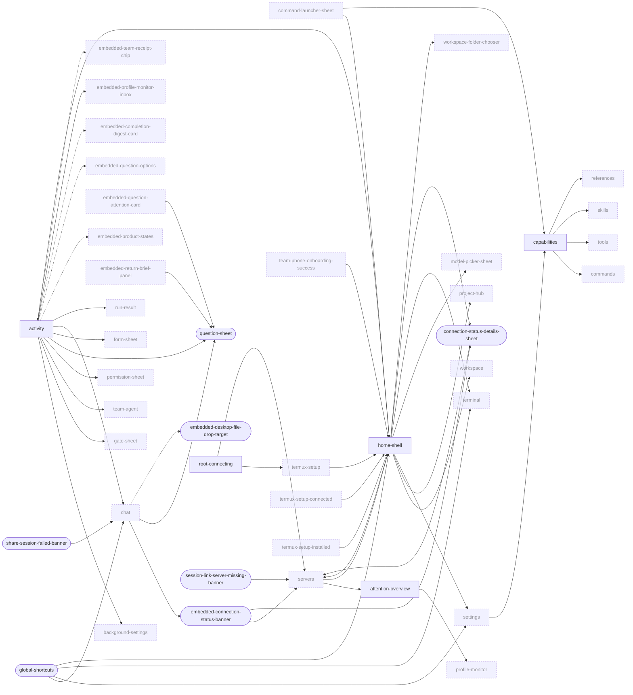
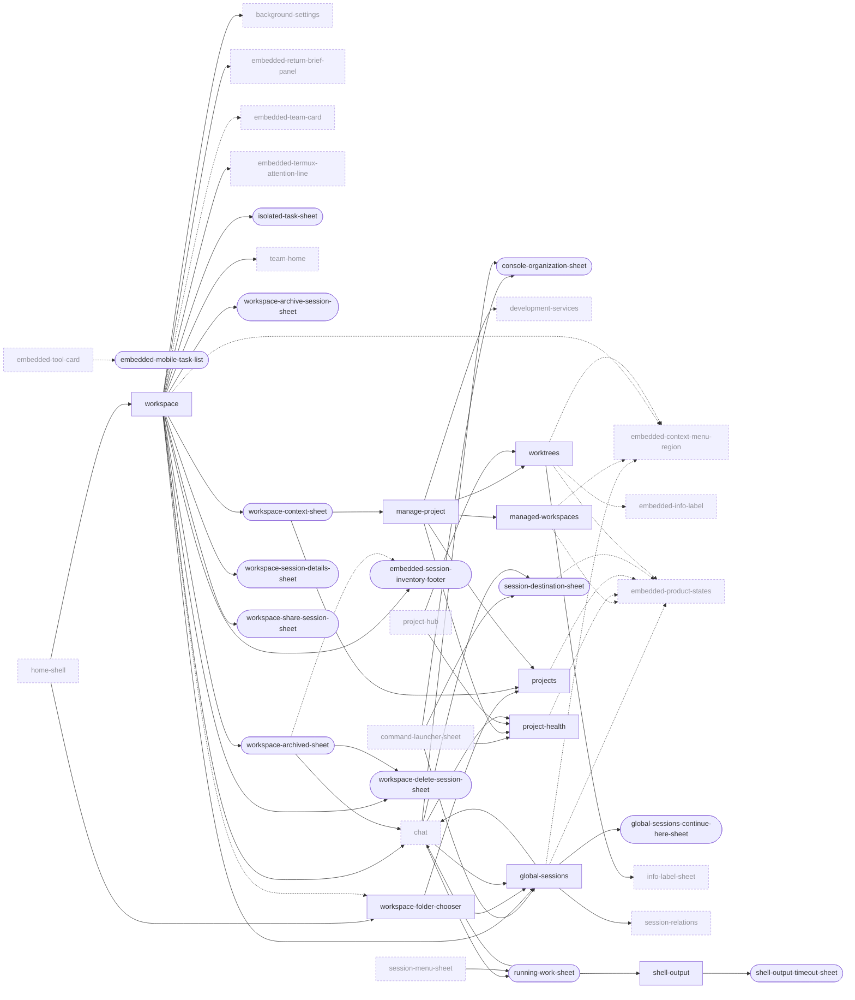
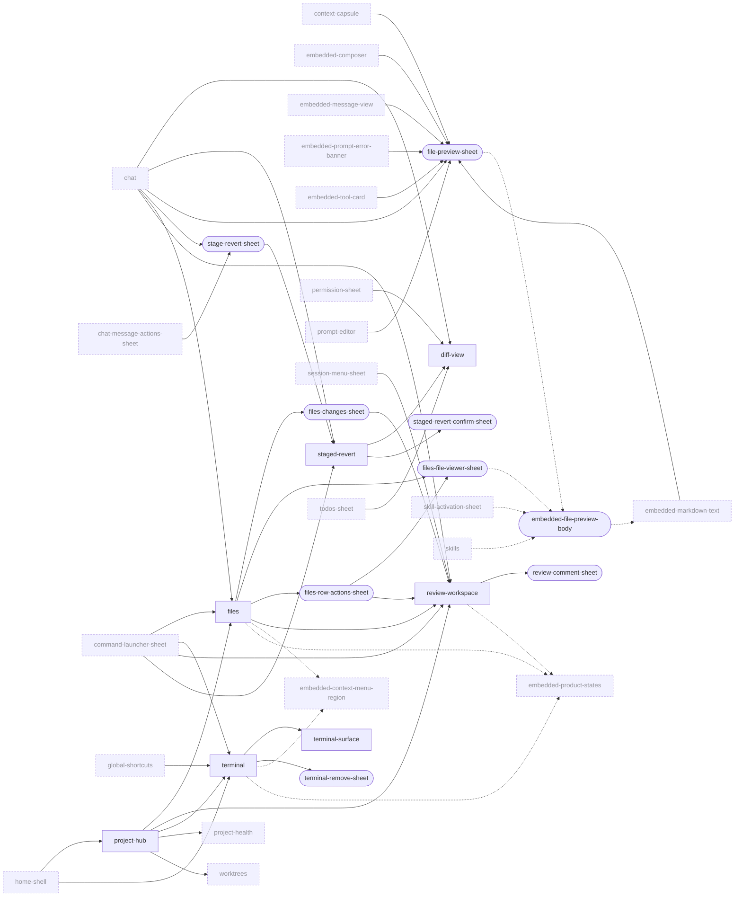
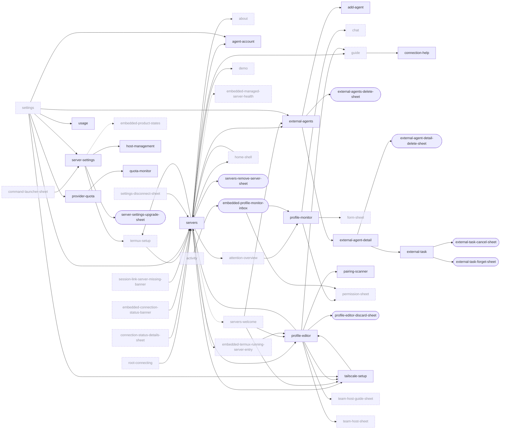
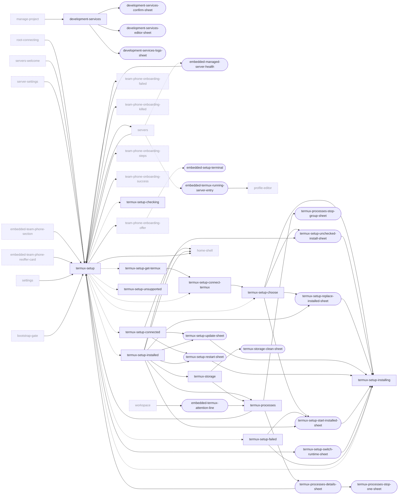
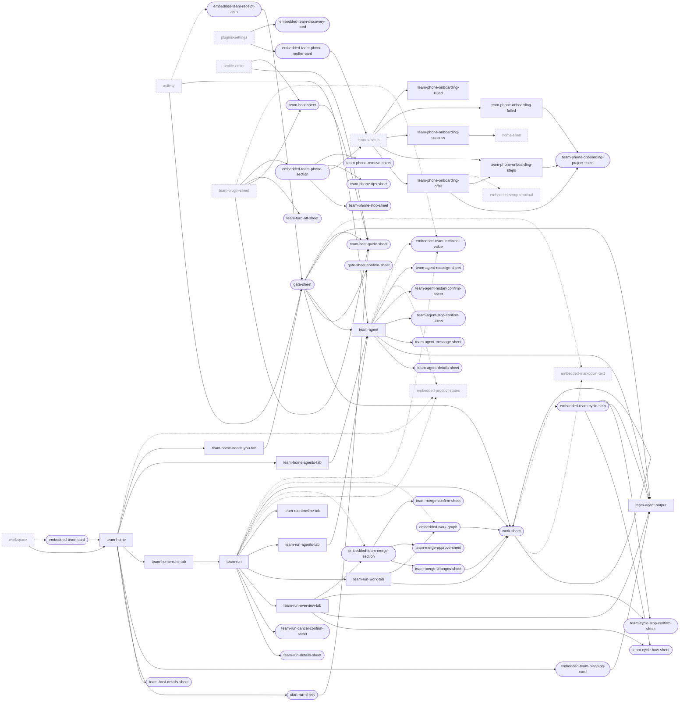
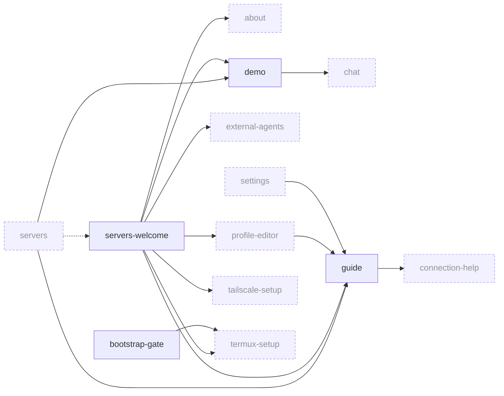

```mermaid
graph LR
  about["about"]:::ext
  active_context["active-context"]
  active_context_message["active-context-message"]
  activity["activity"]:::ext
  app_diagnostics["app-diagnostics"]:::ext
  appearance_picker_sheet["appearance-picker-sheet"]:::ext
  appearance_settings["appearance-settings"]:::ext
  capabilities["capabilities"]:::ext
  chat["chat"]
  chat_cancel_inbox_send_sheet(["chat-cancel-inbox-send-sheet"])
  chat_delete_message_sheet(["chat-delete-message-sheet"])
  chat_discard_queued_draft_sheet(["chat-discard-queued-draft-sheet"])
  chat_leave_unsaved_draft_sheet(["chat-leave-unsaved-draft-sheet"])
  chat_message_actions_sheet(["chat-message-actions-sheet"])
  chat_pending_photo_sheet(["chat-pending-photo-sheet"])
  chat_read_aloud_consent_sheet(["chat-read-aloud-consent-sheet"])
  chat_read_aloud_voice_sheet(["chat-read-aloud-voice-sheet"])
  chat_resend_queued_draft_sheet(["chat-resend-queued-draft-sheet"])
  chat_revert_confirm_sheet(["chat-revert-confirm-sheet"])
  chat_share_confirm_sheet(["chat-share-confirm-sheet"])
  chat_stash_attachments_unavailable_sheet(["chat-stash-attachments-unavailable-sheet"])
  chat_stash_restore_confirm_sheet(["chat-stash-restore-confirm-sheet"])
  command_launcher_sheet(["command-launcher-sheet"])
  commands["commands"]:::ext
  console_organization_sheet["console-organization-sheet"]:::ext
  context_capsule["context-capsule"]
  continue_on_computer_sheet(["continue-on-computer-sheet"])
  continue_on_phone_sheet(["continue-on-phone-sheet"])
  demo["demo"]:::ext
  diff_view["diff-view"]:::ext
  embedded_auto_approval_indicator(["embedded-auto-approval-indicator"])
  embedded_completion_digest_card(["embedded-completion-digest-card"])
  embedded_composer(["embedded-composer"])
  embedded_connection_status_banner["embedded-connection-status-banner"]:::ext
  embedded_context_menu_region["embedded-context-menu-region"]:::ext
  embedded_desktop_file_drop_target["embedded-desktop-file-drop-target"]:::ext
  embedded_file_preview_body["embedded-file-preview-body"]:::ext
  embedded_info_label["embedded-info-label"]:::ext
  embedded_markdown_text(["embedded-markdown-text"])
  embedded_message_view(["embedded-message-view"])
  embedded_mobile_task_list["embedded-mobile-task-list"]:::ext
  embedded_model_shortcuts(["embedded-model-shortcuts"])
  embedded_pending_sends_strip(["embedded-pending-sends-strip"])
  embedded_permission_attention_card(["embedded-permission-attention-card"])
  embedded_product_states["embedded-product-states"]:::ext
  embedded_profile_monitor_inbox["embedded-profile-monitor-inbox"]:::ext
  embedded_prompt_error_banner(["embedded-prompt-error-banner"])
  embedded_question_attention_card(["embedded-question-attention-card"])
  embedded_question_options(["embedded-question-options"])
  embedded_return_brief_panel(["embedded-return-brief-panel"])
  embedded_shared_session_banner(["embedded-shared-session-banner"])
  embedded_subagent_context_banner(["embedded-subagent-context-banner"])
  embedded_tool_card(["embedded-tool-card"])
  embedded_transcript_display_toggles(["embedded-transcript-display-toggles"])
  embedded_transcript_find_bar(["embedded-transcript-find-bar"])
  embedded_voice_conversation_controls(["embedded-voice-conversation-controls"])
  file_preview_sheet["file-preview-sheet"]:::ext
  files["files"]:::ext
  form_sheet(["form-sheet"])
  form_sheet_dismiss_confirm_sheet(["form-sheet-dismiss-confirm-sheet"])
  gate_sheet["gate-sheet"]:::ext
  global_sessions["global-sessions"]:::ext
  global_shortcuts["global-shortcuts"]:::ext
  home_shell["home-shell"]:::ext
  integrations["integrations"]:::ext
  legacy_drafts["legacy-drafts"]:::ext
  markdown_code_reader["markdown-code-reader"]
  model_picker_sheet["model-picker-sheet"]:::ext
  permission_sheet(["permission-sheet"])
  profile_monitor["profile-monitor"]:::ext
  project_health["project-health"]:::ext
  prompt_editor["prompt-editor"]
  prompt_editor_discard_sheet(["prompt-editor-discard-sheet"])
  prompt_history_sheet(["prompt-history-sheet"])
  prompt_stash_delete_sheet(["prompt-stash-delete-sheet"])
  prompt_stash_sheet(["prompt-stash-sheet"])
  prompt_tools_sheet(["prompt-tools-sheet"])
  question_sheet["question-sheet"]:::ext
  references["references"]:::ext
  review_workspace["review-workspace"]:::ext
  run_result["run-result"]
  run_result_output_sheet(["run-result-output-sheet"])
  running_work_sheet["running-work-sheet"]:::ext
  server_settings["server-settings"]:::ext
  session_approvals_sheet(["session-approvals-sheet"])
  session_context["session-context"]
  session_destination_sheet["session-destination-sheet"]:::ext
  session_export["session-export"]
  session_import["session-import"]
  session_import_destination_sheet(["session-import-destination-sheet"])
  session_menu_sheet(["session-menu-sheet"])
  session_note["session-note"]
  session_relations["session-relations"]
  settings["settings"]:::ext
  share_session_failed_banner["share-session-failed-banner"]:::ext
  skills["skills"]:::ext
  stage_revert_sheet["stage-revert-sheet"]:::ext
  staged_revert["staged-revert"]:::ext
  terminal["terminal"]:::ext
  timeline_sheet(["timeline-sheet"])
  todos_sheet(["todos-sheet"])
  tools["tools"]:::ext
  voice_composer_sheet(["voice-composer-sheet"])
  voice_model_setup_sheet(["voice-model-setup-sheet"])
  voice_notices["voice-notices"]
  web_sources["web-sources"]:::ext
  work_sheet["work-sheet"]:::ext
  workspace["workspace"]:::ext
  workspace_archived_sheet["workspace-archived-sheet"]:::ext
  activity --> permission_sheet
  activity --> form_sheet
  activity --> chat
  activity --> run_result
  global_shortcuts --> chat
  share_session_failed_banner --> chat
  demo --> chat
  chat --> chat_leave_unsaved_draft_sheet
  chat --> running_work_sheet
  chat --> diff_view
  chat --> session_menu_sheet
  chat --> embedded_connection_status_banner
  chat --> model_picker_sheet
  chat --> chat
  chat --> session_relations
  chat --> staged_revert
  chat --> embedded_transcript_find_bar
  chat --> file_preview_sheet
  chat --> chat_message_actions_sheet
  chat --> stage_revert_sheet
  chat --> chat_delete_message_sheet
  chat --> embedded_message_view
  chat --> integrations
  chat --> timeline_sheet
  chat --> embedded_question_attention_card
  chat --> question_sheet
  chat --> session_approvals_sheet
  chat --> permission_sheet
  chat --> form_sheet
  chat --> embedded_pending_sends_strip
  chat --> command_launcher_sheet
  chat --> prompt_editor
  chat --> prompt_history_sheet
  chat --> prompt_stash_sheet
  chat --> legacy_drafts
  chat --> voice_composer_sheet
  chat --> web_sources
  chat --> context_capsule
  chat --> embedded_model_shortcuts
  chat_message_actions_sheet --> chat
  chat_message_actions_sheet --> stage_revert_sheet
  chat_message_actions_sheet --> chat_delete_message_sheet
  command_launcher_sheet --> chat
  command_launcher_sheet --> global_sessions
  command_launcher_sheet --> home_shell
  command_launcher_sheet --> session_destination_sheet
  command_launcher_sheet --> prompt_editor
  command_launcher_sheet --> files
  command_launcher_sheet --> project_health
  command_launcher_sheet --> terminal
  command_launcher_sheet --> model_picker_sheet
  command_launcher_sheet --> integrations
  command_launcher_sheet --> console_organization_sheet
  command_launcher_sheet --> skills
  command_launcher_sheet --> capabilities
  command_launcher_sheet --> references
  command_launcher_sheet --> server_settings
  command_launcher_sheet --> app_diagnostics
  command_launcher_sheet --> appearance_settings
  command_launcher_sheet --> review_workspace
  command_launcher_sheet --> session_context
  command_launcher_sheet --> chat_share_confirm_sheet
  command_launcher_sheet --> timeline_sheet
  command_launcher_sheet --> chat_revert_confirm_sheet
  command_launcher_sheet --> staged_revert
  command_launcher_sheet --> session_export
  command_launcher_sheet --> command_launcher_sheet
  session_menu_sheet --> running_work_sheet
  session_menu_sheet --> timeline_sheet
  session_menu_sheet --> review_workspace
  session_menu_sheet --> todos_sheet
  session_menu_sheet --> session_relations
  session_menu_sheet --> session_context
  session_menu_sheet --> skills
  session_menu_sheet --> session_note
  session_menu_sheet --> session_approvals_sheet
  session_menu_sheet --> chat_revert_confirm_sheet
  session_menu_sheet --> chat
  session_menu_sheet --> chat_share_confirm_sheet
  session_menu_sheet --> command_launcher_sheet
  session_menu_sheet --> continue_on_computer_sheet
  session_menu_sheet --> continue_on_phone_sheet
  embedded_composer --> command_launcher_sheet
  embedded_composer --> file_preview_sheet
  embedded_composer --> prompt_tools_sheet
  embedded_composer --> model_picker_sheet
  embedded_composer --> prompt_editor
  prompt_tools_sheet --> command_launcher_sheet
  prompt_tools_sheet --> voice_composer_sheet
  prompt_tools_sheet --> context_capsule
  prompt_tools_sheet --> web_sources
  prompt_tools_sheet --> prompt_history_sheet
  prompt_tools_sheet --> legacy_drafts
  prompt_tools_sheet --> prompt_stash_sheet
  prompt_editor --> prompt_editor_discard_sheet
  prompt_editor --> file_preview_sheet
  prompt_stash_sheet --> prompt_stash_delete_sheet
  chat_read_aloud_consent_sheet --> chat_read_aloud_voice_sheet
  embedded_prompt_error_banner --> model_picker_sheet
  embedded_subagent_context_banner --> chat
  embedded_subagent_context_banner --> session_relations
  embedded_message_view --> timeline_sheet
  embedded_message_view --> chat
  embedded_message_view --> file_preview_sheet
  embedded_message_view --> chat_message_actions_sheet
  embedded_message_view --> model_picker_sheet
  embedded_message_view --> integrations
  embedded_pending_sends_strip --> chat_discard_queued_draft_sheet
  permission_sheet --> diff_view
  embedded_auto_approval_indicator --> session_approvals_sheet
  embedded_permission_attention_card --> permission_sheet
  embedded_question_attention_card --> question_sheet
  embedded_voice_conversation_controls --> voice_composer_sheet
  voice_composer_sheet --> voice_model_setup_sheet
  embedded_tool_card --> chat
  embedded_tool_card --> file_preview_sheet
  embedded_markdown_text --> file_preview_sheet
  embedded_markdown_text --> markdown_code_reader
  embedded_completion_digest_card --> chat
  embedded_completion_digest_card --> permission_sheet
  embedded_completion_digest_card --> run_result
  embedded_return_brief_panel --> permission_sheet
  embedded_return_brief_panel --> run_result
  embedded_return_brief_panel --> chat
  form_sheet --> form_sheet_dismiss_confirm_sheet
  workspace --> embedded_return_brief_panel
  workspace --> chat
  workspace_archived_sheet --> chat
  global_sessions --> chat
  global_sessions --> session_relations
  running_work_sheet --> chat
  profile_monitor --> permission_sheet
  profile_monitor --> chat
  embedded_profile_monitor_inbox --> permission_sheet
  settings --> voice_model_setup_sheet
  settings --> session_import
  settings --> voice_notices
  commands --> chat
  session_context --> active_context
  active_context --> active_context_message
  session_import --> session_import_destination_sheet
  session_import --> chat
  context_capsule --> file_preview_sheet
  run_result --> run_result_output_sheet
  run_result --> chat
  continue_on_computer_sheet --> session_export
  chat_stash_attachments_unavailable_sheet --> chat_stash_restore_confirm_sheet
  embedded_return_brief_panel --> form_sheet
  embedded_return_brief_panel --> question_sheet
  chat -.-> embedded_desktop_file_drop_target
  embedded_message_view -.-> embedded_context_menu_region
  embedded_prompt_error_banner -.-> embedded_context_menu_region
  active_context -.-> embedded_product_states
  chat -.-> embedded_product_states
  session_context -.-> embedded_product_states
  session_relations -.-> embedded_product_states
  voice_notices -.-> embedded_product_states
  prompt_stash_sheet --> chat_stash_attachments_unavailable_sheet
  prompt_stash_sheet --> chat_stash_restore_confirm_sheet
  embedded_pending_sends_strip --> chat_resend_queued_draft_sheet
  embedded_pending_sends_strip --> chat_cancel_inbox_send_sheet
  embedded_composer --> chat_pending_photo_sheet
  chat --> chat_share_confirm_sheet
  chat --> embedded_composer
  chat --> chat_read_aloud_consent_sheet
  chat --> chat_read_aloud_voice_sheet
  session_menu_sheet --> embedded_transcript_display_toggles
  chat --> embedded_prompt_error_banner
  chat --> embedded_subagent_context_banner
  chat --> embedded_shared_session_banner
  chat -.-> embedded_auto_approval_indicator
  chat -.-> embedded_permission_attention_card
  chat --> embedded_voice_conversation_controls
  chat --> voice_model_setup_sheet
  appearance_settings --> voice_notices
  chat -.-> embedded_tool_card
  embedded_prompt_error_banner -.-> embedded_tool_card
  run_result -.-> embedded_tool_card
  run_result_output_sheet -.-> embedded_tool_card
  about -.-> embedded_markdown_text
  chat -.-> embedded_markdown_text
  embedded_file_preview_body -.-> embedded_markdown_text
  embedded_prompt_error_banner -.-> embedded_markdown_text
  embedded_tool_card -.-> embedded_markdown_text
  gate_sheet -.-> embedded_markdown_text
  work_sheet -.-> embedded_markdown_text
  activity -.-> embedded_question_options
  chat -.-> embedded_question_options
  embedded_permission_attention_card -.-> embedded_question_options
  embedded_question_attention_card -.-> embedded_question_options
  activity -.-> embedded_completion_digest_card
  profile_monitor --> form_sheet
  chat --> project_health
  chat --> global_sessions
  chat --> session_destination_sheet
  chat --> console_organization_sheet
  embedded_tool_card -.-> embedded_mobile_task_list
  chat --> files
  chat --> review_workspace
  embedded_prompt_error_banner --> file_preview_sheet
  todos_sheet --> diff_view
  chat --> appearance_picker_sheet
  chat --> app_diagnostics
  chat --> skills
  chat --> references
  chat --> tools
  chat --> session_context
  chat --> session_export
  chat --> session_note
  chat --> continue_on_computer_sheet
  chat --> continue_on_phone_sheet
  embedded_prompt_error_banner -.-> embedded_info_label
  classDef ext stroke-dasharray: 4 3,opacity:0.7
```

```mermaid
graph LR
  about["about"]
  about_open_source_tab["about-open-source-tab"]
  about_privacy_tab["about-privacy-tab"]
  activity["activity"]:::ext
  agent_account["agent-account"]:::ext
  app_diagnostics["app-diagnostics"]
  app_diagnostics_clear_sheet(["app-diagnostics-clear-sheet"])
  appearance_picker_sheet(["appearance-picker-sheet"])
  appearance_settings["appearance-settings"]
  background_settings["background-settings"]
  capabilities["capabilities"]:::ext
  catalog["catalog"]
  chat["chat"]:::ext
  coding_settings_shell_sheet(["coding-settings-shell-sheet"])
  command_auth_sheet(["command-auth-sheet"])
  command_auth_sheet_confirm_sheet(["command-auth-sheet-confirm-sheet"])
  command_launcher_sheet["command-launcher-sheet"]:::ext
  commands["commands"]
  credential_management_sheet(["credential-management-sheet"])
  credential_management_sheet_remove_sheet(["credential-management-sheet-remove-sheet"])
  embedded_composer["embedded-composer"]:::ext
  embedded_file_preview_body["embedded-file-preview-body"]:::ext
  embedded_info_label["embedded-info-label"]:::ext
  embedded_markdown_text["embedded-markdown-text"]:::ext
  embedded_message_view["embedded-message-view"]:::ext
  embedded_product_states["embedded-product-states"]:::ext
  embedded_prompt_error_banner["embedded-prompt-error-banner"]:::ext
  embedded_team_discovery_card["embedded-team-discovery-card"]:::ext
  embedded_team_phone_reoffer_card["embedded-team-phone-reoffer-card"]:::ext
  embedded_team_phone_section["embedded-team-phone-section"]:::ext
  embedded_team_technical_value["embedded-team-technical-value"]:::ext
  external_agents["external-agents"]:::ext
  global_shortcuts["global-shortcuts"]:::ext
  guide["guide"]:::ext
  home_shell["home-shell"]:::ext
  info_label_sheet["info-label-sheet"]:::ext
  integrations["integrations"]
  integrations_connect_method_sheet(["integrations-connect-method-sheet"])
  integrations_disconnect_provider_sheet(["integrations-disconnect-provider-sheet"])
  integrations_forget_pending_auth_sheet(["integrations-forget-pending-auth-sheet"])
  integrations_forget_uncertain_auth_sheet(["integrations-forget-uncertain-auth-sheet"])
  integrations_remove_mcp_sheet(["integrations-remove-mcp-sheet"])
  language_sheet(["language-sheet"])
  legacy_drafts["legacy-drafts"]
  legacy_drafts_delete_sheet(["legacy-drafts-delete-sheet"])
  legacy_drafts_review_sheet(["legacy-drafts-review-sheet"])
  mcp_setup["mcp-setup"]
  model_picker_sheet(["model-picker-sheet"])
  plugins_clear_mappings_sheet(["plugins-clear-mappings-sheet"])
  plugins_settings["plugins-settings"]
  privacy_settings["privacy-settings"]
  privacy_settings_clear_drafts_sheet(["privacy-settings-clear-drafts-sheet"])
  privacy_settings_clear_queued_sheet(["privacy-settings-clear-queued-sheet"])
  prompt_tools_sheet["prompt-tools-sheet"]:::ext
  provider_quota["provider-quota"]:::ext
  references["references"]
  saved_permissions["saved-permissions"]
  server_settings["server-settings"]:::ext
  servers["servers"]:::ext
  servers_welcome["servers-welcome"]:::ext
  session_import["session-import"]:::ext
  session_menu_sheet["session-menu-sheet"]:::ext
  settings["settings"]
  settings_disconnect_sheet(["settings-disconnect-sheet"])
  settings_transcript_display_sheet(["settings-transcript-display-sheet"])
  skill_activation_sheet(["skill-activation-sheet"])
  skills["skills"]
  skills_preview_sheet(["skills-preview-sheet"])
  tailscale_setup["tailscale-setup"]:::ext
  team_host_guide_sheet["team-host-guide-sheet"]:::ext
  team_host_sheet["team-host-sheet"]:::ext
  team_plugin_sheet(["team-plugin-sheet"])
  team_turn_off_sheet["team-turn-off-sheet"]:::ext
  termux_setup["termux-setup"]:::ext
  theme_pack_preview_sheet(["theme-pack-preview-sheet"])
  tools["tools"]
  tools_detail_sheet(["tools-detail-sheet"])
  usage["usage"]:::ext
  voice_model_setup_sheet["voice-model-setup-sheet"]:::ext
  voice_notices["voice-notices"]:::ext
  web_sources["web-sources"]
  workspace["workspace"]:::ext
  home_shell --> settings
  home_shell --> model_picker_sheet
  activity --> background_settings
  global_shortcuts --> settings
  capabilities --> commands
  capabilities --> tools
  capabilities --> skills
  capabilities --> references
  chat --> model_picker_sheet
  chat --> integrations
  chat --> legacy_drafts
  chat --> web_sources
  command_launcher_sheet --> model_picker_sheet
  command_launcher_sheet --> integrations
  command_launcher_sheet --> skills
  command_launcher_sheet --> references
  command_launcher_sheet --> app_diagnostics
  command_launcher_sheet --> appearance_settings
  session_menu_sheet --> skills
  embedded_composer --> model_picker_sheet
  prompt_tools_sheet --> web_sources
  prompt_tools_sheet --> legacy_drafts
  embedded_prompt_error_banner --> model_picker_sheet
  embedded_message_view --> model_picker_sheet
  embedded_message_view --> integrations
  workspace --> background_settings
  servers --> about
  servers_welcome --> about
  settings --> server_settings
  settings --> servers
  settings --> termux_setup
  settings --> agent_account
  settings --> external_agents
  settings --> tailscale_setup
  settings --> settings_disconnect_sheet
  settings --> model_picker_sheet
  settings --> coding_settings_shell_sheet
  settings --> saved_permissions
  settings --> settings_transcript_display_sheet
  settings --> voice_model_setup_sheet
  settings --> background_settings
  settings --> appearance_settings
  settings --> catalog
  settings --> integrations
  settings --> capabilities
  settings --> plugins_settings
  settings --> session_import
  settings --> usage
  settings --> provider_quota
  settings --> privacy_settings
  settings --> guide
  settings --> app_diagnostics
  settings --> about
  settings --> voice_notices
  settings_disconnect_sheet --> servers
  appearance_settings --> appearance_picker_sheet
  appearance_settings --> language_sheet
  appearance_settings --> theme_pack_preview_sheet
  privacy_settings --> privacy_settings_clear_queued_sheet
  privacy_settings --> privacy_settings_clear_drafts_sheet
  plugins_settings --> team_plugin_sheet
  plugins_settings --> plugins_clear_mappings_sheet
  team_plugin_sheet --> team_host_guide_sheet
  team_plugin_sheet --> team_host_sheet
  team_plugin_sheet --> team_turn_off_sheet
  about --> about_privacy_tab
  about --> about_open_source_tab
  app_diagnostics --> app_diagnostics_clear_sheet
  legacy_drafts --> legacy_drafts_review_sheet
  legacy_drafts_review_sheet --> legacy_drafts_delete_sheet
  commands --> chat
  skills --> skill_activation_sheet
  tools --> model_picker_sheet
  tools --> tools_detail_sheet
  integrations --> mcp_setup
  integrations --> integrations_forget_uncertain_auth_sheet
  integrations --> integrations_forget_pending_auth_sheet
  integrations --> integrations_connect_method_sheet
  integrations --> integrations_disconnect_provider_sheet
  integrations --> credential_management_sheet
  integrations --> info_label_sheet
  integrations --> integrations_remove_mcp_sheet
  command_auth_sheet --> command_auth_sheet_confirm_sheet
  credential_management_sheet --> credential_management_sheet_remove_sheet
  mcp_setup --> info_label_sheet
  skills --> skills_preview_sheet
  integrations --> command_auth_sheet
  integrations_connect_method_sheet --> command_auth_sheet
  commands -.-> embedded_product_states
  references -.-> embedded_product_states
  saved_permissions -.-> embedded_product_states
  settings -.-> embedded_product_states
  skills -.-> embedded_product_states
  tools -.-> embedded_product_states
  appearance_settings --> voice_notices
  about -.-> embedded_markdown_text
  skill_activation_sheet -.-> embedded_file_preview_body
  skills -.-> embedded_file_preview_body
  team_plugin_sheet --> embedded_team_phone_section
  plugins_settings --> embedded_team_phone_reoffer_card
  plugins_settings --> embedded_team_discovery_card
  team_plugin_sheet -.-> embedded_team_technical_value
  chat --> appearance_picker_sheet
  chat --> app_diagnostics
  chat --> skills
  chat --> references
  chat --> tools
  catalog --> integrations
  integrations -.-> embedded_info_label
  classDef ext stroke-dasharray: 4 3,opacity:0.7
```

# UI ledger: navigation map

Generated by `build_ledger.py`. Depth = minimum number of taps from the connected shell (`home-shell` and its four tabs); the second number, after the slash, is the depth from the pre-connection root (`servers` / `root-connecting`), `-` when not reachable from there. (edges marked `embedded` or `state` cost no tap; the `system` pseudo page is not a root, pages reachable only through it show `system only`).

## Roots

- `servers`: OpenCode — Servers (screen, `lib/ui/screens/servers_screen.dart`); gates: named route '/servers' (lib/main.dart:1230); list body shown when bootstrap.store.profiles.isNotEmpty; otherwise the servers-welcome body is shown; route argument 'edit-active' auto-opens the active profile's editor with the password/token focused (didChangeDependencies, line 70)
- `root-connecting`: Connecting to {name} (screen, `lib/main.dart`); gates: conn.profile != null; !conn.hasConnectedServer; !(conn.profile!.requiresPasswordReentry \|\| conn.profile!.requiresCodexTokenReentry)
- `home-shell`: {server name} · Work / Inbox / Project / Settings (screen, `lib/ui/screens/home_screen.dart`); gates: named route '/home' is ungated; via '/' requires conn.profile != null && conn.hasConnectedServer
- `workspace`: Work (tab, `lib/ui/screens/workspace_screen.dart`)
- `activity`: Inbox (screen, `lib/ui/screens/activity_screen.dart`)
- `project-hub`: Project (tab, `lib/ui/screens/project_hub_screen.dart`); gates: ProjectHub.isAvailable(conn.capabilities): at least one row is available
- `settings`: Settings (tab, `lib/ui/screens/settings_screen.dart`)

## Diagrams

One diagram per area. Dialog pages and the `system` pseudo page are left out of the diagrams for readability (they are in the tables below). Dashed nodes belong to another area; dotted arrows mean "embeds".

### Shell and navigation

### Chat

### Workspace and projects

### Files, review and terminal

### Servers and connection

### Termux / on-device setup

### AI Team / orchestration

### Settings / More

### Onboarding

### Misc dialogs and sheets

```mermaid
graph LR
  active_context["active-context"]:::ext
  activity["activity"]:::ext
  chat["chat"]:::ext
  commands["commands"]:::ext
  embedded_context_menu_region(["embedded-context-menu-region"])
  embedded_info_label(["embedded-info-label"])
  embedded_message_view["embedded-message-view"]:::ext
  embedded_product_states(["embedded-product-states"])
  embedded_prompt_error_banner["embedded-prompt-error-banner"]:::ext
  files["files"]:::ext
  global_sessions["global-sessions"]:::ext
  info_label_sheet(["info-label-sheet"])
  integrations["integrations"]:::ext
  managed_workspaces["managed-workspaces"]:::ext
  mcp_setup["mcp-setup"]:::ext
  project_health["project-health"]:::ext
  projects["projects"]:::ext
  references["references"]:::ext
  review_workspace["review-workspace"]:::ext
  saved_permissions["saved-permissions"]:::ext
  server_settings["server-settings"]:::ext
  session_context["session-context"]:::ext
  session_destination_sheet["session-destination-sheet"]:::ext
  session_relations["session-relations"]:::ext
  settings["settings"]:::ext
  skills["skills"]:::ext
  team_agent["team-agent"]:::ext
  team_home["team-home"]:::ext
  team_run["team-run"]:::ext
  terminal["terminal"]:::ext
  tools["tools"]:::ext
  voice_notices["voice-notices"]:::ext
  workspace["workspace"]:::ext
  worktrees["worktrees"]:::ext
  worktrees --> info_label_sheet
  integrations --> info_label_sheet
  mcp_setup --> info_label_sheet
  embedded_info_label --> info_label_sheet
  embedded_message_view -.-> embedded_context_menu_region
  embedded_prompt_error_banner -.-> embedded_context_menu_region
  files -.-> embedded_context_menu_region
  global_sessions -.-> embedded_context_menu_region
  managed_workspaces -.-> embedded_context_menu_region
  terminal -.-> embedded_context_menu_region
  workspace -.-> embedded_context_menu_region
  worktrees -.-> embedded_context_menu_region
  active_context -.-> embedded_product_states
  activity -.-> embedded_product_states
  chat -.-> embedded_product_states
  commands -.-> embedded_product_states
  files -.-> embedded_product_states
  global_sessions -.-> embedded_product_states
  managed_workspaces -.-> embedded_product_states
  project_health -.-> embedded_product_states
  projects -.-> embedded_product_states
  references -.-> embedded_product_states
  review_workspace -.-> embedded_product_states
  saved_permissions -.-> embedded_product_states
  server_settings -.-> embedded_product_states
  session_context -.-> embedded_product_states
  session_destination_sheet -.-> embedded_product_states
  session_relations -.-> embedded_product_states
  settings -.-> embedded_product_states
  skills -.-> embedded_product_states
  team_agent -.-> embedded_product_states
  team_home -.-> embedded_product_states
  team_run -.-> embedded_product_states
  terminal -.-> embedded_product_states
  tools -.-> embedded_product_states
  voice_notices -.-> embedded_product_states
  worktrees -.-> embedded_product_states
  embedded_prompt_error_banner -.-> embedded_info_label
  integrations -.-> embedded_info_label
  worktrees -.-> embedded_info_label
  classDef ext stroke-dasharray: 4 3,opacity:0.7
```

## Per-page edges

### Shell and navigation

| Page | Kind | Depth | Inbound (page / element) | Outbound (element -> page) |
|---|---|---|---|---|
| `system` | overlay | system only | _none_ | system-entry-share-text -> `chat` system-entry-launch-connect -> `servers` system-entry-launch-new-task -> `chat` system-entry-launch-pinned-session -> `chat` system-entry-launch-activity -> `activity` system-entry-session-link -> `chat` system-entry-team-link-gate -> `activity` system-entry-team-link-run -> `team-run` system-entry-alert-quota -> `quota-monitor` system-entry-alert-monitored-request -> `profile-monitor-switch-server-dialog` system-entry-alert-question -> `activity` system-entry-alert-session -> `chat` system-app-launch-runapp-appbootstrapgate-at-lib-main-dart-66-repla-to-bootstrap-gate -> `bootstrap-gate` system-initialroute-main-dart-1227-1229-shown-automatically-when-co-to-root-connecting -> `root-connecting` system-route-root-returns-homescreen-when-conn-hasconnectedserver-m-to-home-shell -> `home-shell` system-session-handoff-link-ai-team-link-for-a-non-active-saved-ser-to-home-shell -> `home-shell` system-activityscreen-initialquestionsessionid-from-a-question-noti-to-question-sheet -> `question-sheet` system-always-active-on-desktop-builds-while-ocapp-is-mounted-to-global-shortcuts -> `global-shortcuts` system-system-trigger-to-share-session-failed-banner -> `share-session-failed-banner` system-system-trigger-to-session-link-server-missing-banner -> `session-link-server-missing-banner` system-automatic-app-start-resume-when-a-newer-release-tag-exists-to-desktop-release-notice -> `desktop-release-notice` system-automatic-app-start-resume-when-service-checkforupdate-repor-to-shorebird-update-notice -> `shorebird-update-notice` system-automatic-from-initstate-line-570-when-the-saved-session-dra-to-chat-draft-attachment-recovery-sheet -> `chat-draft-attachment-recovery-sheet` system-system-back-while-the-prompt-editor-is-dirty-popscope-prompt-to-prompt-editor-discard-sheet -> `prompt-editor-discard-sheet` system-automatic-replaces-the-workspace-tab-body-while-controller-w-to-workspace-folder-chooser -> `workspace-folder-chooser` system-openterminalintent-keyboard-shortcut-handled-in-homescreenst-to-terminal -> `terminal` system-app-root-root-build-returns-serversscreen-when-conn-profile--to-servers-welcome -> `servers-welcome` system-launch-shortcut-launch-action-showserversforlaunch-pushes-se-to-servers-welcome -> `servers-welcome` system-any-route-into-serversscreen-while-the-profile-store-is-empt-to-servers-welcome -> `servers-welcome` system-servers-opened-with-arguments-edit-active-connection-banner--to-profile-editor -> `profile-editor` system-system-back-gesture-in-the-editor-while-dirty-popscope-onpop-to-profile-editor-discard-sheet -> `profile-editor-discard-sheet` system-deep-link-restored-route-direct-push-on-a-non-termux-platfor-to-termux-setup-unsupported -> `termux-setup-unsupported` system-initial-state-on-open-phase-phase-checking-to-termux-setup-checking -> `termux-setup-checking` system-automatic-refresh-found-capabilities-installed-phase-phase-n-to-termux-setup-get-termux -> `termux-setup-get-termux` system-automatic-capabilities-permissiongranted-verifybridge-failur-to-termux-setup-connect-termux -> `termux-setup-connect-termux` system-automatic-bridge-verified-and-snapshot-idle-stopped-phase-ph-to-termux-setup-choose -> `termux-setup-choose` system-automatic-on-open-resume-refreshstatus-finds-status-isrunnin-to-termux-setup-installing -> `termux-setup-installing` system-automatic-snapshot-isready-with-a-saved-profile-phase-phase--to-termux-setup-connected -> `termux-setup-connected` system-automatic-phase-phase-failed-snapshot-failed-switch-pending--to-termux-setup-failed -> `termux-setup-failed` system-automatic-build-branch-at-line-1629-once-an-installed-runnin-to-termux-setup-installed -> `termux-setup-installed` system-activityscreen-opened-with-an-initial-gate-id-post-frame-sho-to-gate-sheet -> `gate-sheet` system-desktop-command-settings-shortcut-mod-4-go-3-lib-main-dart-1-to-settings -> `settings` system-desktop-shortcut-mod-opensettings-pushes-settingsscreen-lib--to-settings -> `settings` system-named-route-about-lib-main-dart-1238-to-about -> `about` system-named-route-guide-lib-main-dart-1237-to-guide -> `guide` system-named-route-debug-via-desktop-command-diagnostics-lib-main-d-to-app-diagnostics -> `app-diagnostics` system-automatic-post-frame-in-scheduleagententry-when-widget-focus-to-model-picker-sheet-agent-dialog -> `model-picker-sheet-agent-dialog` |
| `share-session-failed-banner` | overlay | system only | `system` / system-system-trigger-to-share-session-failed-banner | share-session-failed-banner-retry -> `chat` |
| `session-link-server-missing-banner` | overlay | system only | `system` / system-system-trigger-to-session-link-server-missing-banner | session-link-server-missing-banner-open-servers -> `servers` |
| `root-connecting` | screen | - / 0 | `system` / system-initialroute-main-dart-1227-1229-shown-automatically-when-co-to-root-connecting | root-connecting-termux-secondary -> `termux-setup` root-connecting-change -> `servers` root-connecting-primary-termux -> `termux-setup` root-connecting-primary-password -> `servers` root-connecting-primary-token -> `servers` root-connecting-primary-change -> `servers` |
| `embedded-desktop-file-drop-target` | overlay | 1 / 2 | `chat` / (embedded) | embedded-desktop-file-drop-target-drop -> `file-drop-failed-dialog` |
| `file-drop-failed-dialog` | dialog | 2 / 3 | `embedded-desktop-file-drop-target` / embedded-desktop-file-drop-target-drop | _none_ |
| `global-shortcuts` | overlay | system only | `system` / system-always-active-on-desktop-builds-while-ocapp-is-mounted-to-global-shortcuts | global-shortcuts-palette -> `command-palette-dialog` global-shortcuts-new-session -> `chat` global-shortcuts-settings -> `settings` global-shortcuts-help -> `shortcuts-help-dialog` global-shortcuts-terminal -> `terminal` global-shortcuts-destinations -> `home-shell` |
| `command-palette-dialog` | dialog | system only | `global-shortcuts` / global-shortcuts-palette | command-palette-dialog-cmd-new-session -> `chat` command-palette-dialog-cmd-workspace -> `home-shell` command-palette-dialog-cmd-files -> `home-shell` command-palette-dialog-cmd-activity -> `home-shell` command-palette-dialog-cmd-more -> `home-shell` command-palette-dialog-cmd-settings -> `settings` command-palette-dialog-cmd-shortcuts -> `shortcuts-help-dialog` command-palette-dialog-cmd-diagnostics -> `app-diagnostics` |
| `shortcuts-help-dialog` | dialog | 1 / 3 | `global-shortcuts` / global-shortcuts-help `command-palette-dialog` / command-palette-dialog-cmd-shortcuts `settings` / settings-keyboard-shortcuts | _none_ |
| `activity` | screen | 0 / 2 | `home-shell` / home-shell-tab-activity `system` / system-entry-launch-activity `system` / system-entry-team-link-gate `system` / system-entry-alert-question | activity-background-hint -> `background-settings` activity-team-gate-row -> `gate-sheet` activity-team-agent-blocked-row -> `team-agent` activity-permission-row -> `permission-sheet` activity-question-row -> `question-sheet` activity-form-row -> `form-sheet` activity-running-row -> `chat` activity-digest-open-conversation -> `chat` activity-digest-review -> `permission-sheet` activity-digest-run-results -> `run-result` activity-digest-review -> `question-sheet` (embedded) -> `embedded-product-states` (embedded) -> `embedded-question-options` (embedded) -> `embedded-completion-digest-card` -> `embedded-profile-monitor-inbox` (embedded) -> `embedded-profile-monitor-inbox` (embedded) -> `embedded-team-receipt-chip` |
| `question-sheet` | sheet | 1 / 3 | `activity` / activity-question-row `activity` / activity-digest-review `profile-monitor-switch-server-dialog` `embedded-return-brief-panel` `system` / system-activityscreen-initialquestionsessionid-from-a-question-noti-to-question-sheet `chat` / chat-question-card-more `embedded-question-attention-card` / embedded-question-attention-card-answer `embedded-question-attention-card` / embedded-question-attention-card-more | question-sheet-dismiss -> `question-sheet-dismiss-dialog` |
| `question-sheet-dismiss-dialog` | dialog | 2 / 4 | `question-sheet` / question-sheet-dismiss | _none_ |
| `attention-overview` | screen | 2 / 1 | `servers` / servers-attention | attention-overview-monitor-settings -> `profile-monitor` |
| `capabilities` | screen | 1 / 3 | `command-launcher-sheet` / chat-command-tools `settings` / settings-commands-tools | capabilities-tab-commands -> `commands` capabilities-tab-tools -> `tools` capabilities-tab-skills -> `skills` capabilities-tab-references -> `references` |
| `home-shell` | screen | 0 / 1 | `termux-setup` `global-shortcuts` / global-shortcuts-destinations `command-palette-dialog` / command-palette-dialog-cmd-workspace `command-palette-dialog` / command-palette-dialog-cmd-files `command-palette-dialog` / command-palette-dialog-cmd-activity `command-palette-dialog` / command-palette-dialog-cmd-more `system` / system-route-root-returns-homescreen-when-conn-hasconnectedserver-m-to-home-shell `system` / system-session-handoff-link-ai-team-link-for-a-non-active-saved-ser-to-home-shell `command-launcher-sheet` / chat-command-workspaces `servers` / servers-profile-row `servers` / servers-profile-menu-connect `termux-setup-connected` / termux-setup-connected-continue `termux-setup-connected` / termux-setup-connected-team-open-workspace `termux-setup-installed` / termux-setup-installed-continue `termux-setup-installed` / termux-setup-installed-team-open-workspace `team-phone-onboarding-success` / team-phone-onboarding-success-open-workspace | home-shell-tab-workspace -> `workspace` home-shell-tab-files -> `project-hub` home-shell-tab-activity -> `activity` home-shell-tab-more -> `settings` home-shell-menu-model -> `model-picker-sheet` home-shell-menu-disconnect -> `servers` home-shell-shortcut-terminal -> `terminal` home-shell-banner-update-token -> `servers` home-shell-banner-update-password -> `servers` home-shell-banner-details -> `connection-status-details-sheet` home-shell-tab-workspace -> `workspace-folder-chooser` |
| `embedded-connection-status-banner` | overlay | 1 / 2 | `chat` / chat-connection-status-banner `chat` / (embedded) | embedded-connection-status-banner-update-token -> `servers` embedded-connection-status-banner-update-password -> `servers` embedded-connection-status-banner-details -> `connection-status-details-sheet` |
| `connection-status-details-sheet` | sheet | 1 / 2 | `home-shell` / home-shell-banner-details `embedded-connection-status-banner` / embedded-connection-status-banner-details | connection-status-details-sheet-change-server -> `servers` |
| `desktop-release-notice` | overlay | system only | `system` / system-automatic-app-start-resume-when-a-newer-release-tag-exists-to-desktop-release-notice | desktop-release-notice-view -> `external-link-dialog` |
| `shorebird-update-notice` | overlay | system only | `system` / system-automatic-app-start-resume-when-service-checkforupdate-repor-to-shorebird-update-notice | _none_ |

### Chat

| Page | Kind | Depth | Inbound (page / element) | Outbound (element -> page) |
|---|---|---|---|---|
| `active-context` | screen | 3 / 4 | `session-context` / session-context-open-active-context | active-context-message-tile -> `active-context-message` (embedded) -> `embedded-product-states` |
| `active-context-message` | screen | 4 / 5 | `active-context` / active-context-message-tile | _none_ |
| `session-approvals-sheet` | sheet | 2 / 3 | `session-menu-sheet` / session-menu-sheet-approvals `embedded-auto-approval-indicator` / embedded-auto-approval-indicator-open `chat` / chat-auto-approval-indicator | _none_ |
| `embedded-auto-approval-indicator` | overlay | 1 / 2 | `chat` / (embedded) | embedded-auto-approval-indicator-open -> `session-approvals-sheet` |
| `embedded-permission-attention-card` | overlay | 1 / 2 | `chat` / (embedded) | embedded-permission-attention-card-review -> `permission-sheet` (embedded) -> `embedded-question-options` |
| `embedded-question-attention-card` | overlay | 1 / 2 | `chat` / chat-question-card-answer `chat` / (embedded) | embedded-question-attention-card-answer -> `question-sheet` embedded-question-attention-card-more -> `question-sheet` (embedded) -> `embedded-question-options` |
| `session-menu-sheet` | sheet | 2 / 3 | `chat` / chat-appbar-session-menu | session-menu-sheet-results -> `running-work-sheet` session-menu-sheet-timeline -> `timeline-sheet` session-menu-sheet-changes -> `review-workspace` session-menu-sheet-todos -> `todos-sheet` session-menu-sheet-subagents -> `session-relations` session-menu-sheet-context -> `session-context` session-menu-sheet-skills -> `skills` session-menu-sheet-note -> `session-note` session-menu-sheet-approvals -> `session-approvals-sheet` session-menu-sheet-revert -> `chat-revert-confirm-sheet` session-menu-sheet-fork -> `chat` session-menu-sheet-share -> `chat-share-confirm-sheet` session-menu-sheet-shell -> `chat-run-shell-dialog` session-menu-sheet-slash -> `command-launcher-sheet` session-menu-sheet-continue-computer -> `continue-on-computer-sheet` session-menu-sheet-continue-phone -> `continue-on-phone-sheet` -> `embedded-transcript-display-toggles` (embedded) -> `embedded-transcript-display-toggles` |
| `command-launcher-sheet` | sheet | 2 / 3 | `chat` / chat-composer-open-commands `chat` / chat-composer-open-agents `chat` / chat-shortcut-command-palette `command-launcher-sheet` / chat-command-help `embedded-composer` / embedded-composer-inline-command-show-all `embedded-composer` / embedded-composer-inline-agent-show-all `prompt-tools-sheet` / prompt-tools-sheet-commands `session-menu-sheet` / session-menu-sheet-slash | chat-command-new -> `chat` chat-command-sessions -> `global-sessions` chat-command-workspaces -> `home-shell` chat-command-move -> `session-destination-sheet` chat-command-warp -> `session-destination-sheet` chat-command-editor -> `prompt-editor` chat-command-files -> `files` chat-command-health -> `project-health` chat-command-terminal -> `terminal` chat-command-models -> `model-picker-sheet` chat-command-agents -> `model-picker-sheet` chat-command-variants -> `model-picker-sheet` chat-command-mcps -> `integrations` chat-command-connect -> `integrations` chat-command-org -> `console-organization-sheet` chat-command-skills -> `skills` chat-command-tools -> `capabilities` chat-command-references -> `references` chat-command-status -> `server-settings` chat-command-debug -> `app-diagnostics` chat-command-themes -> `appearance-settings` chat-command-diff -> `review-workspace` chat-command-context -> `session-context` chat-command-share -> `chat-share-confirm-sheet` chat-command-rename -> `chat-rename-session-dialog` chat-command-timeline -> `timeline-sheet` chat-command-fork -> `timeline-sheet` chat-command-undo -> `chat-revert-confirm-sheet` chat-command-redo -> `staged-revert` chat-command-export -> `session-export` chat-command-help -> `command-launcher-sheet` command-launcher-sheet-command-row -> `prompt-editor` |
| `embedded-composer` | overlay | 1 / 2 | `chat` `chat` / (embedded) | embedded-composer-inline-command-show-all -> `command-launcher-sheet` embedded-composer-inline-agent-show-all -> `command-launcher-sheet` embedded-composer-attachment-chip-preview -> `file-preview-sheet` embedded-composer-tools-button -> `prompt-tools-sheet` embedded-composer-model-chip -> `model-picker-sheet` embedded-composer-open-editor -> `prompt-editor` -> `chat-pending-photo-sheet` |
| `prompt-tools-sheet` | sheet | 2 / 3 | `embedded-composer` / embedded-composer-tools-button | prompt-tools-sheet-commands -> `command-launcher-sheet` prompt-tools-sheet-voice -> `voice-composer-sheet` prompt-tools-sheet-context-capsule -> `context-capsule` prompt-tools-sheet-web-sources -> `web-sources` prompt-tools-sheet-history -> `prompt-history-sheet` prompt-tools-sheet-legacy-drafts -> `legacy-drafts` prompt-tools-sheet-saved -> `prompt-stash-sheet` |
| `embedded-prompt-error-banner` | overlay | 1 / 2 | `chat` `chat` / (embedded) | embedded-prompt-error-banner-details -> `chat-prompt-error-details-dialog` embedded-prompt-error-banner-choose-model -> `model-picker-sheet` (embedded) -> `embedded-context-menu-region` (embedded) -> `embedded-tool-card` (embedded) -> `embedded-markdown-text` -> `file-preview-sheet` (embedded) -> `embedded-info-label` |
| `chat-prompt-error-details-dialog` | dialog | 2 / 3 | `embedded-prompt-error-banner` / embedded-prompt-error-banner-details | _none_ |
| `embedded-message-view` | overlay | 1 / 2 | `chat` / chat-message-tool-file-preview `chat` / (embedded) | embedded-message-view-earlier-messages-pill -> `timeline-sheet` embedded-message-view-background-result-open-child -> `chat` embedded-message-view-attachment-preview -> `file-preview-sheet` embedded-message-view-long-press -> `chat-message-actions-sheet` embedded-message-view-actions-button -> `chat-message-actions-sheet` embedded-message-view-error-details -> `chat-message-error-details-dialog` embedded-message-view-error-choose-model -> `model-picker-sheet` embedded-message-view-error-open-providers -> `integrations` (embedded) -> `embedded-context-menu-region` |
| `chat-message-error-details-dialog` | dialog | 2 / 3 | `embedded-message-view` / embedded-message-view-error-details | _none_ |
| `embedded-subagent-context-banner` | overlay | 1 / 2 | `chat` `chat` / (embedded) | embedded-subagent-context-banner-parent -> `chat` embedded-subagent-context-banner-all -> `session-relations` |
| `embedded-shared-session-banner` | overlay | 1 / 2 | `chat` `chat` / (embedded) | _none_ |
| `embedded-pending-sends-strip` | overlay | 1 / 2 | `chat` / chat-pending-sends-strip `chat` / (embedded) | embedded-pending-sends-strip-queued-discard -> `chat-discard-queued-draft-sheet` -> `chat-resend-queued-draft-sheet` -> `chat-cancel-inbox-send-sheet` |
| `permission-sheet` | sheet | 1 / 3 | `embedded-permission-attention-card` / embedded-permission-attention-card-review `embedded-return-brief-panel` / embedded-return-brief-panel-request-answer `activity` / activity-permission-row `activity` / activity-digest-review `chat` / chat-permission-card-review `embedded-completion-digest-card` / embedded-completion-digest-card-review `profile-monitor` / profile-monitor-request-row `embedded-profile-monitor-inbox` / embedded-profile-monitor-inbox-request-row | permission-sheet-see-full-diff -> `diff-view` permission-sheet-allow-always -> `permission-sheet-always-dialog` |
| `permission-sheet-always-dialog` | dialog | 2 / 4 | `permission-sheet` / permission-sheet-allow-always | _none_ |
| `prompt-editor` | screen | 2 / 3 | `embedded-composer` / embedded-composer-open-editor `command-launcher-sheet` / command-launcher-sheet-command-row `chat` / chat-composer-open-editor `command-launcher-sheet` / chat-command-editor | prompt-editor-close -> `prompt-editor-discard-sheet` prompt-editor-attachment-preview -> `file-preview-sheet` |
| `prompt-editor-discard-sheet` | sheet | 3 / 4 | `prompt-editor` / prompt-editor-close `system` / system-system-back-while-the-prompt-editor-is-dirty-popscope-prompt-to-prompt-editor-discard-sheet | _none_ |
| `prompt-history-sheet` | sheet | 2 / 3 | `prompt-tools-sheet` / prompt-tools-sheet-history `chat` / chat-composer-reuse-prompt | _none_ |
| `prompt-stash-sheet` | sheet | 2 / 3 | `prompt-tools-sheet` / prompt-tools-sheet-saved `chat` / chat-composer-open-stash | prompt-stash-sheet-delete -> `prompt-stash-delete-sheet` -> `chat-stash-attachments-unavailable-sheet` -> `chat-stash-restore-confirm-sheet` |
| `prompt-stash-delete-sheet` | sheet | 3 / 4 | `prompt-stash-sheet` / prompt-stash-sheet-delete | _none_ |
| `chat-read-aloud-consent-sheet` | sheet | 2 / 3 | `chat` | chat-read-aloud-consent-sheet-confirm -> `chat-read-aloud-voice-sheet` |
| `chat-read-aloud-voice-sheet` | sheet | 2 / 3 | `chat-read-aloud-consent-sheet` / chat-read-aloud-consent-sheet-confirm `chat` | _none_ |
| `todos-sheet` | sheet | 3 / 4 | `session-menu-sheet` / session-menu-sheet-todos | -> `diff-view` |
| `timeline-sheet` | sheet | 2 / 3 | `session-menu-sheet` / session-menu-sheet-timeline `chat` / chat-earlier-messages-pill `command-launcher-sheet` / chat-command-timeline `command-launcher-sheet` / chat-command-fork `embedded-message-view` / embedded-message-view-earlier-messages-pill | _none_ |
| `embedded-transcript-find-bar` | overlay | 1 / 2 | `chat` / chat-find-bar `chat` / (embedded) | _none_ |
| `embedded-voice-conversation-controls` | overlay | 1 / 2 | `chat` `chat` / (embedded) | embedded-voice-conversation-controls-listen -> `voice-composer-sheet` |
| `chat` | screen | 1 / 2 | `profile-monitor-switch-server-dialog` `run-command-dialog` `chat` / chat-message-menu-fork `command-launcher-sheet` / chat-command-new `activity` / activity-running-row `activity` / activity-digest-open-conversation `global-shortcuts` / global-shortcuts-new-session `command-palette-dialog` / command-palette-dialog-cmd-new-session `system` / system-entry-share-text `system` / system-entry-launch-new-task `system` / system-entry-launch-pinned-session `system` / system-entry-session-link `system` / system-entry-alert-session `share-session-failed-banner` / share-session-failed-banner-retry `demo` / demo-chat `chat` / chat-subagent-banner-parent `chat` / chat-v2-row-open-child `chat` / chat-message-open-subagent-session `chat-message-actions-sheet` / chat-message-actions-sheet-fork `session-menu-sheet` / session-menu-sheet-fork `embedded-subagent-context-banner` / embedded-subagent-context-banner-parent `embedded-message-view` / embedded-message-view-background-result-open-child `embedded-tool-card` / embedded-tool-card-open-subagent-session `embedded-completion-digest-card` / embedded-completion-digest-card-open-conversation `embedded-return-brief-panel` / embedded-return-brief-panel-run-continue `workspace` / workspace-session-row `workspace` / workspace-session-context-open `workspace` / workspace-new-session `workspace-archived-sheet` / workspace-archived-sheet-row `workspace-archived-sheet` / workspace-archived-sheet-context-open `global-sessions` / global-sessions-row `global-sessions` / global-sessions-row-menu-open `global-sessions` / global-sessions-row-context-open `running-work-sheet` / running-work-sheet-agent `profile-monitor` / profile-monitor-busy-row `commands` / commands-row-open-chat `session-import` / session-import-open `run-result` / run-result-open-conversation | chat-back-leave -> `chat-leave-unsaved-draft-sheet` chat-appbar-running-work -> `running-work-sheet` chat-appbar-demo-review-changes -> `diff-view` chat-appbar-session-menu -> `session-menu-sheet` chat-body-demo-review-changes -> `diff-view` chat-connection-status-banner -> `embedded-connection-status-banner` chat-prompt-error-choose-model -> `model-picker-sheet` chat-subagent-banner-parent -> `chat` chat-subagent-banner-all -> `session-relations` chat-staged-revert-review -> `staged-revert` chat-find-bar -> `embedded-transcript-find-bar` chat-transcript-path-link -> `file-preview-sheet` chat-v2-row-open-child -> `chat` chat-message-long-press -> `chat-message-actions-sheet` chat-message-menu-fork -> `chat` chat-message-menu-revert -> `stage-revert-sheet` chat-message-menu-delete -> `chat-delete-message-sheet` chat-message-tool-file-preview -> `embedded-message-view` chat-message-error-open-providers -> `integrations` chat-message-error-choose-model -> `model-picker-sheet` chat-message-open-subagent-session -> `chat` chat-earlier-messages-pill -> `timeline-sheet` chat-question-card-answer -> `embedded-question-attention-card` chat-question-card-more -> `question-sheet` chat-auto-approval-indicator -> `session-approvals-sheet` chat-permission-card-review -> `permission-sheet` chat-form-request-card -> `form-sheet` chat-form-request-answer -> `form-sheet` chat-pending-sends-strip -> `embedded-pending-sends-strip` chat-pending-photo-review -> `file-preview-sheet` chat-composer-open-commands -> `command-launcher-sheet` chat-composer-open-agents -> `command-launcher-sheet` chat-composer-open-editor -> `prompt-editor` chat-composer-reuse-prompt -> `prompt-history-sheet` chat-composer-open-stash -> `prompt-stash-sheet` chat-composer-legacy-drafts -> `legacy-drafts` chat-composer-voice -> `voice-composer-sheet` chat-composer-web-sources -> `web-sources` chat-composer-context-capsule -> `context-capsule` chat-composer-choose-model -> `model-picker-sheet` chat-shortcut-command-palette -> `command-launcher-sheet` chat-shortcut-model-cycle -> `embedded-model-shortcuts` chat-shortcut-background-work -> `embedded-model-shortcuts` (embedded) -> `embedded-connection-status-banner` (embedded) -> `embedded-desktop-file-drop-target` (embedded) -> `embedded-product-states` -> `chat-share-confirm-sheet` -> `embedded-composer` (embedded) -> `embedded-composer` (embedded) -> `embedded-transcript-find-bar` -> `chat-read-aloud-consent-sheet` -> `chat-read-aloud-voice-sheet` (embedded) -> `embedded-model-shortcuts` -> `embedded-prompt-error-banner` (embedded) -> `embedded-prompt-error-banner` -> `embedded-subagent-context-banner` (embedded) -> `embedded-subagent-context-banner` -> `embedded-shared-session-banner` (embedded) -> `embedded-shared-session-banner` (embedded) -> `embedded-message-view` (embedded) -> `embedded-pending-sends-strip` (embedded) -> `embedded-auto-approval-indicator` (embedded) -> `embedded-permission-attention-card` (embedded) -> `embedded-question-attention-card` -> `embedded-voice-conversation-controls` (embedded) -> `embedded-voice-conversation-controls` -> `voice-model-setup-sheet` (embedded) -> `embedded-tool-card` (embedded) -> `embedded-markdown-text` (embedded) -> `embedded-question-options` -> `project-health` -> `global-sessions` -> `session-destination-sheet` -> `console-organization-sheet` -> `files` -> `review-workspace` -> `appearance-picker-sheet` -> `app-diagnostics` -> `skills` -> `references` -> `tools` -> `session-context` -> `session-export` -> `session-note` -> `continue-on-computer-sheet` -> `continue-on-phone-sheet` |
| `chat-draft-attachment-recovery-sheet` | sheet | system only | `system` / system-automatic-from-initstate-line-570-when-the-saved-session-dra-to-chat-draft-attachment-recovery-sheet | _none_ |
| `chat-stash-attachments-unavailable-sheet` | sheet | 3 / 4 | `prompt-stash-sheet` | chat-stash-attachments-unavailable-sheet-confirm -> `chat-stash-restore-confirm-sheet` |
| `chat-stash-restore-confirm-sheet` | sheet | 3 / 4 | `prompt-stash-sheet` `chat-stash-attachments-unavailable-sheet` / chat-stash-attachments-unavailable-sheet-confirm | _none_ |
| `chat-discard-queued-draft-sheet` | sheet | 2 / 3 | `embedded-pending-sends-strip` / embedded-pending-sends-strip-queued-discard | _none_ |
| `chat-resend-queued-draft-sheet` | sheet | 2 / 3 | `embedded-pending-sends-strip` | _none_ |
| `chat-cancel-inbox-send-sheet` | sheet | 2 / 3 | `embedded-pending-sends-strip` | _none_ |
| `chat-pending-photo-sheet` | sheet | 2 / 3 | `embedded-composer` | _none_ |
| `chat-share-confirm-sheet` | sheet | 2 / 3 | `chat` `command-launcher-sheet` / chat-command-share `session-menu-sheet` / session-menu-sheet-share | _none_ |
| `chat-message-actions-sheet` | sheet | 2 / 3 | `chat` / chat-message-long-press `embedded-message-view` / embedded-message-view-long-press `embedded-message-view` / embedded-message-view-actions-button | chat-message-actions-sheet-fork -> `chat` chat-message-actions-sheet-revert -> `stage-revert-sheet` chat-message-actions-sheet-delete -> `chat-delete-message-sheet` |
| `chat-delete-message-sheet` | sheet | 2 / 3 | `chat-message-actions-sheet` / chat-message-actions-sheet-delete `chat` / chat-message-menu-delete | _none_ |
| `chat-revert-confirm-sheet` | sheet | 3 / 4 | `command-launcher-sheet` / chat-command-undo `session-menu-sheet` / session-menu-sheet-revert | _none_ |
| `chat-run-shell-dialog` | dialog | 3 / 4 | `session-menu-sheet` / session-menu-sheet-shell | _none_ |
| `chat-rename-session-dialog` | dialog | 3 / 4 | `command-launcher-sheet` / chat-command-rename | _none_ |
| `chat-leave-unsaved-draft-sheet` | sheet | 2 / 3 | `chat` / chat-back-leave | _none_ |
| `context-capsule` | screen | 2 / 3 | `chat` / chat-composer-context-capsule `prompt-tools-sheet` / prompt-tools-sheet-context-capsule | context-capsule-image-tile -> `file-preview-sheet` |
| `run-result` | screen | 1 / 3 | `activity` / activity-digest-run-results `embedded-completion-digest-card` / embedded-completion-digest-card-run-results `embedded-return-brief-panel` / embedded-return-brief-panel-run-review | run-result-file-row -> `run-result-output-sheet` run-result-command-row -> `run-result-output-sheet` run-result-open-conversation -> `chat` (embedded) -> `embedded-tool-card` |
| `session-context` | screen | 2 / 3 | `chat` `command-launcher-sheet` / chat-command-context `session-menu-sheet` / session-menu-sheet-context | session-context-open-active-context -> `active-context` (embedded) -> `embedded-product-states` |
| `session-export` | screen | 2 / 3 | `chat` `continue-on-computer-sheet` / continue-on-computer-sheet-export `command-launcher-sheet` / chat-command-export | _none_ |
| `session-import` | screen | 1 / 3 | `settings` / settings-import-session | session-import-change-destination -> `session-import-destination-sheet` session-import-open -> `chat` |
| `session-import-destination-sheet` | sheet | 2 / 4 | `session-import` / session-import-change-destination | _none_ |
| `session-note` | screen | 2 / 3 | `chat` `session-menu-sheet` / session-menu-sheet-note | session-note-back -> `session-note-discard-dialog` |
| `session-note-discard-dialog` | dialog | 3 / 4 | `session-note` / session-note-back | _none_ |
| `session-relations` | screen | 2 / 3 | `chat` / chat-subagent-banner-all `session-menu-sheet` / session-menu-sheet-subagents `embedded-subagent-context-banner` / embedded-subagent-context-banner-all `global-sessions` / global-sessions-row-menu-related | session-relations-menu-handoff -> `session-handoff-dialog` (embedded) -> `embedded-product-states` |
| `embedded-completion-digest-card` | overlay | 0 / 2 | `activity` / (embedded) | embedded-completion-digest-card-open-conversation -> `chat` embedded-completion-digest-card-review -> `permission-sheet` embedded-completion-digest-card-run-results -> `run-result` |
| `form-sheet` | sheet | 1 / 3 | `embedded-return-brief-panel` / embedded-return-brief-panel-request-answer `profile-monitor` `activity` / activity-form-row `chat` / chat-form-request-card `chat` / chat-form-request-answer | form-sheet-date-field -> `form-sheet-date-picker` form-sheet-external-card -> `external-link-dialog` form-sheet-dismiss -> `form-sheet-dismiss-confirm-sheet` |
| `form-sheet-dismiss-confirm-sheet` | sheet | 2 / 4 | `form-sheet` / form-sheet-dismiss | _none_ |
| `form-sheet-date-picker` | dialog | 2 / 4 | `form-sheet` / form-sheet-date-field | _none_ |
| `embedded-markdown-text` | overlay | 1 / 1 | `about` / (embedded) `chat` / (embedded) `embedded-file-preview-body` / (embedded) `embedded-prompt-error-banner` / (embedded) `embedded-tool-card` / (embedded) `gate-sheet` / (embedded) `work-sheet` / (embedded) | embedded-markdown-text-link -> `external-link-dialog` embedded-markdown-text-path-chip -> `file-preview-sheet` embedded-markdown-text-code-menu-expand -> `markdown-code-reader` |
| `markdown-code-reader` | screen | 2 / 2 | `embedded-markdown-text` / embedded-markdown-text-code-menu-expand | _none_ |
| `embedded-model-shortcuts` | overlay | 1 / 2 | `chat` / chat-shortcut-model-cycle `chat` / chat-shortcut-background-work `chat` / (embedded) | _none_ |
| `embedded-question-options` | overlay | 0 / 2 | `activity` / (embedded) `chat` / (embedded) `embedded-permission-attention-card` / (embedded) `embedded-question-attention-card` / (embedded) | _none_ |
| `embedded-return-brief-panel-status-dialog` | dialog | 1 / 3 | `embedded-return-brief-panel` / embedded-return-brief-panel-status-unknown | _none_ |
| `embedded-return-brief-panel` | overlay | 0 / 2 | `workspace` / workspace-return-brief-panel `workspace` / (embedded) | embedded-return-brief-panel-status-unknown -> `embedded-return-brief-panel-status-dialog` embedded-return-brief-panel-request-answer -> `permission-sheet` embedded-return-brief-panel-run-review -> `run-result` embedded-return-brief-panel-run-continue -> `chat` embedded-return-brief-panel-request-answer -> `form-sheet` -> `question-sheet` |
| `run-result-output-sheet` | sheet | 2 / 4 | `run-result` / run-result-file-row `run-result` / run-result-command-row | (embedded) -> `embedded-tool-card` |
| `session-handoff-dialog` | dialog | 2 / 4 | `session-relations` / session-relations-menu-handoff `global-sessions` / global-sessions-row-menu-handoff | _none_ |
| `continue-on-computer-sheet` | sheet | 2 / 3 | `chat` `session-menu-sheet` / session-menu-sheet-continue-computer | continue-on-computer-sheet-export -> `session-export` |
| `continue-on-phone-sheet` | sheet | 2 / 3 | `chat` `session-menu-sheet` / session-menu-sheet-continue-phone | _none_ |
| `embedded-tool-card` | overlay | 1 / 2 | `chat` / (embedded) `embedded-prompt-error-banner` / (embedded) `run-result` / (embedded) `run-result-output-sheet` / (embedded) | embedded-tool-card-open-subagent-session -> `chat` embedded-tool-card-diff-see-all -> `file-preview-sheet` embedded-tool-card-output-see-all -> `file-preview-sheet` embedded-tool-card-image-preview -> `file-preview-sheet` embedded-tool-card-output-file -> `file-preview-sheet` (embedded) -> `embedded-markdown-text` (embedded) -> `embedded-mobile-task-list` |
| `embedded-transcript-display-toggles` | overlay | 2 / 3 | `session-menu-sheet` `session-menu-sheet` / (embedded) | _none_ |
| `voice-notices` | screen | 1 / 3 | `appearance-settings` `settings` / settings-voice-notices | (embedded) -> `embedded-product-states` |
| `voice-model-setup-sheet` | sheet | 1 / 3 | `voice-composer-sheet` / voice-composer-sheet-model-settings `chat` `settings` / settings-voice | voice-model-setup-sheet-pack-delete -> `voice-model-setup-sheet-delete-dialog` |
| `voice-model-setup-sheet-delete-dialog` | dialog | 2 / 4 | `voice-model-setup-sheet` / voice-model-setup-sheet-pack-delete | _none_ |
| `voice-composer-sheet` | sheet | 2 / 3 | `embedded-voice-conversation-controls` / embedded-voice-conversation-controls-listen `chat` / chat-composer-voice `prompt-tools-sheet` / prompt-tools-sheet-voice | voice-composer-sheet-model-settings -> `voice-model-setup-sheet` |

### Workspace and projects

| Page | Kind | Depth | Inbound (page / element) | Outbound (element -> page) |
|---|---|---|---|---|
| `global-sessions` | screen | 1 / 3 | `workspace` / workspace-search-all-sessions `workspace` / workspace-error-search-all `workspace` / workspace-no-projects-search-all `workspace-folder-chooser` / workspace-folder-chooser-search-all `chat` `command-launcher-sheet` / chat-command-sessions | global-sessions-row -> `chat` global-sessions-row-menu-open -> `chat` global-sessions-row-menu-related -> `session-relations` global-sessions-row-menu-handoff -> `session-handoff-dialog` global-sessions-row-menu-steal -> `global-sessions-continue-here-sheet` global-sessions-row-context-open -> `chat` global-sessions-row-context-steal -> `global-sessions-continue-here-sheet` (embedded) -> `embedded-context-menu-region` (embedded) -> `embedded-product-states` |
| `global-sessions-continue-here-sheet` | sheet | 2 / 4 | `global-sessions` / global-sessions-row-menu-steal `global-sessions` / global-sessions-row-context-steal | _none_ |
| `isolated-task-sheet` | sheet | 1 / 3 | `workspace` / workspace-isolated-task | _none_ |
| `manage-project` | screen | 2 / 4 | `workspace-context-sheet` / workspace-context-sheet-manage-project | manage-project-services -> `development-services` manage-project-switch-project -> `projects` manage-project-worktrees -> `worktrees` manage-project-managed-workspaces -> `managed-workspaces` manage-project-health -> `project-health` |
| `managed-workspaces` | screen | 3 / 5 | `manage-project` / manage-project-managed-workspaces | managed-workspaces-create -> `managed-workspaces-create-dialog` managed-workspaces-tile-menu-remove -> `managed-workspaces-remove-dialog` managed-workspaces-tile-context-remove -> `managed-workspaces-remove-dialog` (embedded) -> `embedded-context-menu-region` (embedded) -> `embedded-product-states` |
| `managed-workspaces-create-dialog` | dialog | 4 / 6 | `managed-workspaces` / managed-workspaces-create | _none_ |
| `managed-workspaces-remove-dialog` | dialog | 4 / 6 | `managed-workspaces` / managed-workspaces-tile-menu-remove `managed-workspaces` / managed-workspaces-tile-context-remove | _none_ |
| `project-folder-new-dialog` | dialog | 1 / 3 | `workspace-folder-chooser` / workspace-folder-chooser-create `projects` / projects-create-folder | _none_ |
| `project-folder-open-dialog` | dialog | 1 / 3 | `workspace-folder-chooser` / workspace-folder-chooser-open `projects` / projects-open-folder | _none_ |
| `project-health` | screen | 1 / 3 | `manage-project` / manage-project-health `chat` `command-launcher-sheet` / chat-command-health `project-hub` / project-hub-health | project-health-git-init -> `project-health-git-init-dialog` project-health-git-init-retry -> `project-health-git-init-dialog` (embedded) -> `embedded-product-states` |
| `project-health-git-init-dialog` | dialog | 2 / 4 | `project-health` / project-health-git-init `project-health` / project-health-git-init-retry | _none_ |
| `projects` | screen | 1 / 3 | `workspace-folder-chooser` / workspace-folder-chooser-browse `workspace-context-sheet` / workspace-context-sheet-switch-project `manage-project` / manage-project-switch-project | projects-create-folder -> `project-folder-new-dialog` projects-open-folder -> `project-folder-open-dialog` projects-project-rename -> `projects-rename-dialog` (embedded) -> `embedded-product-states` |
| `projects-rename-dialog` | dialog | 2 / 4 | `projects` / projects-project-rename | _none_ |
| `running-work-sheet` | sheet | 2 / 3 | `chat` / chat-appbar-running-work `session-menu-sheet` / session-menu-sheet-results | running-work-sheet-agent -> `chat` running-work-sheet-shell -> `shell-output` |
| `shell-output` | screen | 3 / 4 | `running-work-sheet` / running-work-sheet-shell | shell-output-timeout -> `shell-output-timeout-sheet` shell-output-stop -> `shell-output-stop-dialog` |
| `shell-output-stop-dialog` | dialog | 4 / 5 | `shell-output` / shell-output-stop | _none_ |
| `shell-output-timeout-sheet` | sheet | 4 / 5 | `shell-output` / shell-output-timeout | _none_ |
| `session-destination-sheet` | sheet | 2 / 3 | `chat` `command-launcher-sheet` / chat-command-move `command-launcher-sheet` / chat-command-warp | session-destination-sheet-destination -> `session-destination-confirm-dialog` (embedded) -> `embedded-product-states` |
| `session-destination-confirm-dialog` | dialog | 3 / 4 | `session-destination-sheet` / session-destination-sheet-destination | _none_ |
| `console-organization-sheet` | sheet | 2 / 3 | `chat` `command-launcher-sheet` / chat-command-org | console-organization-sheet-org -> `console-organization-switch-dialog` |
| `console-organization-switch-dialog` | dialog | 3 / 4 | `console-organization-sheet` / console-organization-sheet-org | _none_ |
| `workspace` | tab | 0 / 2 | `home-shell` / home-shell-tab-workspace | workspace-error-search-all -> `global-sessions` workspace-no-projects-search-all -> `global-sessions` workspace-project-header -> `workspace-context-sheet` workspace-active-session-directory -> `workspace-directory-details-dialog` workspace-restricted-directory -> `workspace-directory-details-dialog` workspace-return-brief-panel -> `embedded-return-brief-panel` workspace-team-card -> `team-home` workspace-termux-attention-line -> `embedded-termux-attention-line` workspace-session-row -> `chat` workspace-session-menu-details -> `workspace-session-details-sheet` workspace-session-menu-rename -> `workspace-rename-session-dialog` workspace-session-menu-share -> `workspace-share-session-sheet` workspace-session-menu-archive -> `workspace-archive-session-sheet` workspace-session-menu-delete -> `workspace-delete-session-sheet` workspace-session-context-details -> `workspace-session-details-sheet` workspace-session-context-open -> `chat` workspace-session-context-rename -> `workspace-rename-session-dialog` workspace-session-context-share -> `workspace-share-session-sheet` workspace-session-context-archive -> `workspace-archive-session-sheet` workspace-session-context-delete -> `workspace-delete-session-sheet` workspace-search-all-sessions -> `global-sessions` workspace-section-menu-background -> `background-settings` workspace-archived-sessions -> `workspace-archived-sheet` workspace-new-session -> `chat` workspace-isolated-task -> `isolated-task-sheet` workspace-inventory-footer -> `embedded-session-inventory-footer` workspace-session-row-swipe -> `workspace-delete-session-sheet` (embedded) -> `embedded-context-menu-region` (embedded) -> `embedded-return-brief-panel` (state) -> `workspace-folder-chooser` (embedded) -> `embedded-session-inventory-footer` (embedded) -> `embedded-termux-attention-line` (embedded) -> `embedded-team-card` |
| `workspace-directory-details-dialog` | dialog | 1 / 3 | `workspace` / workspace-active-session-directory `workspace` / workspace-restricted-directory | _none_ |
| `workspace-context-sheet` | sheet | 1 / 3 | `workspace` / workspace-project-header | workspace-context-sheet-switch-project -> `projects` workspace-context-sheet-manage-project -> `manage-project` |
| `workspace-session-details-sheet` | sheet | 1 / 3 | `workspace` / workspace-session-menu-details `workspace` / workspace-session-context-details | _none_ |
| `workspace-rename-session-dialog` | dialog | 1 / 3 | `workspace` / workspace-session-menu-rename `workspace` / workspace-session-context-rename `workspace-archived-sheet` / workspace-archived-sheet-menu-rename | _none_ |
| `workspace-archive-session-sheet` | sheet | 1 / 3 | `workspace` / workspace-session-menu-archive `workspace` / workspace-session-context-archive | _none_ |
| `workspace-share-session-sheet` | sheet | 1 / 3 | `workspace` / workspace-session-menu-share `workspace` / workspace-session-context-share | _none_ |
| `workspace-delete-session-sheet` | sheet | 1 / 3 | `workspace` / workspace-session-menu-delete `workspace` / workspace-session-context-delete `workspace` / workspace-session-row-swipe `workspace-archived-sheet` / workspace-archived-sheet-menu-delete `workspace-archived-sheet` / workspace-archived-sheet-context-delete | _none_ |
| `workspace-archived-sheet` | sheet | 1 / 3 | `workspace` / workspace-archived-sessions | workspace-archived-sheet-row -> `chat` workspace-archived-sheet-menu-rename -> `workspace-rename-session-dialog` workspace-archived-sheet-menu-delete -> `workspace-delete-session-sheet` workspace-archived-sheet-context-open -> `chat` workspace-archived-sheet-context-delete -> `workspace-delete-session-sheet` (embedded) -> `embedded-session-inventory-footer` |
| `workspace-folder-chooser` | tab | 0 / 2 | `home-shell` / home-shell-tab-workspace `system` / system-automatic-replaces-the-workspace-tab-body-while-controller-w-to-workspace-folder-chooser `workspace` / (state) | workspace-folder-chooser-create -> `project-folder-new-dialog` workspace-folder-chooser-open -> `project-folder-open-dialog` workspace-folder-chooser-browse -> `projects` workspace-folder-chooser-search-all -> `global-sessions` |
| `worktrees` | screen | 1 / 3 | `manage-project` / manage-project-worktrees `project-hub` / project-hub-worktrees | worktrees-create -> `worktrees-create-dialog` worktrees-glossary-label -> `info-label-sheet` worktrees-tile-menu-reset -> `worktrees-reset-dialog` worktrees-tile-menu-remove -> `worktrees-remove-dialog` worktrees-tile-context-reset -> `worktrees-reset-dialog` worktrees-tile-context-remove -> `worktrees-remove-dialog` (embedded) -> `embedded-context-menu-region` (embedded) -> `embedded-product-states` (embedded) -> `embedded-info-label` |
| `worktrees-reset-dialog` | dialog | 2 / 4 | `worktrees` / worktrees-tile-menu-reset `worktrees` / worktrees-tile-context-reset | _none_ |
| `worktrees-create-dialog` | dialog | 2 / 4 | `worktrees` / worktrees-create | _none_ |
| `worktrees-remove-dialog` | dialog | 2 / 4 | `worktrees` / worktrees-tile-menu-remove `worktrees` / worktrees-tile-context-remove | _none_ |
| `embedded-mobile-task-list` | overlay | 1 / 2 | `embedded-tool-card` / (embedded) | _none_ |
| `embedded-session-inventory-footer` | overlay | 0 / 2 | `workspace` / workspace-inventory-footer `run-command-dialog` / (embedded) `workspace` / (embedded) `workspace-archived-sheet` / (embedded) | _none_ |

### Files, review and terminal

| Page | Kind | Depth | Inbound (page / element) | Outbound (element -> page) |
|---|---|---|---|---|
| `files` | tab | 1 / 3 | `project-hub` / project-hub-files `chat` `command-launcher-sheet` / chat-command-files `project-hub` / project-hub-search | files-changes-card -> `files-changes-sheet` files-row -> `files-file-viewer-sheet` files-row-long-press -> `files-row-actions-sheet` files-row-menu-open -> `files-file-viewer-sheet` files-row-menu-review -> `review-workspace` files-symbol-row -> `files-file-viewer-sheet` files-row -> `review-workspace` (embedded) -> `embedded-context-menu-region` (embedded) -> `embedded-product-states` |
| `files-row-actions-sheet` | sheet | 2 / 4 | `files` / files-row-long-press | files-row-actions-sheet-open -> `files-file-viewer-sheet` files-row-actions-sheet-review -> `review-workspace` |
| `files-changes-sheet` | sheet | 2 / 4 | `files` / files-changes-card | files-changes-sheet-review-all -> `review-workspace` files-changes-sheet-file -> `review-workspace` |
| `files-file-viewer-sheet` | sheet | 2 / 4 | `files` / files-row `files` / files-symbol-row `files` / files-row-menu-open `files-row-actions-sheet` / files-row-actions-sheet-open | (embedded) -> `embedded-file-preview-body` |
| `project-hub` | tab | 0 / 2 | `home-shell` / home-shell-tab-files | project-hub-files -> `files` project-hub-changes -> `review-workspace` project-hub-terminal -> `terminal` project-hub-health -> `project-health` project-hub-worktrees -> `worktrees` project-hub-search -> `files` |
| `review-workspace` | screen | 1 / 3 | `files-changes-sheet` / files-changes-sheet-review-all `files-changes-sheet` / files-changes-sheet-file `files` / files-row-menu-review `files-row-actions-sheet` / files-row-actions-sheet-review `files` / files-row `chat` `command-launcher-sheet` / chat-command-diff `session-menu-sheet` / session-menu-sheet-changes `project-hub` / project-hub-changes | review-workspace-ask-file -> `review-comment-sheet` review-workspace-file-actions-ask -> `review-comment-sheet` review-workspace-selection-comment -> `review-comment-sheet` (embedded) -> `embedded-product-states` |
| `review-comment-sheet` | sheet | 2 / 4 | `review-workspace` / review-workspace-ask-file `review-workspace` / review-workspace-file-actions-ask `review-workspace` / review-workspace-selection-comment | _none_ |
| `stage-revert-sheet` | sheet | 2 / 3 | `chat` / chat-message-menu-revert `chat-message-actions-sheet` / chat-message-actions-sheet-revert | stage-revert-sheet-confirm -> `staged-revert` |
| `staged-revert` | screen | 2 / 3 | `chat` / chat-staged-revert-review `command-launcher-sheet` / chat-command-redo `stage-revert-sheet` / stage-revert-sheet-confirm | staged-revert-file-row -> `diff-view` staged-revert-commit -> `staged-revert-confirm-sheet` staged-revert-clear -> `staged-revert-confirm-sheet` |
| `staged-revert-confirm-sheet` | sheet | 3 / 4 | `staged-revert` / staged-revert-commit `staged-revert` / staged-revert-clear | _none_ |
| `terminal` | screen | 1 / 2 | `home-shell` / home-shell-shortcut-terminal `global-shortcuts` / global-shortcuts-terminal `system` / system-openterminalintent-keyboard-shortcut-handled-in-homescreenst-to-terminal `command-launcher-sheet` / chat-command-terminal `project-hub` / project-hub-terminal | terminal-empty-new -> `terminal-surface` terminal-process-row -> `terminal-surface` terminal-process-actions-rename -> `terminal-rename-dialog` terminal-process-actions-remove -> `terminal-remove-sheet` terminal-process-menu-open -> `terminal-surface` terminal-process-menu-rename -> `terminal-rename-dialog` terminal-process-menu-remove -> `terminal-remove-sheet` terminal-new-fab -> `terminal-surface` (embedded) -> `embedded-context-menu-region` (embedded) -> `embedded-product-states` |
| `terminal-rename-dialog` | dialog | 2 / 3 | `terminal` / terminal-process-actions-rename `terminal` / terminal-process-menu-rename | _none_ |
| `terminal-remove-sheet` | sheet | 2 / 3 | `terminal` / terminal-process-actions-remove `terminal` / terminal-process-menu-remove | _none_ |
| `terminal-surface` | screen | 2 / 3 | `terminal` / terminal-process-row `terminal` / terminal-new-fab `terminal` / terminal-empty-new `terminal` / terminal-process-menu-open | _none_ |
| `diff-view` | screen | 2 / 3 | `staged-revert` / staged-revert-file-row `todos-sheet` `chat` / chat-appbar-demo-review-changes `chat` / chat-body-demo-review-changes `permission-sheet` / permission-sheet-see-full-diff | _none_ |
| `file-preview-sheet` | sheet | 2 / 2 | `embedded-prompt-error-banner` `chat` / chat-transcript-path-link `chat` / chat-pending-photo-review `embedded-composer` / embedded-composer-attachment-chip-preview `prompt-editor` / prompt-editor-attachment-preview `embedded-message-view` / embedded-message-view-attachment-preview `embedded-tool-card` / embedded-tool-card-diff-see-all `embedded-tool-card` / embedded-tool-card-output-see-all `embedded-tool-card` / embedded-tool-card-image-preview `embedded-tool-card` / embedded-tool-card-output-file `embedded-markdown-text` / embedded-markdown-text-path-chip `context-capsule` / context-capsule-image-tile | (embedded) -> `embedded-file-preview-body` |
| `embedded-file-preview-body` | overlay | 2 / 2 | `file-preview-sheet` / (embedded) `files-file-viewer-sheet` / (embedded) `skill-activation-sheet` / (embedded) `skills` / (embedded) | (embedded) -> `embedded-markdown-text` |
| `run-command-dialog` | dialog | 2 / 4 | `plugins-clear-mappings-sheet` `plugins-settings` / plugins-review-command `commands` / commands-row | -> `chat` (embedded) -> `embedded-session-inventory-footer` |

### Servers and connection

| Page | Kind | Depth | Inbound (page / element) | Outbound (element -> page) |
|---|---|---|---|---|
| `agent-account` | screen | 1 / 1 | `servers` / servers-profile-menu-account `settings` / settings-accounts | agent-account-open-sign-in -> `external-link-dialog` |
| `connection-help` | screen | 2 / 2 | `guide` / guide-connection-help | _none_ |
| `external-agents` | screen | 1 / 1 | `servers` / servers-external-agents `servers-welcome` / servers-welcome-external-agents `settings` / settings-external-agents | external-agents-add -> `add-agent` external-agents-row -> `external-agent-detail` external-agents-retry-delete -> `external-agents-delete-sheet` -> `external-link-dialog` |
| `external-agents-delete-sheet` | sheet | 2 / 2 | `external-agents` / external-agents-retry-delete | _none_ |
| `add-agent` | screen | 2 / 2 | `external-agents` / external-agents-add | _none_ |
| `external-agent-detail` | screen | 2 / 2 | `external-agents` / external-agents-row | external-agent-detail-new-task -> `external-agent-detail-input-dialog` external-agent-detail-task-row -> `external-task` external-agent-detail-update-credential -> `external-agent-detail-input-dialog` external-agent-detail-delete -> `external-agent-detail-delete-sheet` |
| `external-agent-detail-delete-sheet` | sheet | 3 / 3 | `external-agent-detail` / external-agent-detail-delete | _none_ |
| `external-agent-detail-input-dialog` | dialog | 3 / 3 | `external-agent-detail` / external-agent-detail-new-task `external-agent-detail` / external-agent-detail-update-credential | external-agent-detail-input-dialog-submit -> `external-task` |
| `external-task` | screen | 3 / 3 | `external-agent-detail` / external-agent-detail-task-row `external-agent-detail-input-dialog` / external-agent-detail-input-dialog-submit | external-task-review-link -> `external-link-dialog` external-task-cancel -> `external-task-cancel-sheet` external-task-forget -> `external-task-forget-sheet` |
| `external-task-cancel-sheet` | sheet | 4 / 4 | `external-task` / external-task-cancel | _none_ |
| `external-task-forget-sheet` | sheet | 4 / 4 | `external-task` / external-task-forget | _none_ |
| `host-management` | screen | 2 / 4 | `server-settings` / server-settings-host-management | _none_ |
| `pairing-scanner` | screen | 3 / 2 | `profile-editor` / profile-editor-pairing-scan | _none_ |
| `profile-monitor-switch-server-dialog` | dialog | 1 / 3 | `profile-monitor` / profile-monitor-request-row `profile-monitor` / profile-monitor-busy-row `embedded-profile-monitor-inbox` / embedded-profile-monitor-inbox-request-row `system` / system-entry-alert-monitored-request | -> `question-sheet` -> `chat` |
| `profile-monitor` | screen | 1 / 2 | `attention-overview` / attention-overview-monitor-settings `embedded-profile-monitor-inbox` / embedded-profile-monitor-inbox-summary | profile-monitor-quiet-start -> `profile-monitor-quiet-time-dialog` profile-monitor-quiet-end -> `profile-monitor-quiet-time-dialog` profile-monitor-request-row -> `permission-sheet` profile-monitor-busy-row -> `chat` profile-monitor-request-row -> `profile-monitor-switch-server-dialog` profile-monitor-busy-row -> `profile-monitor-switch-server-dialog` -> `form-sheet` |
| `embedded-profile-monitor-inbox` | overlay | 0 / 2 | `activity` `activity` / (embedded) | embedded-profile-monitor-inbox-summary -> `profile-monitor` embedded-profile-monitor-inbox-request-row -> `permission-sheet` embedded-profile-monitor-inbox-request-row -> `profile-monitor-switch-server-dialog` |
| `profile-monitor-quiet-time-dialog` | dialog | 2 / 3 | `profile-monitor` / profile-monitor-quiet-start `profile-monitor` / profile-monitor-quiet-end | _none_ |
| `provider-quota` | screen | 1 / 3 | `settings` / settings-category-quota | provider-quota-open-monitor -> `quota-monitor` provider-quota-enable-monitoring -> `provider-quota-enroll-dialog` provider-quota-clear-thresholds -> `provider-quota-clear-dialog` |
| `provider-quota-enroll-dialog` | dialog | 2 / 4 | `provider-quota` / provider-quota-enable-monitoring | provider-quota-enroll-dialog-enable -> `quota-monitor` |
| `provider-quota-clear-dialog` | dialog | 2 / 4 | `provider-quota` / provider-quota-clear-thresholds | _none_ |
| `quota-monitor` | screen | 2 / 4 | `provider-quota` / provider-quota-open-monitor `provider-quota-enroll-dialog` / provider-quota-enroll-dialog-enable `system` / system-entry-alert-quota | _none_ |
| `servers` | screen | 1 / 0 | `profile-editor` `settings` / settings-saved-servers `root-connecting` / root-connecting-change `root-connecting` / root-connecting-primary-password `root-connecting` / root-connecting-primary-token `root-connecting` / root-connecting-primary-change `home-shell` / home-shell-menu-disconnect `home-shell` / home-shell-banner-update-token `home-shell` / home-shell-banner-update-password `connection-status-details-sheet` / connection-status-details-sheet-change-server `embedded-connection-status-banner` / embedded-connection-status-banner-update-token `embedded-connection-status-banner` / embedded-connection-status-banner-update-password `system` / system-entry-launch-connect `session-link-server-missing-banner` / session-link-server-missing-banner-open-servers `termux-setup` / termux-setup-connect-existing `settings-disconnect-sheet` / settings-disconnect-sheet-confirm | servers-attention -> `attention-overview` servers-about -> `about` servers-guide -> `guide` servers-profile-row -> `home-shell` servers-profile-menu-account -> `agent-account` servers-profile-menu-connect -> `home-shell` servers-profile-menu-edit -> `profile-editor` servers-profile-menu-remove -> `servers-remove-server-sheet` servers-add-server -> `profile-editor` servers-connect-opencode2 -> `profile-editor` servers-try-demo -> `demo` servers-termux-setup -> `termux-setup` servers-tailscale -> `tailscale-setup` servers-setup-guide -> `guide` servers-external-agents -> `external-agents` servers-profile-row -> `profile-editor` (state) -> `servers-welcome` (embedded) -> `embedded-termux-running-server-entry` (embedded) -> `embedded-managed-server-health` |
| `servers-remove-server-sheet` | sheet | 2 / 1 | `servers` / servers-profile-menu-remove | _none_ |
| `profile-editor` | screen | 2 / 1 | `servers` / servers-add-server `servers` / servers-connect-opencode2 `servers` / servers-profile-menu-edit `servers` / servers-profile-row `servers-welcome` / servers-welcome-connect `servers-welcome` / servers-welcome-connect-opencode2 `tailscale-setup` / tailscale-setup-continue `embedded-termux-running-server-entry` `system` / system-servers-opened-with-arguments-edit-active-connection-banner--to-profile-editor | profile-editor-close -> `profile-editor-discard-sheet` profile-editor-tailscale-help -> `tailscale-setup` profile-editor-pairing-scan -> `pairing-scanner` profile-editor-test-guide -> `guide` profile-editor-team-learn -> `team-host-guide-sheet` profile-editor-team-add -> `team-host-sheet` -> `servers` |
| `profile-editor-discard-sheet` | sheet | 3 / 2 | `profile-editor` / profile-editor-close `system` / system-system-back-gesture-in-the-editor-while-dirty-popscope-onpop-to-profile-editor-discard-sheet | _none_ |
| `server-settings` | screen | 1 / 3 | `settings` / settings-category-server `command-launcher-sheet` / chat-command-status | server-settings-host-management -> `host-management` server-settings-updates-managed -> `termux-setup` server-settings-updates-restart -> `server-settings-restart-dialog` server-settings-updates-upgrade -> `server-settings-upgrade-sheet` (embedded) -> `embedded-product-states` |
| `server-settings-restart-dialog` | dialog | 2 / 4 | `server-settings` / server-settings-updates-restart | _none_ |
| `server-settings-upgrade-sheet` | sheet | 2 / 4 | `server-settings` / server-settings-updates-upgrade | _none_ |
| `tailscale-setup` | screen | 1 / 1 | `servers` / servers-tailscale `servers-welcome` / servers-welcome-tailscale `profile-editor` / profile-editor-tailscale-help `settings` / settings-tailscale | tailscale-setup-install -> `external-link-dialog` tailscale-setup-continue -> `profile-editor` tailscale-setup-serve-docs -> `external-link-dialog` tailscale-setup-android-docs -> `external-link-dialog` |
| `usage` | screen | 1 / 3 | `settings` / settings-category-usage | usage-budget-usd -> `usage-budget-dialog` usage-budget-tokens -> `usage-budget-dialog` usage-budget-clear-all -> `usage-budget-clear-dialog` |
| `usage-budget-dialog` | dialog | 2 / 4 | `usage` / usage-budget-usd `usage` / usage-budget-tokens | _none_ |
| `usage-budget-clear-dialog` | dialog | 2 / 4 | `usage` / usage-budget-clear-all | _none_ |

### Termux / on-device setup

| Page | Kind | Depth | Inbound (page / element) | Outbound (element -> page) |
|---|---|---|---|---|
| `development-services` | screen | 3 / 5 | `manage-project` / manage-project-services | development-services-register -> `development-services-editor-sheet` development-services-start -> `development-services-confirm-sheet` development-services-stop -> `development-services-confirm-sheet` development-services-restart -> `development-services-confirm-sheet` development-services-logs -> `development-services-logs-sheet` development-services-visit -> `external-link-dialog` development-services-forget -> `development-services-confirm-sheet` development-services-remove -> `development-services-confirm-sheet` |
| `development-services-confirm-sheet` | sheet | 4 / 6 | `development-services` / development-services-start `development-services` / development-services-stop `development-services` / development-services-restart `development-services` / development-services-forget `development-services` / development-services-remove | _none_ |
| `development-services-logs-sheet` | sheet | 4 / 6 | `development-services` / development-services-logs | _none_ |
| `development-services-editor-sheet` | sheet | 4 / 6 | `development-services` / development-services-register | _none_ |
| `termux-processes` | screen | 1 / 2 | `termux-setup-installed` / termux-setup-installed-processes-row `embedded-termux-attention-line` / embedded-termux-attention-line-open `termux-storage` / termux-storage-open-running | termux-processes-stop-group -> `termux-processes-stop-group-sheet` termux-processes-row -> `termux-processes-details-sheet` termux-processes-row-protected -> `termux-setup` |
| `termux-processes-stop-one-sheet` | sheet | 3 / 4 | `termux-processes-details-sheet` / termux-processes-details-sheet-stop | _none_ |
| `termux-processes-stop-group-sheet` | sheet | 2 / 3 | `termux-processes` / termux-processes-stop-group | _none_ |
| `termux-processes-details-sheet` | sheet | 2 / 3 | `termux-processes` / termux-processes-row | termux-processes-details-sheet-server-controls -> `termux-setup` termux-processes-details-sheet-stop -> `termux-processes-stop-one-sheet` |
| `termux-setup` | screen | 1 / 1 | `embedded-managed-server-health` / embedded-managed-server-health-manage `bootstrap-gate` `termux-processes` / termux-processes-row-protected `termux-processes-details-sheet` / termux-processes-details-sheet-server-controls `root-connecting` / root-connecting-termux-secondary `root-connecting` / root-connecting-primary-termux `servers` / servers-termux-setup `servers-welcome` / servers-welcome-termux-setup `server-settings` / server-settings-updates-managed `embedded-team-phone-section` / embedded-team-phone-section-open-setup `embedded-team-phone-reoffer-card` / embedded-team-phone-reoffer-card-set-up `settings` / settings-on-this-phone | termux-setup-connect-existing -> `servers` termux-setup-switch-retry -> `termux-setup-switch-runtime-sheet` termux-setup-switch-return-previous -> `termux-setup-switch-runtime-sheet` termux-setup-switch-runtime -> `termux-setup-switch-runtime-sheet` -> `home-shell` (state) -> `termux-setup-unsupported` (state) -> `termux-setup-checking` (state) -> `termux-setup-get-termux` (state) -> `termux-setup-connect-termux` (state) -> `termux-setup-choose` (state) -> `termux-setup-installing` (state) -> `termux-setup-connected` (state) -> `termux-setup-failed` (state) -> `termux-setup-installed` -> `team-phone-onboarding-offer` (embedded) -> `team-phone-onboarding-offer` -> `team-phone-onboarding-steps` (embedded) -> `team-phone-onboarding-steps` -> `team-phone-onboarding-success` (embedded) -> `team-phone-onboarding-success` -> `team-phone-onboarding-failed` (embedded) -> `team-phone-onboarding-failed` -> `team-phone-onboarding-killed` (embedded) -> `team-phone-onboarding-killed` |
| `termux-setup-switch-runtime-sheet` | sheet | 2 / 2 | `termux-setup` / termux-setup-switch-retry `termux-setup` / termux-setup-switch-return-previous `termux-setup` / termux-setup-switch-runtime | termux-setup-switch-runtime-sheet-confirm -> `termux-setup-installing` |
| `termux-setup-update-sheet` | sheet | 2 / 2 | `termux-setup-connected` / termux-setup-connected-update `termux-setup-installed` / termux-setup-installed-update | termux-setup-update-sheet-confirm -> `termux-setup-installing` |
| `termux-setup-restart-sheet` | sheet | 2 / 2 | `termux-setup-connected` / termux-setup-connected-restart `termux-setup-installed` / termux-setup-installed-restart | termux-setup-restart-sheet-confirm -> `termux-setup-installing` |
| `termux-setup-unsupported` | onboarding-step | 1 / 1 | `system` / system-deep-link-restored-route-direct-push-on-a-non-termux-platfor-to-termux-setup-unsupported `termux-setup` / (state) | _none_ |
| `termux-setup-get-termux` | onboarding-step | 1 / 1 | `system` / system-automatic-refresh-found-capabilities-installed-phase-phase-n-to-termux-setup-get-termux `termux-setup` / (state) | termux-setup-get-termux-check-again -> `termux-setup-connect-termux` |
| `termux-setup-connect-termux` | onboarding-step | 1 / 1 | `termux-setup-get-termux` / termux-setup-get-termux-check-again `system` / system-automatic-capabilities-permissiongranted-verifybridge-failur-to-termux-setup-connect-termux `termux-setup` / (state) | termux-setup-connect-termux-verify -> `termux-setup-choose` |
| `termux-setup-choose` | onboarding-step | 1 / 1 | `termux-setup-connect-termux` / termux-setup-connect-termux-verify `system` / system-automatic-bridge-verified-and-snapshot-idle-stopped-phase-ph-to-termux-setup-choose `termux-setup` / (state) | termux-setup-choose-start-installed -> `termux-setup-start-installed-sheet` termux-setup-choose-reinstall-start -> `termux-setup-replace-installed-sheet` termux-setup-choose-install-start -> `termux-setup-installing` termux-setup-choose-install-start -> `termux-setup-unchecked-install-sheet` |
| `termux-setup-checking` | onboarding-step | 1 / 1 | `system` / system-initial-state-on-open-phase-phase-checking-to-termux-setup-checking `termux-setup` / (state) | _none_ |
| `termux-setup-connected` | onboarding-step | 1 / 1 | `system` / system-automatic-snapshot-isready-with-a-saved-profile-phase-phase--to-termux-setup-connected `termux-setup` / (state) | termux-setup-connected-continue -> `home-shell` termux-setup-connected-restart -> `termux-setup-restart-sheet` termux-setup-connected-update -> `termux-setup-update-sheet` termux-setup-connected-team-open-workspace -> `home-shell` |
| `termux-setup-failed` | onboarding-step | 1 / 1 | `system` / system-automatic-phase-phase-failed-snapshot-failed-switch-pending--to-termux-setup-failed `termux-setup` / (state) | termux-setup-failed-start-installed -> `termux-setup-start-installed-sheet` termux-setup-failed-retry -> `termux-setup-installing` termux-setup-failed-resume-live -> `termux-setup-installing` |
| `termux-setup-installed` | onboarding-step | 1 / 1 | `system` / system-automatic-build-branch-at-line-1629-once-an-installed-runnin-to-termux-setup-installed `termux-setup` / (state) | termux-setup-installed-continue -> `home-shell` termux-setup-installed-start -> `termux-setup-start-installed-sheet` termux-setup-installed-restart -> `termux-setup-restart-sheet` termux-setup-installed-update -> `termux-setup-update-sheet` termux-setup-installed-reinstall -> `termux-setup-replace-installed-sheet` termux-setup-installed-storage-row -> `termux-storage` termux-setup-installed-processes-row -> `termux-processes` termux-setup-installed-team-open-workspace -> `home-shell` termux-setup-installed-reinstall -> `termux-setup-unchecked-install-sheet` |
| `termux-setup-start-installed-sheet` | sheet | 2 / 2 | `termux-setup-installed` / termux-setup-installed-start `termux-setup-choose` / termux-setup-choose-start-installed `termux-setup-failed` / termux-setup-failed-start-installed | termux-setup-start-installed-sheet-confirm -> `termux-setup-installing` |
| `termux-setup-replace-installed-sheet` | sheet | 2 / 2 | `termux-setup-installed` / termux-setup-installed-reinstall `termux-setup-choose` / termux-setup-choose-reinstall-start | termux-setup-replace-installed-sheet-confirm -> `termux-setup-installing` |
| `termux-setup-unchecked-install-sheet` | sheet | 2 / 2 | `termux-setup-choose` / termux-setup-choose-install-start `termux-setup-installed` / termux-setup-installed-reinstall | termux-setup-unchecked-install-sheet-confirm -> `termux-setup-installing` |
| `termux-setup-installing` | onboarding-step | 1 / 1 | `termux-setup-choose` / termux-setup-choose-install-start `termux-setup-unchecked-install-sheet` / termux-setup-unchecked-install-sheet-confirm `termux-setup-replace-installed-sheet` / termux-setup-replace-installed-sheet-confirm `termux-setup-update-sheet` / termux-setup-update-sheet-confirm `termux-setup-restart-sheet` / termux-setup-restart-sheet-confirm `termux-setup-start-installed-sheet` / termux-setup-start-installed-sheet-confirm `termux-setup-switch-runtime-sheet` / termux-setup-switch-runtime-sheet-confirm `termux-setup-failed` / termux-setup-failed-retry `termux-setup-failed` / termux-setup-failed-resume-live `system` / system-automatic-on-open-resume-refreshstatus-finds-status-isrunnin-to-termux-setup-installing `termux-setup` / (state) | _none_ |
| `termux-storage` | screen | 2 / 2 | `termux-setup-installed` / termux-setup-installed-storage-row | termux-storage-open-running -> `termux-processes` termux-storage-category-clean -> `termux-storage-clean-sheet` |
| `termux-storage-clean-sheet` | sheet | 3 / 3 | `termux-storage` / termux-storage-category-clean | _none_ |
| `embedded-managed-server-health` | overlay | 1 / 0 | `servers` / (embedded) | embedded-managed-server-health-manage -> `termux-setup` |
| `embedded-setup-terminal` | overlay | 1 / 1 | `team-phone-onboarding-offer` / (embedded) | _none_ |
| `embedded-termux-attention-line` | overlay | 0 / 2 | `workspace` / workspace-termux-attention-line `workspace` / (embedded) | embedded-termux-attention-line-open -> `termux-processes` |
| `embedded-termux-running-server-entry` | overlay | 1 / 0 | `servers` / (embedded) | -> `profile-editor` |

### AI Team / orchestration

| Page | Kind | Depth | Inbound (page / element) | Outbound (element -> page) |
|---|---|---|---|---|
| `team-agent-output` | screen | 2 / 4 | `team-agent` / team-agent-open-output `team-run-overview-tab` / team-run-overview-cycle-open-output `embedded-team-cycle-strip` / embedded-team-cycle-strip-open-output `gate-sheet` / gate-sheet-run-logs `embedded-team-planning-card` / embedded-team-planning-card-output | _none_ |
| `team-agent` | screen | 1 / 3 | `team-home-agents-tab` / team-home-agents-row `team-run-agents-tab` / team-run-agents-row `activity` / activity-team-agent-blocked-row `gate-sheet` / gate-sheet-run-agent | team-agent-details -> `team-agent-details-sheet` team-agent-open-output -> `team-agent-output` team-agent-control-message -> `team-agent-message-sheet` team-agent-control-stop -> `team-agent-stop-confirm-sheet` team-agent-control-restart -> `team-agent-restart-confirm-sheet` team-agent-control-reassign -> `team-agent-reassign-sheet` (embedded) -> `embedded-product-states` (embedded) -> `embedded-team-technical-value` |
| `team-agent-stop-confirm-sheet` | sheet | 2 / 4 | `team-agent` / team-agent-control-stop | _none_ |
| `team-agent-restart-confirm-sheet` | sheet | 2 / 4 | `team-agent` / team-agent-control-restart | _none_ |
| `team-agent-message-sheet` | sheet | 2 / 4 | `team-agent` / team-agent-control-message | _none_ |
| `team-agent-reassign-sheet` | sheet | 2 / 4 | `team-agent` / team-agent-control-reassign | _none_ |
| `team-agent-details-sheet` | sheet | 2 / 4 | `team-agent` / team-agent-details | _none_ |
| `gate-sheet` | sheet | 1 / 3 | `activity` / activity-team-gate-row `system` / system-activityscreen-opened-with-an-initial-gate-id-post-frame-sho-to-gate-sheet `team-home-needs-you-tab` / team-home-needs-you-gate-row `team-home-needs-you-tab` / team-home-needs-you-gate-receipt-chip `embedded-team-receipt-chip` / embedded-team-receipt-chip-open | gate-sheet-work-chip -> `work-sheet` gate-sheet-approve -> `gate-sheet-confirm-sheet` gate-sheet-deny -> `gate-sheet-confirm-sheet` gate-sheet-run-agent -> `team-agent` gate-sheet-run-logs -> `team-agent-output` gate-sheet-run-cancel -> `gate-sheet-confirm-sheet` gate-sheet-how -> `team-host-guide-sheet` (embedded) -> `embedded-markdown-text` |
| `gate-sheet-confirm-sheet` | sheet | 2 / 4 | `gate-sheet` / gate-sheet-approve `gate-sheet` / gate-sheet-deny `gate-sheet` / gate-sheet-run-cancel | _none_ |
| `embedded-team-merge-section` | overlay | 3 / 5 | `team-run-overview-tab` / team-run-overview-merge-section `team-run` / (embedded) | embedded-team-merge-section-review -> `team-merge-changes-sheet` embedded-team-merge-section-approve -> `team-merge-approve-sheet` embedded-team-merge-section-merge -> `team-merge-confirm-sheet` |
| `team-merge-confirm-sheet` | sheet | 4 / 6 | `embedded-team-merge-section` / embedded-team-merge-section-merge | _none_ |
| `team-merge-approve-sheet` | sheet | 4 / 6 | `embedded-team-merge-section` / embedded-team-merge-section-approve | _none_ |
| `team-merge-changes-sheet` | sheet | 4 / 6 | `embedded-team-merge-section` / embedded-team-merge-section-review | team-merge-changes-sheet-work-row -> `work-sheet` |
| `team-run` | screen | 3 / 5 | `team-home-runs-tab` / team-home-runs-row `system` / system-entry-team-link-run | team-run-details -> `team-run-details-sheet` team-run-cancel -> `team-run-cancel-confirm-sheet` team-run-tabs -> `team-run-overview-tab` team-run-tabs -> `team-run-work-tab` team-run-tabs -> `team-run-agents-tab` team-run-tabs -> `team-run-timeline-tab` (embedded) -> `embedded-product-states` (embedded) -> `embedded-team-merge-section` -> `work-sheet` (embedded) -> `embedded-work-graph` (embedded) -> `embedded-team-technical-value` |
| `team-run-cancel-confirm-sheet` | sheet | 4 / 6 | `team-run` / team-run-cancel | _none_ |
| `team-run-agents-tab` | tab | 4 / 6 | `team-run` / team-run-tabs | team-run-agents-row -> `team-agent` |
| `team-run-overview-tab` | tab | 4 / 6 | `team-run` / team-run-tabs | team-run-overview-cycle-how -> `team-cycle-how-sheet` team-run-overview-cycle-open-output -> `team-agent-output` team-run-overview-cycle-stop -> `team-cycle-stop-confirm-sheet` team-run-overview-merge-section -> `embedded-team-merge-section` |
| `team-run-work-tab` | tab | 4 / 6 | `team-run` / team-run-tabs | team-run-work-row -> `work-sheet` team-run-work-graph-node -> `work-sheet` -> `embedded-work-graph` |
| `team-run-timeline-tab` | tab | 4 / 6 | `team-run` / team-run-tabs | _none_ |
| `team-run-details-sheet` | sheet | 4 / 6 | `team-run` / team-run-details | _none_ |
| `start-run-sheet` | sheet | 2 / 4 | `team-home` / team-home-start-run | start-run-sheet-host-guide -> `team-host-guide-sheet` |
| `embedded-team-planning-card` | overlay | 1 / 3 | `team-home` / team-home-planning-card `team-home` / (embedded) | embedded-team-planning-card-output -> `team-agent-output` |
| `team-home` | screen | 1 / 3 | `embedded-team-card` / embedded-team-card-open `workspace` / workspace-team-card `embedded-team-card` / embedded-team-card-run-row `embedded-team-card` / embedded-team-card-completed-runs `embedded-team-card` / embedded-team-card-more-runs | team-home-start-run -> `start-run-sheet` team-home-host-chip -> `team-host-details-sheet` team-home-planning-card -> `embedded-team-planning-card` team-home-segments -> `team-home-runs-tab` team-home-segments-menu-item -> `team-home-runs-tab` team-home-segments -> `team-home-agents-tab` team-home-segments-menu-item -> `team-home-agents-tab` team-home-segments -> `team-home-needs-you-tab` team-home-segments-menu-item -> `team-home-needs-you-tab` (embedded) -> `embedded-product-states` (embedded) -> `embedded-team-planning-card` |
| `team-home-runs-tab` | tab | 2 / 4 | `team-home` / team-home-segments `team-home` / team-home-segments-menu-item | team-home-runs-row -> `team-run` |
| `team-home-agents-tab` | tab | 2 / 4 | `team-home` / team-home-segments `team-home` / team-home-segments-menu-item | team-home-agents-row -> `team-agent` |
| `team-home-needs-you-tab` | tab | 2 / 4 | `team-home` / team-home-segments `team-home` / team-home-segments-menu-item | team-home-needs-you-gate-row -> `gate-sheet` team-home-needs-you-gate-receipt-chip -> `gate-sheet` |
| `embedded-work-graph` | overlay | 3 / 5 | `team-run-work-tab` `team-run` / (embedded) | embedded-work-graph-node -> `work-sheet` |
| `work-sheet` | sheet | 2 / 4 | `gate-sheet` / gate-sheet-work-chip `team-merge-changes-sheet` / team-merge-changes-sheet-work-row `work-sheet` / work-sheet-dependency-chip `embedded-work-graph` / embedded-work-graph-node `team-run` `team-run-work-tab` / team-run-work-row `team-run-work-tab` / team-run-work-graph-node `work-sheet` / work-sheet-blocking-chip | work-sheet-dependency-chip -> `work-sheet` work-sheet-blocking-chip -> `work-sheet` (embedded) -> `embedded-markdown-text` (embedded) -> `embedded-team-cycle-strip` |
| `embedded-team-card` | overlay | 0 / 2 | `workspace` / (embedded) | embedded-team-card-run-row -> `team-home` embedded-team-card-completed-runs -> `team-home` embedded-team-card-more-runs -> `team-home` embedded-team-card-open -> `team-home` |
| `team-cycle-how-sheet` | sheet | 3 / 5 | `team-run-overview-tab` / team-run-overview-cycle-how `embedded-team-cycle-strip` / embedded-team-cycle-strip-how | _none_ |
| `embedded-team-cycle-strip` | overlay | 2 / 4 | `work-sheet` / (embedded) | embedded-team-cycle-strip-how -> `team-cycle-how-sheet` embedded-team-cycle-strip-open-output -> `team-agent-output` embedded-team-cycle-strip-stop -> `team-cycle-stop-confirm-sheet` |
| `team-cycle-stop-confirm-sheet` | sheet | 3 / 5 | `team-run-overview-tab` / team-run-overview-cycle-stop `embedded-team-cycle-strip` / embedded-team-cycle-strip-stop | _none_ |
| `embedded-team-discovery-card` | overlay | 1 / 3 | `plugins-settings` `plugins-settings` / (embedded) | _none_ |
| `team-host-sheet` | sheet | 3 / 2 | `profile-editor` / profile-editor-team-add `team-plugin-sheet` / team-plugin-sheet-add-manually | team-host-sheet-verdict-how -> `team-host-guide-sheet` |
| `team-host-guide-sheet` | sheet | 2 / 2 | `gate-sheet` / gate-sheet-how `start-run-sheet` / start-run-sheet-host-guide `team-host-sheet` / team-host-sheet-verdict-how `profile-editor` / profile-editor-team-learn `team-plugin-sheet` / team-plugin-sheet-how | _none_ |
| `team-turn-off-sheet` | sheet | 3 / 5 | `team-plugin-sheet` / team-plugin-sheet-turn-off | _none_ |
| `team-phone-onboarding-offer` | onboarding-step | 1 / 1 | `termux-setup` `termux-setup` / (embedded) | team-phone-onboarding-offer-set-up -> `team-phone-onboarding-project-sheet` team-phone-onboarding-offer-set-up -> `team-phone-onboarding-steps` (embedded) -> `embedded-setup-terminal` |
| `team-phone-onboarding-steps` | onboarding-step | 1 / 1 | `termux-setup` `team-phone-onboarding-offer` / team-phone-onboarding-offer-set-up `termux-setup` / (embedded) | team-phone-onboarding-steps-continue -> `team-phone-onboarding-project-sheet` |
| `team-phone-onboarding-success` | onboarding-step | 1 / 1 | `termux-setup` `termux-setup` / (embedded) | team-phone-onboarding-success-open-workspace -> `home-shell` |
| `team-phone-onboarding-failed` | onboarding-step | 1 / 1 | `termux-setup` `termux-setup` / (embedded) | team-phone-onboarding-failed-retry -> `team-phone-onboarding-project-sheet` |
| `team-phone-onboarding-killed` | onboarding-step | 1 / 1 | `termux-setup` `termux-setup` / (embedded) | _none_ |
| `team-phone-onboarding-project-sheet` | sheet | 2 / 2 | `team-phone-onboarding-offer` / team-phone-onboarding-offer-set-up `team-phone-onboarding-steps` / team-phone-onboarding-steps-continue `team-phone-onboarding-failed` / team-phone-onboarding-failed-retry | _none_ |
| `embedded-team-phone-section` | overlay | 2 / 4 | `team-plugin-sheet` `team-plugin-sheet` / (embedded) | embedded-team-phone-section-stop -> `team-phone-stop-sheet` embedded-team-phone-section-open-setup -> `termux-setup` embedded-team-phone-section-keep-running -> `team-phone-tips-sheet` embedded-team-phone-section-remove -> `team-phone-remove-sheet` |
| `team-phone-stop-sheet` | sheet | 3 / 5 | `embedded-team-phone-section` / embedded-team-phone-section-stop | _none_ |
| `team-phone-remove-sheet` | sheet | 3 / 5 | `embedded-team-phone-section` / embedded-team-phone-section-remove | _none_ |
| `team-phone-tips-sheet` | sheet | 3 / 5 | `embedded-team-phone-section` / embedded-team-phone-section-keep-running | _none_ |
| `embedded-team-phone-reoffer-card` | overlay | 1 / 3 | `plugins-settings` `plugins-settings` / (embedded) | embedded-team-phone-reoffer-card-set-up -> `termux-setup` |
| `embedded-team-receipt-chip` | overlay | 0 / 2 | `activity` / (embedded) | embedded-team-receipt-chip-open -> `gate-sheet` |
| `team-host-details-sheet` | sheet | 2 / 4 | `team-home` / team-home-host-chip | _none_ |
| `embedded-team-technical-value` | overlay | 1 / 3 | `team-agent` / (embedded) `team-plugin-sheet` / (embedded) `team-run` / (embedded) | _none_ |

### Settings / More

| Page | Kind | Depth | Inbound (page / element) | Outbound (element -> page) |
|---|---|---|---|---|
| `about` | screen | 1 / 1 | `settings` / settings-privacy-data-use `settings` / settings-about-notices `system` / system-named-route-about-lib-main-dart-1238-to-about `servers` / servers-about `servers-welcome` / servers-welcome-about | about-tab-privacy -> `about-privacy-tab` about-tab-open-source -> `about-open-source-tab` (embedded) -> `embedded-markdown-text` |
| `about-open-source-tab` | tab | 2 / 2 | `about` / about-tab-open-source | _none_ |
| `about-privacy-tab` | tab | 2 / 2 | `about` / about-tab-privacy | _none_ |
| `app-diagnostics` | screen | 1 / 3 | `settings` / settings-app-diagnostics `chat` `command-palette-dialog` / command-palette-dialog-cmd-diagnostics `system` / system-named-route-debug-via-desktop-command-diagnostics-lib-main-d-to-app-diagnostics `command-launcher-sheet` / chat-command-debug | app-diagnostics-clear -> `app-diagnostics-clear-sheet` |
| `app-diagnostics-clear-sheet` | sheet | 2 / 4 | `app-diagnostics` / app-diagnostics-clear | _none_ |
| `legacy-drafts` | screen | 2 / 3 | `chat` / chat-composer-legacy-drafts `prompt-tools-sheet` / prompt-tools-sheet-legacy-drafts | legacy-drafts-item -> `legacy-drafts-review-sheet` |
| `legacy-drafts-review-sheet` | sheet | 3 / 4 | `legacy-drafts` / legacy-drafts-item | legacy-drafts-review-sheet-delete -> `legacy-drafts-delete-sheet` |
| `legacy-drafts-delete-sheet` | sheet | 4 / 5 | `legacy-drafts-review-sheet` / legacy-drafts-review-sheet-delete | _none_ |
| `catalog` | screen | 1 / 3 | `settings` / settings-models | -> `integrations` |
| `command-auth-sheet` | sheet | 2 / 4 | `integrations` / integrations-provider-connect `integrations` / integrations-provider-server-signin `integrations-connect-method-sheet` / integrations-connect-method-sheet-method | command-auth-sheet-start -> `command-auth-sheet-confirm-sheet` |
| `command-auth-sheet-confirm-sheet` | sheet | 3 / 5 | `command-auth-sheet` / command-auth-sheet-start | _none_ |
| `commands` | screen | 2 / 4 | `capabilities` / capabilities-tab-commands | commands-row -> `run-command-dialog` commands-row-open-chat -> `chat` (embedded) -> `embedded-product-states` |
| `credential-management-sheet` | sheet | 2 / 4 | `integrations` / integrations-provider-manage-accounts | credential-management-sheet-rename -> `credential-management-sheet-rename-dialog` credential-management-sheet-remove -> `credential-management-sheet-remove-sheet` |
| `credential-management-sheet-remove-sheet` | sheet | 3 / 5 | `credential-management-sheet` / credential-management-sheet-remove | _none_ |
| `credential-management-sheet-rename-dialog` | dialog | 3 / 5 | `credential-management-sheet` / credential-management-sheet-rename | _none_ |
| `integrations-mcp-oauth-code-dialog` | dialog | 2 / 4 | `integrations` / integrations-mcp-pending-enter-code | _none_ |
| `integrations-oauth-code-dialog` | dialog | 2 / 4 | `integrations` / integrations-legacy-oauth-action `integrations` / integrations-pending-enter-code | _none_ |
| `integrations-oauth-inputs-dialog` | dialog | 2 / 4 | `integrations` / integrations-provider-connect `integrations-connect-method-sheet` / integrations-connect-method-sheet-method | integrations-oauth-inputs-dialog-continue -> `integrations-authorization-launch-dialog` |
| `integrations` | screen | 1 / 3 | `catalog` `chat` / chat-message-error-open-providers `command-launcher-sheet` / chat-command-mcps `command-launcher-sheet` / chat-command-connect `embedded-message-view` / embedded-message-view-error-open-providers `settings` / settings-providers `settings` / settings-mcp | integrations-add-mcp -> `mcp-setup` integrations-uncertain-forget -> `integrations-forget-uncertain-auth-sheet` integrations-pending-enter-code -> `integrations-oauth-code-dialog` integrations-pending-forget -> `integrations-forget-pending-auth-sheet` integrations-legacy-oauth-action -> `integrations-oauth-code-dialog` integrations-provider-connect -> `integrations-connect-method-sheet` integrations-provider-disconnect -> `integrations-disconnect-provider-sheet` integrations-provider-server-signin -> `integrations-connect-method-sheet` integrations-provider-manage-accounts -> `credential-management-sheet` integrations-mcp-glossary -> `info-label-sheet` integrations-mcp-empty-add -> `mcp-setup` integrations-mcp-server-action -> `integrations-authorization-launch-dialog` integrations-mcp-remove -> `integrations-remove-mcp-sheet` integrations-mcp-pending-enter-code -> `integrations-mcp-oauth-code-dialog` integrations-resources-empty-add -> `mcp-setup` integrations-provider-connect -> `integrations-connect-key-dialog` integrations-provider-connect -> `integrations-oauth-inputs-dialog` integrations-provider-connect -> `integrations-authorization-launch-dialog` integrations-provider-connect -> `command-auth-sheet` integrations-provider-server-signin -> `command-auth-sheet` -> `external-link-dialog` (embedded) -> `embedded-info-label` |
| `integrations-remove-mcp-sheet` | sheet | 2 / 4 | `integrations` / integrations-mcp-remove | _none_ |
| `integrations-authorization-launch-dialog` | dialog | 2 / 4 | `integrations` / integrations-mcp-server-action `integrations` / integrations-provider-connect `integrations-oauth-inputs-dialog` / integrations-oauth-inputs-dialog-continue `integrations-connect-method-sheet` / integrations-connect-method-sheet-method | _none_ |
| `integrations-disconnect-provider-sheet` | sheet | 2 / 4 | `integrations` / integrations-provider-disconnect | _none_ |
| `integrations-connect-method-sheet` | sheet | 2 / 4 | `integrations` / integrations-provider-connect `integrations` / integrations-provider-server-signin | integrations-connect-method-sheet-method -> `integrations-connect-key-dialog` integrations-connect-method-sheet-method -> `integrations-oauth-inputs-dialog` integrations-connect-method-sheet-method -> `integrations-authorization-launch-dialog` integrations-connect-method-sheet-method -> `command-auth-sheet` |
| `integrations-connect-key-dialog` | dialog | 2 / 4 | `integrations` / integrations-provider-connect `integrations-connect-method-sheet` / integrations-connect-method-sheet-method | _none_ |
| `integrations-forget-pending-auth-sheet` | sheet | 2 / 4 | `integrations` / integrations-pending-forget | _none_ |
| `integrations-forget-uncertain-auth-sheet` | sheet | 2 / 4 | `integrations` / integrations-uncertain-forget | _none_ |
| `references` | screen | 2 / 3 | `chat` `capabilities` / capabilities-tab-references `command-launcher-sheet` / chat-command-references | (embedded) -> `embedded-product-states` |
| `skill-activation-sheet` | sheet | 3 / 4 | `skills` / skills-row | (embedded) -> `embedded-file-preview-body` |
| `skills` | screen | 2 / 3 | `chat` `capabilities` / capabilities-tab-skills `command-launcher-sheet` / chat-command-skills `session-menu-sheet` / session-menu-sheet-skills | skills-row -> `skill-activation-sheet` skills-row -> `skills-preview-sheet` (embedded) -> `embedded-product-states` (embedded) -> `embedded-file-preview-body` |
| `skills-preview-sheet` | sheet | 3 / 4 | `skills` / skills-row | _none_ |
| `mcp-setup` | screen | 2 / 4 | `integrations` / integrations-add-mcp `integrations` / integrations-mcp-empty-add `integrations` / integrations-resources-empty-add | mcp-setup-glossary -> `info-label-sheet` |
| `saved-permissions` | screen | 1 / 3 | `settings` / settings-saved-permissions | saved-permissions-revoke -> `saved-permissions-revoke-dialog` (embedded) -> `embedded-product-states` |
| `saved-permissions-revoke-dialog` | dialog | 2 / 4 | `saved-permissions` / saved-permissions-revoke | _none_ |
| `background-settings` | screen | 1 / 3 | `settings` / settings-category-background `activity` / activity-background-hint `workspace` / workspace-section-menu-background | _none_ |
| `coding-settings-shell-sheet` | sheet | 1 / 3 | `settings` / settings-default-shell | _none_ |
| `appearance-settings` | screen | 1 / 3 | `settings` / settings-category-appearance `command-launcher-sheet` / chat-command-themes | appearance-settings-mode -> `appearance-picker-sheet` appearance-settings-language -> `language-sheet` appearance-settings-theme-pack -> `theme-pack-preview-sheet` -> `voice-notices` |
| `privacy-settings` | screen | 1 / 3 | `settings` / settings-category-privacy | privacy-settings-clear-queued -> `privacy-settings-clear-queued-sheet` privacy-settings-clear-drafts -> `privacy-settings-clear-drafts-sheet` |
| `privacy-settings-clear-drafts-sheet` | sheet | 2 / 4 | `privacy-settings` / privacy-settings-clear-drafts | _none_ |
| `privacy-settings-clear-queued-sheet` | sheet | 2 / 4 | `privacy-settings` / privacy-settings-clear-queued | _none_ |
| `plugins-settings` | screen | 1 / 3 | `settings` / settings-category-plugins | plugins-settings-ai-team-row -> `team-plugin-sheet` plugins-clear-mappings -> `plugins-clear-mappings-sheet` plugins-review-command -> `run-command-dialog` plugins-manage-mapping -> `plugins-mapping-dialog` -> `embedded-team-phone-reoffer-card` (embedded) -> `embedded-team-phone-reoffer-card` -> `embedded-team-discovery-card` (embedded) -> `embedded-team-discovery-card` |
| `team-plugin-sheet` | sheet | 2 / 4 | `plugins-settings` / plugins-settings-ai-team-row | team-plugin-sheet-how -> `team-host-guide-sheet` team-plugin-sheet-add-manually -> `team-host-sheet` team-plugin-sheet-turn-off -> `team-turn-off-sheet` -> `embedded-team-phone-section` (embedded) -> `embedded-team-phone-section` (embedded) -> `embedded-team-technical-value` |
| `plugins-clear-mappings-sheet` | sheet | 2 / 4 | `plugins-settings` / plugins-clear-mappings | -> `run-command-dialog` |
| `plugins-mapping-dialog` | dialog | 2 / 4 | `plugins-settings` / plugins-manage-mapping | _none_ |
| `settings` | tab | 0 / 2 | `home-shell` / home-shell-tab-more `global-shortcuts` / global-shortcuts-settings `command-palette-dialog` / command-palette-dialog-cmd-settings `system` / system-desktop-command-settings-shortcut-mod-4-go-3-lib-main-dart-1-to-settings `system` / system-desktop-shortcut-mod-opensettings-pushes-settingsscreen-lib--to-settings | settings-category-server -> `server-settings` settings-saved-servers -> `servers` settings-on-this-phone -> `termux-setup` settings-accounts -> `agent-account` settings-external-agents -> `external-agents` settings-tailscale -> `tailscale-setup` settings-disconnect -> `settings-disconnect-sheet` settings-model-and-mode -> `model-picker-sheet` settings-default-shell -> `coding-settings-shell-sheet` settings-saved-permissions -> `saved-permissions` settings-transcript-display -> `settings-transcript-display-sheet` settings-voice -> `voice-model-setup-sheet` settings-category-background -> `background-settings` settings-category-appearance -> `appearance-settings` settings-models -> `catalog` settings-providers -> `integrations` settings-mcp -> `integrations` settings-commands-tools -> `capabilities` settings-category-plugins -> `plugins-settings` settings-import-session -> `session-import` settings-category-usage -> `usage` settings-category-quota -> `provider-quota` settings-category-privacy -> `privacy-settings` settings-setup-guide -> `guide` settings-keyboard-shortcuts -> `shortcuts-help-dialog` settings-app-diagnostics -> `app-diagnostics` settings-privacy-data-use -> `about` settings-voice-notices -> `voice-notices` settings-about-notices -> `about` (embedded) -> `embedded-product-states` |
| `settings-disconnect-sheet` | sheet | 1 / 3 | `settings` / settings-disconnect | settings-disconnect-sheet-confirm -> `servers` |
| `settings-transcript-display-sheet` | sheet | 1 / 3 | `settings` / settings-transcript-display | _none_ |
| `tools` | screen | 2 / 3 | `chat` `capabilities` / capabilities-tab-tools | tools-choose-model-empty -> `model-picker-sheet` tools-model-summary -> `model-picker-sheet` tools-header-change -> `model-picker-sheet` tools-callable-row -> `tools-detail-sheet` (embedded) -> `embedded-product-states` |
| `tools-detail-sheet` | sheet | 3 / 4 | `tools` / tools-callable-row | _none_ |
| `web-sources` | screen | 2 / 3 | `chat` / chat-composer-web-sources `prompt-tools-sheet` / prompt-tools-sheet-web-sources | -> `external-link-dialog` |
| `appearance-picker-sheet` | sheet | 2 / 3 | `appearance-settings` / appearance-settings-mode `chat` | _none_ |
| `theme-pack-preview-sheet` | sheet | 2 / 4 | `appearance-settings` / appearance-settings-theme-pack | _none_ |
| `language-sheet` | sheet | 2 / 4 | `appearance-settings` / appearance-settings-language | _none_ |
| `model-picker-sheet` | sheet | 1 / 2 | `home-shell` / home-shell-menu-model `chat` / chat-prompt-error-choose-model `chat` / chat-message-error-choose-model `chat` / chat-composer-choose-model `command-launcher-sheet` / chat-command-models `command-launcher-sheet` / chat-command-agents `command-launcher-sheet` / chat-command-variants `embedded-composer` / embedded-composer-model-chip `embedded-prompt-error-banner` / embedded-prompt-error-banner-choose-model `embedded-message-view` / embedded-message-view-error-choose-model `settings` / settings-model-and-mode `tools` / tools-choose-model-empty `tools` / tools-model-summary `tools` / tools-header-change | model-picker-sheet-unloaded-providers-info -> `model-picker-sheet-unloaded-providers-dialog` model-picker-sheet-options -> `model-picker-sheet-options-dialog` |
| `model-picker-sheet-unloaded-providers-dialog` | dialog | 2 / 3 | `model-picker-sheet` / model-picker-sheet-unloaded-providers-info | _none_ |
| `model-picker-sheet-agent-dialog` | dialog | system only | `system` / system-automatic-post-frame-in-scheduleagententry-when-widget-focus-to-model-picker-sheet-agent-dialog | _none_ |
| `model-picker-sheet-options-dialog` | dialog | 2 / 3 | `model-picker-sheet` / model-picker-sheet-options | _none_ |

### Onboarding

| Page | Kind | Depth | Inbound (page / element) | Outbound (element -> page) |
|---|---|---|---|---|
| `bootstrap-gate` | screen | system only | `system` / system-app-launch-runapp-appbootstrapgate-at-lib-main-dart-66-repla-to-bootstrap-gate | -> `termux-setup` |
| `demo` | screen | 2 / 1 | `servers` / servers-try-demo `servers-welcome` / servers-welcome-try-demo | demo-chat -> `chat` |
| `guide` | screen | 1 / 1 | `settings` / settings-setup-guide `system` / system-named-route-guide-lib-main-dart-1237-to-guide `servers` / servers-guide `servers` / servers-setup-guide `servers-welcome` / servers-welcome-guide `servers-welcome` / servers-welcome-setup-guide `profile-editor` / profile-editor-test-guide | guide-connection-help -> `connection-help` |
| `servers-welcome` | screen | 1 / 0 | `system` / system-app-root-root-build-returns-serversscreen-when-conn-profile--to-servers-welcome `system` / system-launch-shortcut-launch-action-showserversforlaunch-pushes-se-to-servers-welcome `system` / system-any-route-into-serversscreen-while-the-profile-store-is-empt-to-servers-welcome `servers` / (state) | servers-welcome-about -> `about` servers-welcome-guide -> `guide` servers-welcome-connect -> `profile-editor` servers-welcome-try-demo -> `demo` servers-welcome-connect-opencode2 -> `profile-editor` servers-welcome-termux-setup -> `termux-setup` servers-welcome-tailscale -> `tailscale-setup` servers-welcome-setup-guide -> `guide` servers-welcome-external-agents -> `external-agents` |

### Misc dialogs and sheets

| Page | Kind | Depth | Inbound (page / element) | Outbound (element -> page) |
|---|---|---|---|---|
| `embedded-context-menu-region` | overlay | 0 / 2 | `embedded-message-view` / (embedded) `embedded-prompt-error-banner` / (embedded) `files` / (embedded) `global-sessions` / (embedded) `managed-workspaces` / (embedded) `terminal` / (embedded) `workspace` / (embedded) `worktrees` / (embedded) | _none_ |
| `confirm-sheet` | sheet | unreachable | _none_ | _none_ |
| `external-link-dialog` | dialog | 2 / 2 | `desktop-release-notice` / desktop-release-notice-view `external-agents` `web-sources` `integrations` `embedded-markdown-text` / embedded-markdown-text-link `form-sheet` / form-sheet-external-card `tailscale-setup` / tailscale-setup-install `tailscale-setup` / tailscale-setup-serve-docs `tailscale-setup` / tailscale-setup-android-docs `agent-account` / agent-account-open-sign-in `external-task` / external-task-review-link `development-services` / development-services-visit | _none_ |
| `embedded-info-label` | overlay | 1 / 2 | `embedded-prompt-error-banner` / (embedded) `integrations` / (embedded) `worktrees` / (embedded) | embedded-info-label-term -> `info-label-sheet` |
| `info-label-sheet` | sheet | 2 / 3 | `embedded-info-label` / embedded-info-label-term `worktrees` / worktrees-glossary-label `integrations` / integrations-mcp-glossary `mcp-setup` / mcp-setup-glossary | _none_ |
| `embedded-product-states` | overlay | 0 / 2 | `active-context` / (embedded) `activity` / (embedded) `chat` / (embedded) `commands` / (embedded) `files` / (embedded) `global-sessions` / (embedded) `managed-workspaces` / (embedded) `project-health` / (embedded) `projects` / (embedded) `references` / (embedded) `review-workspace` / (embedded) `saved-permissions` / (embedded) `server-settings` / (embedded) `session-context` / (embedded) `session-destination-sheet` / (embedded) `session-relations` / (embedded) `settings` / (embedded) `skills` / (embedded) `team-agent` / (embedded) `team-home` / (embedded) `team-run` / (embedded) `terminal` / (embedded) `tools` / (embedded) `voice-notices` / (embedded) `worktrees` / (embedded) | _none_ |

