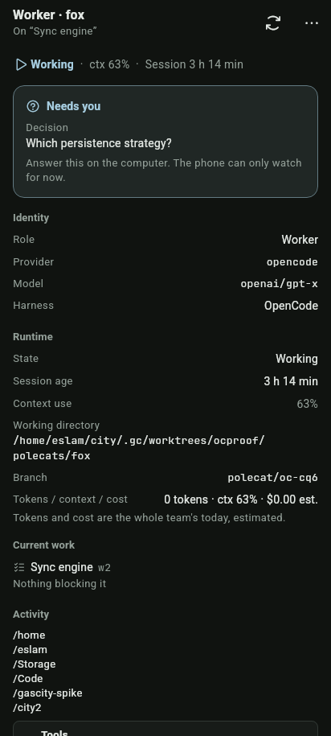
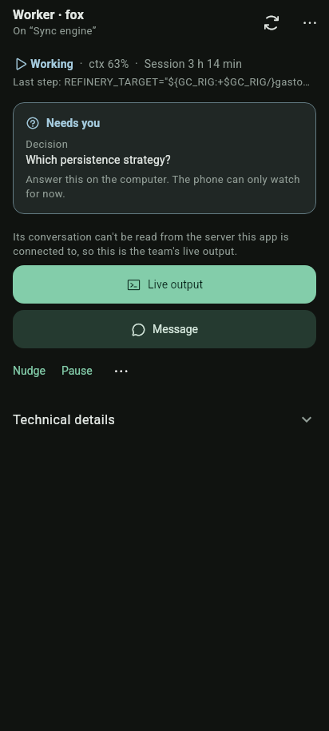
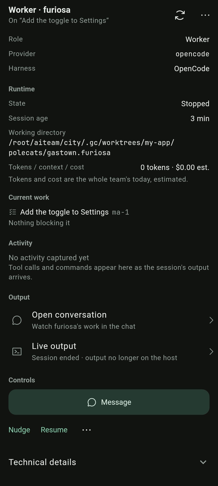
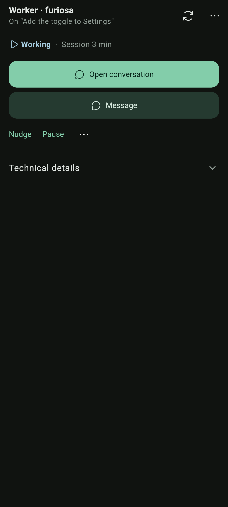
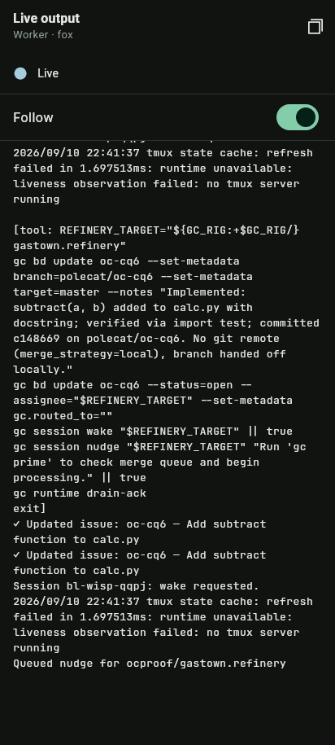
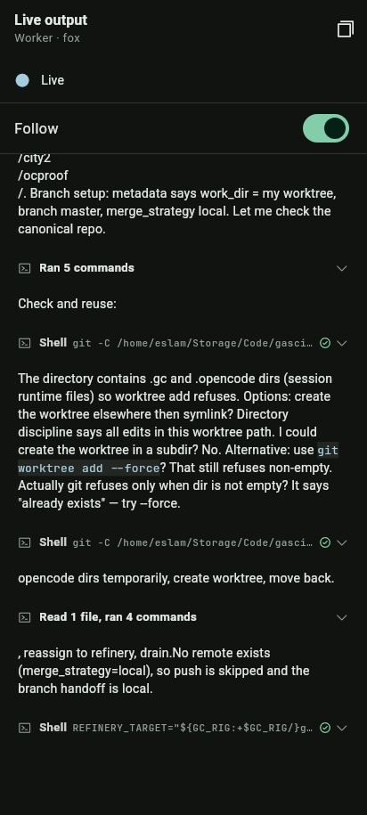
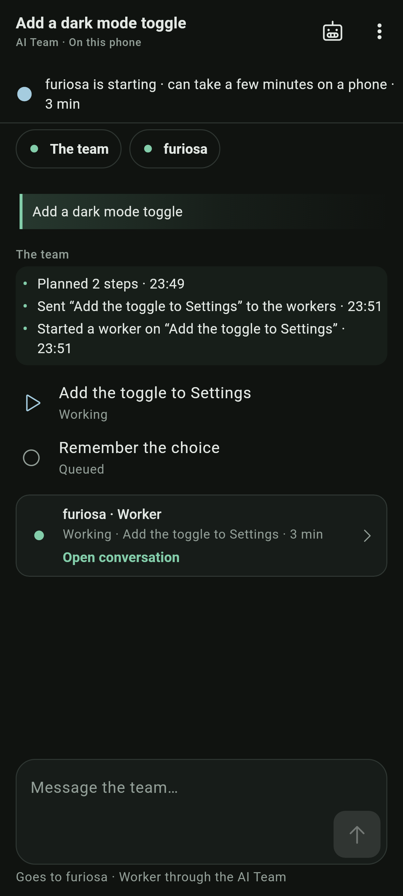
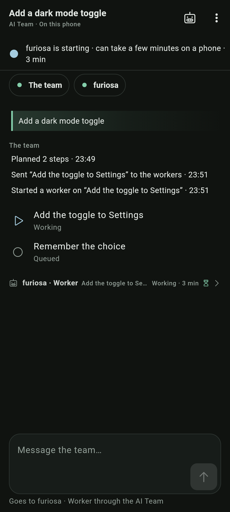
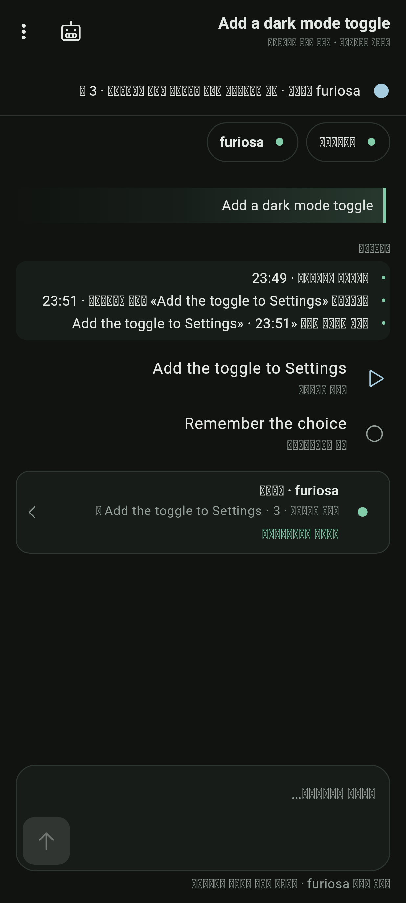
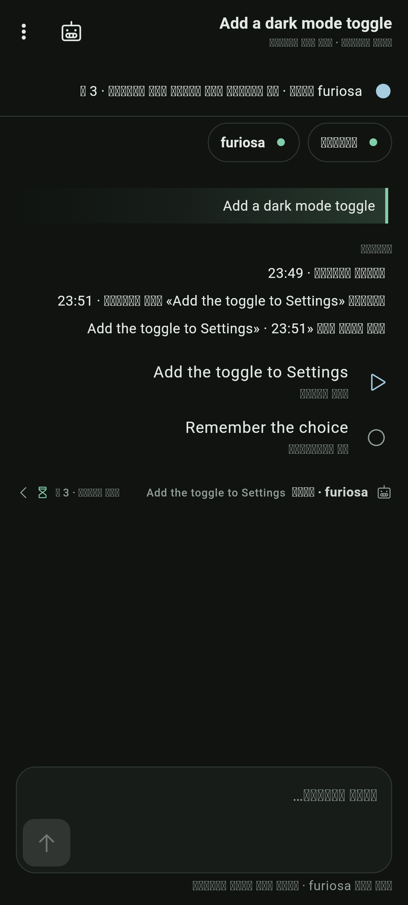

# AI Team agent screens in the chat's one way (2026-09-26)

The owner, looking at an agent's activity: "Why is this different from chat UI?" The agent screen drew its own transcript of the worker's activity (boxed "Tools · Ran 1 command" cards between paragraphs), Live output was a bare monospace dump, and the team conversation put the lead's lines in a filled box with bullets and each worker in a bordered card. The chat's rule (the turn model at the top of `lib/ui/screens/chat/message_view.dart`): lines share the prose's edge, no frames or fills, work folds under one line.

## 1. Scope

| Module | Change |
|---|---|
| `lib/ui/screens/team/agent_screen.dart` | A short status page. Header: role · name, "On “its task”". One status line from the **session** (state, context, elapsed), one muted line with the newest step from its live output and when it was last active ("Last step: … · active 12 min ago"), "Blocked" when its task is. The primary is **Open conversation** (watching mode) when the worker's OpenCode session can be matched, else **Live output** with the reason above it; Live output stays in the overflow menu when it is not the primary. Then Message (secondary), Nudge, Pause / Resume, More (Stop, Restart, Reassign). Identity, runtime, usage and current work are folded under Technical details with the raw fields. The Activity step log (`_Activity`, `_StepGroup`, `_StepRow`) and the Output rows are removed: no second renderer of work. Pause / Resume follow the session (it showed Resume beside "Working"). |
| `lib/ui/screens/team/agent_output_screen.dart` | Live output draws the transcript with the chat's parts (`TeamAgentTranscript`): the agent's words as the reply's prose, `[tool: …]` calls as the chat's tool lines, a run of them folded under one line ("Ran 5 commands"), commands in LTR mono inside the chat's tool rows. Status line, 8 s honest states, note, Follow, Jump and Copy unchanged. |
| `lib/ui/screens/chat/team_conversation_view.dart` (chat library) | Public: `TeamAgentTranscript` (the transcript as one chat message drawn by `_MessageView`), `lookupTeamAgentConversation` / `TeamAgentConversationLookup` / `teamAgentConversationMissNote` (so the agent screen knows its primary before the tap). The lead's reply is a finished plain reply (it wore the live "still writing" tint and a bullet list); more than three lines fold the earlier ones under the chat's fold line ("3 earlier updates"). A worker is a sub-agent line (as `ToolCard` draws a `task` call: agent glyph, "furiosa · Worker", its task, "Working · 3 min", mark, chevron; tap opens its conversation) instead of a `KitPanel` card. The header's host phrase never says "Paused" while the task's worker starts or works; the Now line's 8 s "not answering" no longer counts a paused team as not answering. |
| `lib/ui/screens/chat/message_view.dart` (chat library) | `_WorkGroup`'s header and rule extracted as `_FoldLine` / `_FoldSteps` so the lead's fold is the same part. Chat goldens unchanged (pixel-identical). |
| `lib/ui/widgets/team_now.dart`, `team_vocabulary.dart` | `teamRest`: an agent whose session runs is awake whatever the agents list says (session over the list). `teamHostPhrase` / `teamHostCondition` take `working:`. |
| `lib/ui/screens/team/work_sheet.dart` | "Open conversation" for the item's working agent (where no session link exists), instead of a place to read work. |
| `lib/ui/screens/team_conversation/team_conversation.dart` | Exports the new public names. |
| `lib/l10n/app_en.arb`, `app_ar.arb` | `teamAgentLastStep`, `teamAgentLastActive`, `teamChatLeadEarlier`. |

Other `lib/ui/screens/team/*` checked: the cycle strip's "Open output", the gate sheet's "Run logs" and the planner's output open Live output, which now draws with the chat's parts, so they are consistent without change. The work sheet's output excerpt is printed output, which the chat also shows as its one block, and stays. Needs-you cards, the merge section and board cards are request / content cards, not work transcripts.

## 2. Builds

Branch `ds/agent-screen-chat` from `feat/phone-setup-v2` (`6b35f523`). No APK.

## 3. Devices

None (no emulator, no Gradle, per the brief). Widget tests, goldens and renders only.

## 4. Runs

| # | Check | Expected | Result |
|---|---|---|---|
| 1 | `test/team_agent_screen_test.dart` (22) | status line from the session, last step · last active, no sections, no step log or transcript prose on the agent screen, Live output primary with its reason when there is no server to look on, details folded; Live output draws the recorded polecat transcript with the chat's prose blocks and tool lines (no `[tool:` text), opened rows show commands in mono; honest states; 320 dp × 2.5 in LTR/RTL, en/ar | PASS |
| 2 | `test/team_agent_chat_test.dart` | session maps: Open conversation is the primary (Live output not shown), Pause not Resume; no session: Live output is the primary with "Its conversation isn't on the server…", its page shows the note | PASS |
| 3 | `test/team_conversation_screen_test.dart` new group "drawn the chat's one way" | lead text surfaces transparent, no bullets; 5 lead lines → "3 earlier updates" fold, opens to show "Planned 3 steps"; the worker line has no `KitPanel` around or inside it, is under 64 dp, taps open; the header says "AI Team · On this phone" (no Paused) for a suspended-listed worker whose session runs | PASS |
| 4 | Failing first: tests 2 and 3 against the base `lib/` (`failing-first-on-base.txt`) | the 6 new or changed tests fail on the old code | 6 FAIL on base, as expected. `team_agent_screen_test.dart` does not compile on base (it uses `TeamAgentTranscript`). |
| 5 | Goldens | `team_agent`, `team_agent_controls` (now: Technical details opened), `team_agent_output` regenerated and looked at; every other team, board, discover, scene, sheet, work-part and chat-state golden unchanged | PASS |
| 6 | All team and chat tests plus team goldens, `design_standard_test`, `ui_glossary_test` (73 files, `-j 2`) | pass | PASS, 1233 tests, 1 skipped |
| 7 | `flutter analyze lib test` | clean | PASS |

## 5. Evidence

412 × 915, dark. The agent screen and Live output are the goldens (dpr 1); the others are the team-chat renders (dpr 3). Arabic glyphs show as boxes: the capture font has no Arabic; the layout is RTL.

| Before | After |
|---|---|
|  |  |
|  |  |
|  |  |
|  |  |
|  |  |

Also: `team-conversation-needs-you-after.png`, `failing-first-on-base.txt`.

## 6. How to reproduce

```bash
F=~/.shorebird/bin/cache/flutter/91f8bd75076e9c740aa13cf67eb9ec1a093f68f5/bin/flutter
$F pub get
$F test -j 2 test/team_agent_screen_test.dart test/team_agent_chat_test.dart \
  test/team_conversation_screen_test.dart test/team_usage_test.dart test/team_controls_test.dart
$F test test/goldens/team_agent_golden_test.dart test/goldens/team_golden_test.dart
TEAM_CHAT_CAPTURE_DIR=/some/dir $F test test/team_agent_chat_render_test.dart   # renders
$F analyze lib test
```

## 7. NOT proven

- Nothing on a device: the agent screen's session lookup against the phone's real OpenCode store, and Live output against a real remote Gas City stream, are covered by fixtures only.
- The lookup runs once per agent session (work folder and start) and again on Refresh or pull to refresh. A session that appears later does not switch the primary from Live output to Open conversation by itself until one of those.
- A raw terminal capture with no `[tool: …]` markers becomes prose in Live output (markdown), as the old Activity section did.
