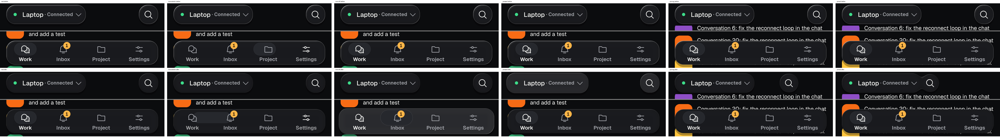
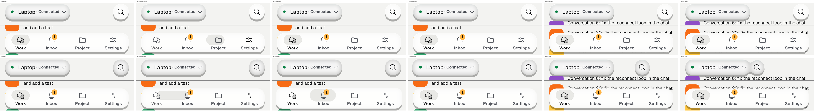
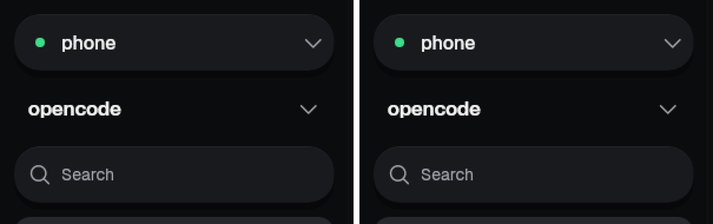
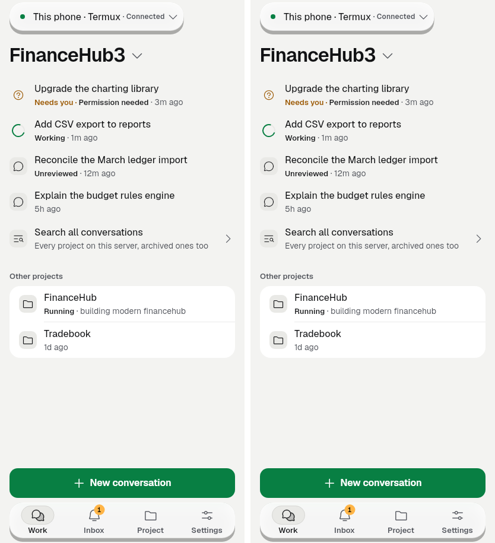

# kit-fluid-glass — the floating navigation layer moves like liquid (2026-09-28)

Unit `kit-fluid-glass`, branch `revamp/kit-fluid-glass` (worktree `oc_app-fluid-glass`),
base `0bc6651e`, merged with `feat/phone-setup-v2` at `c9504b56`.

Spec: the owner's approved **"Fluid Glass"** motion sample (artifact
`UH4zkQzgLQMHSiB4AExMyV`, visual language §6 proposal), ported to the liquid-glass
floating navigation layer only. Part spec: `docs/ux-system/kit-api/KitGlass.md`
(new), with the motion sections of `KitNav.md` and `KitTopBar.md` updated.

Finish line: the four motions of the sample run on the dock, rail and top controls
(and are ready for the composer), on `KitMotion` springs, crisp at rest, still under
reduced motion, solid with a hairline when glass is off.
Non-goal: glass anywhere else; a glass lens inside the glass bar (glass never sits on
glass); magnifying content inside the lens.

## Owner rules, and how each is met

| Rule | Where |
|---|---|
| Glass only on the floating nav layer | `KitGlass` users: `KitNav` (dock, rail), `KitTopBar` / `KitShellControls` (server pill, search), `KitComposer` (chat lane). No other `KitGlass` in `lib/ui` (checked with grep at commit time). Sheets, cards, rows and the sidebar stay solid. |
| "Very very sharp and crisp" | Content is never scaled (G21 bans `Transform.scale`; only the drawn shape moves). Press and flow controllers end exactly on their targets, and the lens rounds its edges to device pixels, so the rim is one physical pixel at rest. The liquid frost went from σ 8 to σ 5. |
| Adaptive phone / tablet / PC | compact: dock + joined top pair; medium: rail (vertical lens drag) + top pair; expanded/large: solid sidebar, its pill and search give under a finger but do not join. Galleries at all five §8.4 sizes plus 2.0 text. |
| Graphite and custom theme colours read | Galleries on Graphite light/dark plus a new `kit_glass_joined_catppuccin` shot; `test/glass_surface_test.dart` keeps the contrast floor on every theme pack (unchanged, passing). |
| Framework animation only, KitMotion tokens | `AnimationController.animateWith(SpringSimulation(...))` and one `Ticker` for the lens; eight new spring tokens in `lib/ui/kit/kit_motion.dart` (the sample's own stiffness/damping). No `flutter_animate`. |
| Reduced motion → no motion | `KitMotion.reduced`: every state instant, the lens jumps and follows a drag without lifting, no ticker runs (behaviour tests assert `transientCallbackCount == 0`). |
| Glass off → solid with hairline | `KitGlassLook.solid`: `surface2` 94 %, hairline rim, no shadow, never moves; the pair still joins as one solid outline (`kit_glass_solid_*`). |
| Hold 60 fps | "60 fps budget" test: no glass or navigation widget rebuilds during a lens spring and a held press; the shell's frames on the test host: **mean 2.34 ms, max 4.01 ms** (budget 16 ms). The shader program compiles once; motion only sets uniforms on one of two shader instances. |

## Sample → app

| Sample step | App |
|---|---|
| The tab lens stretches (lead/trail springs, lifts while dragged) | `KitNav` dock and rail: `lensLead`/`lensTrail`, `lensDragLead`/`lensDragTrail`, `lensLift`; a drag along the bar opens the destination it is let go on. |
| Glass gives when pressed | `KitGlass(respond: true)` on dock, rail, server pill, search: swells ≤ 4 dp a side, brightens (`u_glow`), `glassPress` springs back. |
| Search joins the server pill on scroll | `KitGlass.pair` in `KitShellControls` (bar): scrolled past one `minTarget` (`KitGlass.trackScroll` / `scrolledOf`), search slides next to the pill and they melt together (`glassJoin`); a new tab starts apart. |
| The composer grows as you type | `KitGlass(flow: true)`, `glassFlow`, from the bottom edge. **Call site in the chat lane, not made here** (see below). |

## Images

Before = base `0bc6651e`; after = this unit. Galleries are `flutter test` (Skia: the
frosted look); `renders/` are Impeller (`--enable-impeller`, the liquid look) from
`tool/capture/fluid_glass_test.dart`, run on the base (before) and on this unit (after).

- Before/after contact sheets (liquid, Impeller; rest, lens stretch, lens lift, pressed, joining, joined):
  - 
  - 
- Per-state renders: `renders/before/liquid-*.png`, `renders/after/liquid-*.png`.
- Galleries, before: `before/kit_nav_dock_default_{dark,light}.png`, `before/kit_nav_dock_solid_dark.png`,
  `before/kit_nav_rail_needs_you_1280x800_dark.png`, `before/kit_nav_sidebar_default_1280x800_dark.png`,
  `before/kit_top_bar_shell_connected_{dark,light}.png`.
- Galleries, after (`after/`): `kit_glass_shell_{dark,light}` (412×915), `kit_glass_shell_360x800_dark`,
  `kit_glass_shell_800x1280_dark`, `kit_glass_shell_1280x800_dark`, `kit_glass_shell_1600x1000_light`,
  `kit_glass_shell_text2_1280x800_dark`, motion samples `kit_glass_lens_stretch_dark`,
  `kit_glass_lens_lift_light`, `kit_glass_pressed_light`, `kit_glass_joining_dark`, `kit_glass_joined_dark`,
  `kit_glass_flow_dark`, glass off `kit_glass_solid_dark`, theme pack `kit_glass_joined_catppuccin_{dark,light}`.
- Sidebar header at 1280×800 before/after (pixel-doubled crop; only the rim/shadow of the now-responsive pill and search moved by a few px): 

The full gallery set is in `test/goldens/kit/kit_glass_*.png` (shell at 360×800,
412×915, 800×1280, 1280×800, 1600×1000 light/dark; 2.0 text at 412×915 and 1280×800).

## Merge with feat/phone-setup-v2

`git merge feat/phone-setup-v2` merged without textual conflicts (ratchet baseline
included). Both intents kept:

- kit-hygiene: the merge deletes `lib/ui/widgets/glass_surface.dart` and the other
  retired wrappers; this unit never touched them and nothing it adds refers to them.
- kit-polish: the sidebar width now follows text scale (`KitLayout.sidebarWidth`);
  `kit_glass_shell_text2_1280x800_*` and the four `kit_nav_sidebar_default*` goldens
  were regenerated on the merged tree (sidebar width, and the responsive glass rim).
- tests-a: the server pill's label stacks the status under the name at large text
  (a `LayoutBuilder`); inside `KitGlass.pair` the leading piece gets bounded width, so
  it works unchanged (the 2.0-text phone shots did not move).

## Fixed while finishing

A finger lifted after the glass left the screen (a page changing under a held press)
still reaches the old `Listener`, which then sprang a disposed controller — an
assertion in debug, seen in the gallery's tear-down. `_KitGlassState._pressTo` and
`_KitGlassPairState._springTo` now return when unmounted. Two regression tests in
`test/kit/kit_glass_test.dart` fail without the guard (both checked) and pass with it.

## Call-site change for the chat lane (P5.1 owns `lib/ui/kit/chat/**`)

`lib/ui/kit/chat/kit_composer.dart`, the one `KitGlass` (around line 458): add
`flow: true`. Nothing else; `KitComposer.layer` and `KitBottomInset` need no change.

## Verification

Candidate: this commit (merge of `640fe431` + `feat/phone-setup-v2@c9504b56`, plus the
finishing changes). Pinned Flutter 3.47.1 (Shorebird cache), `flutter pub get --offline`.

- `flutter analyze`: **No issues found**. `dart format --language-version=3.10`: clean.
- Gates, all passing: `test/kit_ratchet_test.dart` (incl. G21 look-in-kit),
  `test/kit/kit_manifest_test.dart` (G4), `test/redaction_test.dart`,
  `test/ui_glossary_test.dart`, `test/no_raw_error_text_test.dart`.
- Unit tests, all passing: `test/kit/kit_glass_test.dart` (20, incl. the two new
  regression tests; frame budget mean 2.34 ms / max 4.01 ms), `test/kit_glass_test.dart`,
  `test/glass_surface_test.dart`, `test/kit/kit_nav_test.dart`, `test/kit/kit_top_bar_test.dart`,
  `test/goldens/kit/kit_glass_golden_test.dart` (every shot), `test/goldens/kit/kit_nav_golden_test.dart`.
- Full suite (830 files, 16 chunks, `-j 3`, on a machine shared with other agents): the
  base `c9504b56` itself is far from green (1,409 failing tests in the files that failed
  here; e.g. G23 harness ratchet, G8x reduced-motion manifest, `home_navigation_test`,
  `kit_composer_golden_test`, `kit_screen_golden_test`, `kit_top_bar_r1_test`). The same
  files were run on a clean checkout of `c9504b56` and failures compared by test name:
  **32 tests failed here and not on the base**, all screen goldens whose only change is
  the glass (the dock, the top controls, the composer glass, the sidebar header; diff
  boxes confined to those areas). Those 32 images were regenerated
  (`test/goldens/{chat_notify,chat_permission,chat_send_error,chat_transcript_1280x800,
  shell_command_palette_open*,shell_home_shell_*,shell_shortcuts_help_open*,work_*}`,
  `test/revamp/goldens/work_workspace_*`); goldens that fail on the base too were left
  untouched. After that, the four affected files fail only tests that fail on the base.
  Example: 
- Not run: the Impeller renders were not regenerated after the merge (the merge does
  not touch the glass code; `renders/` are from the WIP commit `640fe431`).

## Follow-ups (not this unit)

- In the Impeller renders on light themes the glass shadow shows as a hard grey ledge
  under the dock and the top controls; it is identical in the before renders (the
  2026-09-25 liquid-glass look, possibly the tester's Impeller shadow), so it is not a
  fluid-glass regression. Worth checking on a phone.
- The composer `flow: true` line above.
