# slice-P0.7-port: removing This phone keeps projects by default, plus waiting prompts on the This phone card (2026-09-28)

Branch `revamp/slice-P0.7-port`, base `53c2bf2a` (`feat/phone-setup-v2`). Re-lands unit P0.7 (earlier build: `revamp/slice-P0.7`, commits `4cef9dc5`, `e14c17ed`, `0223a671`, record `docs/qa/revamp-slice-P0.7-2026-09-27/` on that branch) on the current "This phone" pages, and adds the slice-queue-move hand-off to the This phone card.

## 1. Feasibility (gate: can projects be kept when This phone is removed?)

**Yes, in the normal layout.** Read `lib/builtin/builtin_linux.dart`, `lib/builtin/builtin_folders.dart` and [codex-p07n](../codex-p07n-2026-09-27/README.md) (commit `70d3f813`, an ancestor of this base):

- Projects live at `<filesDir>/projects`, outside the Ubuntu rootfs, bound into proot as `/root/projects`. The first run after the update renames the old `rootfs/root/projects` there (one atomic rename, no copy).
- `BuiltinLinux.uninstall()` equals `remove()`: it deletes Ubuntu, tools, runtime settings, logs and the download archive, and keeps `<filesDir>/projects`. Setup mounts the kept folder again before it starts OpenCode, and `BuiltinFolders.list('/root/projects')` lists it even while Ubuntu is gone.
- Deleting projects needs `remove(alsoDeleteProjects: true, confirmationName: 'OpenCode')`. Dart and native code both check the name.
- `projectStorage()` measures both choices afresh: `keepProjectsFreedBytes` (runtime) and `deleteEverythingFreedBytes` (runtime plus projects). A reading that fails throws; it never returns 0.

So the "Export projects first" fallback is not needed and was not built (AGENTS rule 2: no workaround when the contract holds). What is left: if the two project locations both hold data, or a parent folder is a link, native code refuses to remove anything. The question stays open with the kit's plain "did not finish" notice and Try again. Nothing is lost, but the only way forward is outside the app. An export or recovery flow for that case is future work.

Clearing the app's data or uninstalling the app still deletes the projects, because they are in app-private storage. No sheet says otherwise.

## 2. What was already on the base, and what this slice changed

P1.3 and P1.5 had already carried most of P0.7 into `phone_server_card.dart`: the keep-my-projects default, the kept/lost lines and the typed-name Delete everything. This slice ports what was still missing:

| Acceptance / rule | Before (base) | After |
|---|---|---|
| Copy names the size freed **in each choice** | Only the default said a size ("700.0 MB comes back"). The "Delete everything" alternative said none until the second question. | The alternative reads "Delete everything, freeing about 1.9 GB…". Without a reading it says "Delete everything…", never "0 B". Both bodies say "freeing about {size}", because the codex contract calls the figure an estimate. |
| Deletion never loses data silently | The keep question said queued prompts move to Saved prompts. The Delete everything question did not, although that path keeps them too. | Both questions have the "N queued prompts move to Saved prompts" line. |
| Failed removal (DATA-14) | The card and This phone page stayed on "Removing…" after a failed attempt while the question was open with Try again. | `onRemovingChanged(bool)` is true only while an attempt runs. |
| Stale "everything is deleted" copy | `phoneServerCardRemoveBody`, `phoneServerCardRemoveBodyUnmeasured` and `builtinServerRemoveBody` still said every project goes. They were unused after the old page was deleted. | Deleted, together with the Arabic leftovers `builtinServerRemoveTitle`, `builtinServerRemove` and `phoneServerCardRemoveOpenCode`. |
| Reuse | The flow was private to the card. | Public `confirmPhoneRuntimeRemoval()` returns `PhoneRuntimeRemoval`. The This phone card, the This phone page ("Remove OpenCode") and the switcher (via `runPhoneServerAction`) all use it. |

**Hand-off (slice-queue-move on the This phone card).** `PhoneServerCard` in both shapes (the panel in the switcher, `.row` on Servers) now reads the queue the way a Servers row does. It shows nothing while the phone is the server in use or the view is isolated.
- The row's line starts with "3 prompts waiting to send · " in the strong label weight. The line may take 2 lines so the version stays readable.
- The menu has "Move 3 waiting prompts to Laptop" when a connected server can take them. It opens the same `showQueuedPromptMoveSheet`, through the new `PhoneServerAction.moveQueued`, so the switcher path works too.
- A partial Undo problem is shown as a kit alert in plain words, with the technical text only under Details.
- The card listens to the connection and redraws only when the count or the destination changes.

Files: `lib/ui/widgets/phone_server_card.dart`, `lib/ui/screens/this_phone_screen.dart` (busy flag only), `lib/l10n/app_en.arb` and `app_ar.arb` (deleted keys), regenerated `app_localizations*.dart`, the two new test files, 10 new goldens, and `test/phone_server_card_test.dart` (one literal updated to the new body copy).

New strings: `removeFromPhoneDeleteAllChoice`, `removeFromPhoneDeleteAllChoiceSize`, `phoneServerCardErrorDetail`. Changed strings: `removeFromPhoneKeepBody`, `removeFromPhoneDeleteBody` ("freeing about").

No new kit parts. No chat, team, setup or kit press files were touched.

## 3. Tests

New files. Each was run once against the change; the base comparison was run in a temporary detached worktree of `53c2bf2a` with the new test files copied in:

| Test (`--plain-name`) | This branch | Base |
|---|---|---|
| `test/phone_server_remove_keep_projects_test.dart` "the default keeps projects and names what each choice frees" | pass | **fail** (alternative names no size) |
| … "Delete everything needs the exact app name typed" | pass | pass (guard) |
| … "cancelling Delete everything removes nothing" | pass | pass (guard) |
| … "an unmeasured phone leaves the figures out, never 0 B" | pass | **fail** |
| … "a slow measurement opens the question without figures" | pass | pass (guard) |
| … "empty projects are kept without a 0 B figure" | pass | pass (guard) |
| … "queued prompts are said to be kept on both paths" | pass | **fail** |
| … "a failed removal keeps the question open and the entry" (no raw error, card not stuck on Removing) | pass | **fail** |
| … 8 goldens (keep and delete questions, 412x915 and 1280x800, dark and light) | pass | n/a (new API) |
| `test/phone_server_card_queued_prompts_test.dart`: count + move opens the sheet; row shape; no destination; connected to This phone; live update | pass | 4 of 5 **fail** (connected-to-phone guard passes) |
| … 2 goldens (card with menu open, phone and wide, dark) | pass | differ (the before images below) |

Existing affected tests and gates: see §5 (run log).

## 4. Images

| | Before (base) | After |
|---|---|---|
| Remove question from the This phone page (screen-phone-1 golden) | 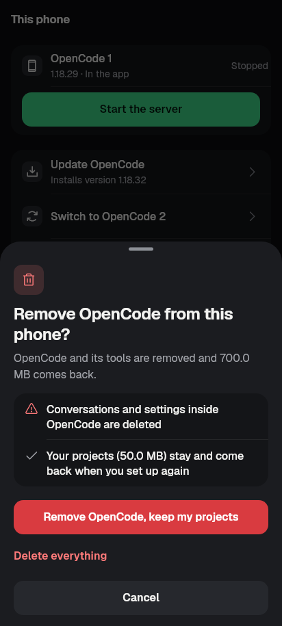 | 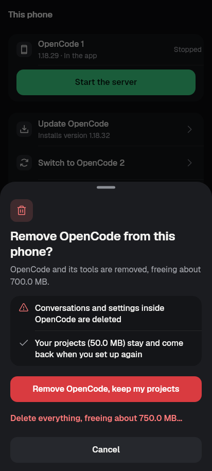 |
| Remove question from the card, phone | 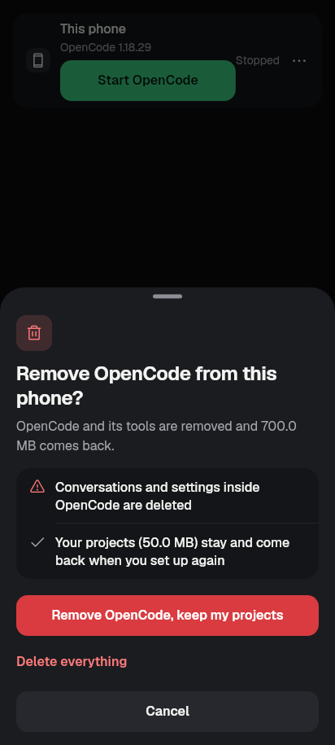 | 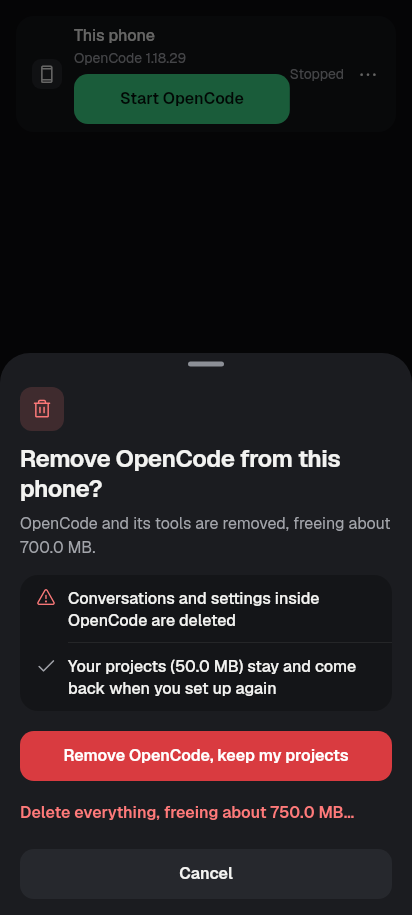 |
| Remove question, wide | 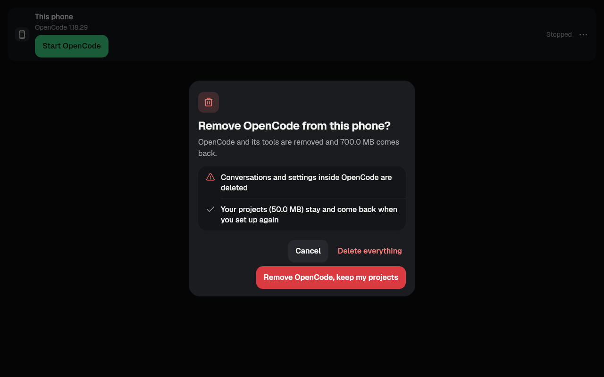 | 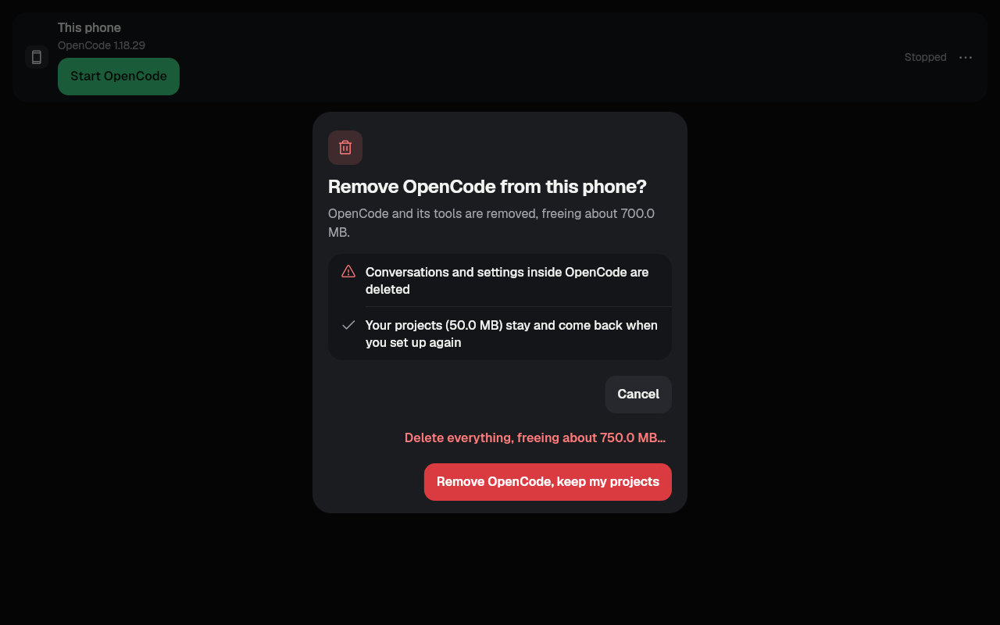 |
| With 2 queued prompts, wide light | none | 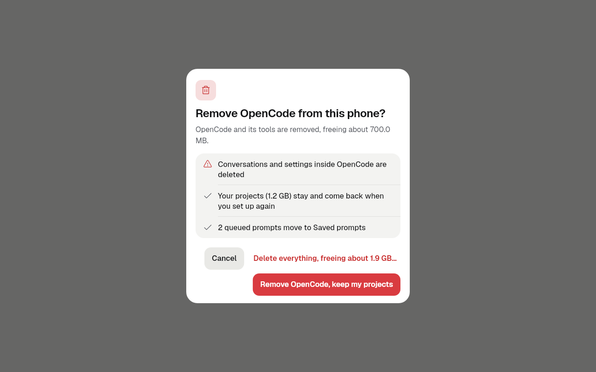 |
| Delete everything (typed name), phone | none (it named no queued prompts) | 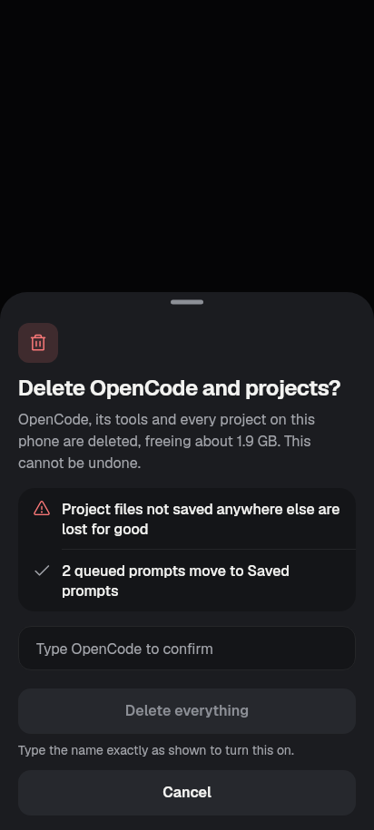 |
| This phone card, 3 waiting prompts, menu open, phone | 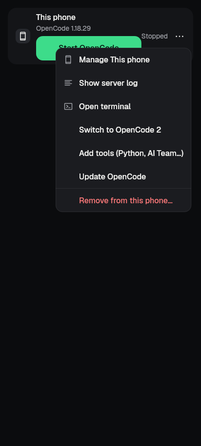 | 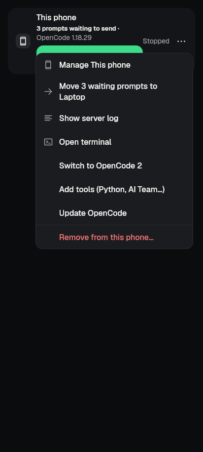 |
| Same, wide | 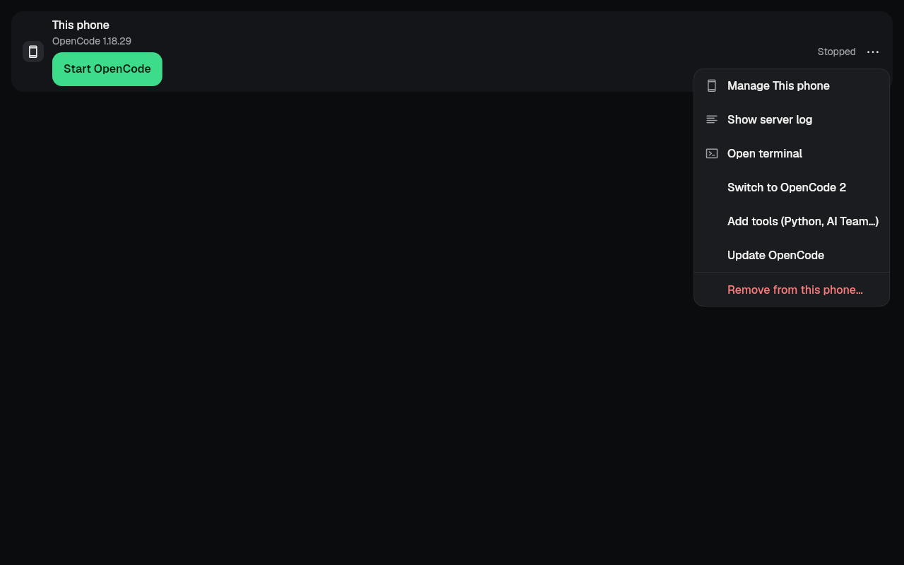 | 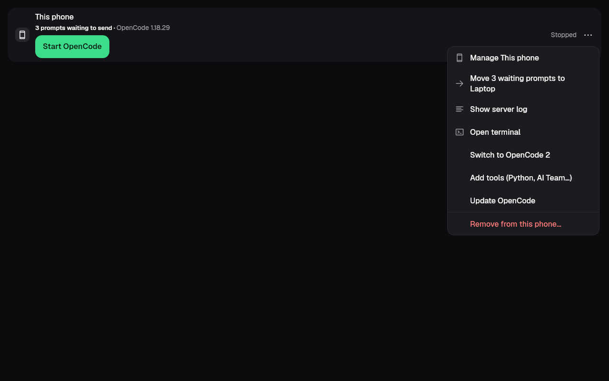 |

## 5. Run log

All commands used the pinned Flutter 3.47.1 through `tool/qa/machine_lock.sh` and ran serially (`-j 1`) on affected files only.

| # | Command | Result |
|---|---|---|
| 1 | `flutter test test/phone_server_remove_keep_projects_test.dart` (8 behaviour tests + 8 goldens) | 16 passed |
| 2 | `flutter test test/phone_server_card_queued_prompts_test.dart` (5 behaviour tests + 2 goldens) | 7 passed |
| 3 | Gates `kit_ratchet`, `redaction`, `ui_glossary`, `no_raw_error_text`, `kit/kit_manifest`, `kit/kit_draft_manifest`, plus `phone_server_card_test`, `this_phone_component_removal_test`, `revamp/shared_phone_1_test` and `this_phone_screen_test` | 176 passed, 1 failed: `this_phone_screen_test` "the first Start asks once to keep the server running (P6.7)", which **also fails on base `53c2bf2a`** |
| 4 | `revamp/screen_phone_1_golden_test`, `revamp/shared_phone_1_golden_test` and `this_phone_screen_test` on base and on this branch (`-r expanded`, failing-name lists compared) | base 29 failures, branch 31. The only new ones are "this phone remove question (dark\|light)", expected (new copy), and regenerated after looking. The other 29 are pre-existing (setup start, team sheets, P6.7). |
| 5 | Both new test files against base lib (temporary detached worktree of `53c2bf2a`) | 8 of 13 behaviour tests fail with assertions. The 5 that pass guard behaviour that was already right (see §3). |
| 6 | `flutter analyze lib` + the 3 changed or new test files | No issues found |

## 6. Still needs a device (the unit's `proof`)

On an emulator with a release APK built from the merged branch (not done here: unit agents do not build APKs):
1. Set up This phone. Ask OpenCode to create `/root/projects/p07-proof/README.md`.
2. Servers → This phone ⋯ → "Remove from this phone…". Check that the body names the size, the kept line names the projects' size, and the alternative names the larger figure. Choose "Remove OpenCode, keep my projects".
3. `adb shell run-as <app id> ls files/projects` shows `p07-proof`.
4. Set up This phone again. The folder browser and new-conversation project list show `p07-proof`.
5. ⋯ → Remove → "Delete everything, freeing about …". Confirm stays off until `OpenCode` is typed exactly. Afterwards `files/projects` is gone.
6. Queue a prompt for This phone while it is stopped and a computer server is connected. The card line says "1 prompt waiting to send", and ⋯ → "Move 1 waiting prompt to <server>" moves it.

Not proven: native bind and migration on Android (codex host harness only); a measurement slower than 3 s on a real phone; the conflicting-layout refusal described in §1.

## State

| State | |
|---|---|
| Implemented | yes |
| Enabled | yes (This phone card, This phone page, switcher) |
| Verified | tests and goldens only |
| Committed | yes (this branch) |
| Deployed / released | no |
