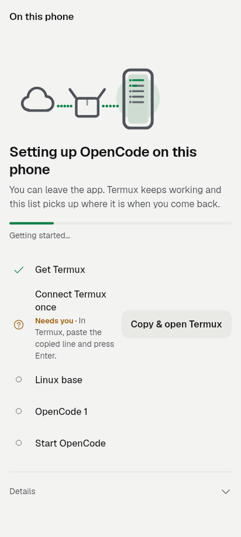
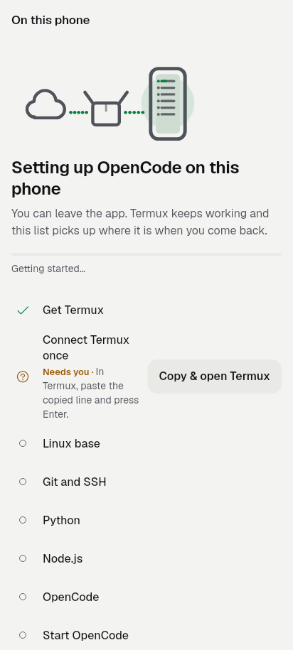
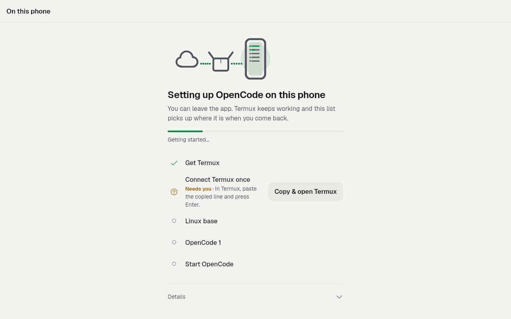
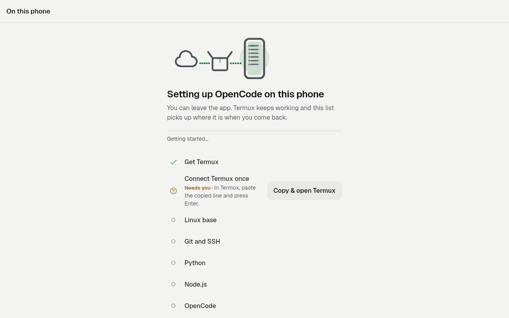
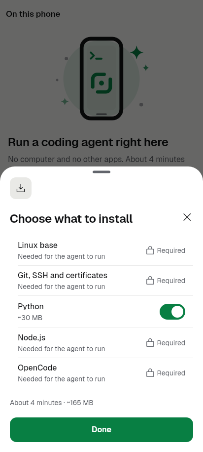
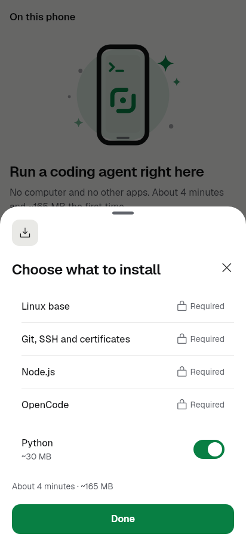
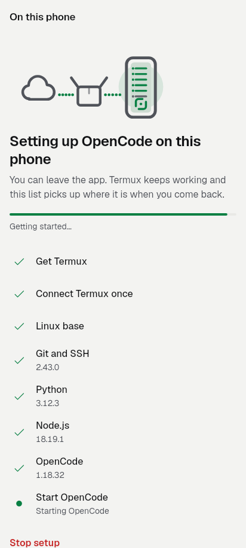
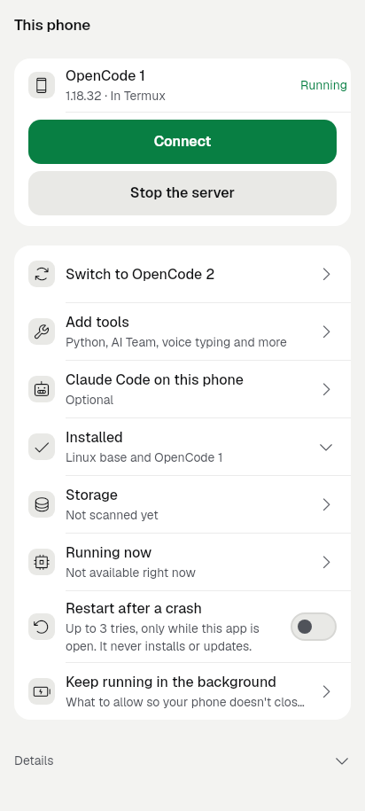

# slice-P1.2 — Termux is a v2 host

Date: 2026-09-27. Branch `revamp/slice-P1.2`, base `9dfdb414`
(feat/phone-setup-v2 with Codex X12 merged).

Finish line: "Use Termux instead" runs the same v2 job as the in-app setup
with `host=termux`. The person steps are rows, the components run through the
Termux bridge, a failure is a failed row with resume, and success is
phone-setup-ready.
Non-goal: deleting the old wizard (P1.3). Update, switch and start on This
phone still go through the Termux manager (`PhoneSetupTermuxScreen`).

Builds on [X12](../codex-x12-2026-09-27/README.md), which added the durable
native Termux host. The earlier blocker is in
[P12](../codex-p12-2026-09-27/README.md).

## What changed, per page

**Phone setup, "Use Termux instead"** (`phone_setup_start_screen.dart`
`_useTermux`, and This phone's "Set up" for Termux). This now opens
`PhoneSetupTermuxJobScreen` (new), which uses the v2 engine
(`PhoneSetup.termux`, `ChannelSetupEngine.termux`) instead of the old
manager path. The start screen passes its Customize selection along.
- "Get Termux" and "Connect Termux once" lead the list as person rows. They
  are checked again whenever the app comes back from the download page,
  Settings or Termux.
- After that, the chosen components run in Termux's Ubuntu: the same
  catalogue, the same check-before-install and the same `SetupProgressView`
  as the in-app setup.
- The OpenCode that Termux already records (`~/.oc/runtime`) is kept, so a
  job never installs the other generation next to it.
- A job that Termux kept running while the app was gone is followed and never
  started twice. A job that stopped part way (app or Termux killed) shows
  Continue setup, which runs the same components again. The checks skip what
  already finished, and the job keeps its own params.
- A first setup ends on "name your first project" for the Termux host. The
  ready screen makes the folder in Termux's Ubuntu (`TermuxSetupHost`) and
  reconnects to the Termux profile.

**The job's last step on Termux** (`lib/builtin/setup/termux_setup_finish.dart`,
new; wired in `main.dart` through `PhoneSetup.attach(termuxFinisher:)`):
1. Takes back the password Termux already holds, or creates the Termux
   profile with a new password.
2. Gives the manager the runtime and the password (a mode-600 file). It
   refuses when Termux serves the other OpenCode or a switch is pending.
3. Restarts through `~/.oc/manager.sh`, waits for that restart's result, and
   connects.

It returns null only once the app is connected. A server that already runs
the right OpenCode, with the app connected to it, is left alone.

**Existing Termux install recognised as done** (`components.dart`,
`setupComponents(host:)`). On the Termux host, the Node check accepts the Node
that older builds installed from Ubuntu's packages, as long as it and npm run.
The Linux, essentials and OpenCode checks already pass on such an install. The
result: every component is skipped, and only "Start OpenCode" runs.

**This phone (Termux), "Add tools"**. This was a separate sheet that listed
only Claude Code, and the AI Team block when the server was running. It is now
the same v2 Customize sheet as the in-app host, fed by the Termux engine, so
Python, AI Team and voice typing are listed. What Termux already has shows as
Installed. The chosen tools run as a Termux v2 "Adding …" job, which returns
to This phone when it is done.
- Claude Code keeps its own row on This phone ("Claude Code on this phone").
- The AI Team's per-project run stays reachable from the AI Team sheet
  (`TeamPhoneSection`), which already sends "not installed" back to This
  phone.
- The subtitle is now "Python, AI Team, voice typing and more" for both hosts.
  It used to name Node.js, which is required and cannot be added.

**Customize sheet ("Choose what to install")**, as asked by the coordinator:
- The required rows come first, in their own group.
- Each required row shows only its lock and "Required". The repeated fallback
  "Needed for the agent to run" is gone, and that string is deleted.
- A component's own reason still shows where it has one. Optional tools follow
  in a second group, with their sizes. The totals line is unchanged.

**Voice typing on Termux.** The app-side component already works through the
engine's app-step path. A test shows it installing after the start and being
acknowledged to the Termux job.

Copy: added `phoneSetupTermuxOtherRuntime`. Renamed `thisPhoneAddToolsInApp`
to `thisPhoneAddToolsDetail`. Deleted `phoneSetupStartRequiredWhy` (en and ar)
and `thisPhoneAddToolsTermux`. Ran gen-l10n.

## Images

| | Before | After |
|---|---|---|
| Termux setup, allow step (phone) |  |  |
| Termux setup, allow step (1280x800) |  |  |
| Termux "Add tools" |  |  |
| Customize, first setup |  |  |
| Existing Termux install recognised as done | — |  |
| This phone in Termux | — |  |

"Before" images were rendered from base `9dfdb414` with a temporary golden
test in a throwaway worktree. "After" images come from
`test/revamp/termux_v2_host_golden_test.dart` and the updated
`screen_phone_1` goldens (customize ×3, this phone running ×3).

## Tests

These tests are new and all pass:
- `test/termux_setup_finish_test.dart` (8): fresh install, reusing Termux's
  password, a connected server left alone, restart after a new OpenCode, the
  other runtime refused, restart and connect failures, an in-app job refused,
  and the staging script.
- `test/setup_termux_existing_install_test.dart` (3): the Termux Node check,
  an existing install being all skipped with only the start run, and voice
  typing on the Termux host.
- `test/phone_setup_termux_job_screen_test.dart` (8): person steps and the
  re-check on resume, Allow and then the job, keeping Termux's runtime,
  following a running job, Continue after an interruption, the hand-over to
  ready, a stale "done", and Add tools.
- `test/revamp/termux_v2_host_golden_test.dart` (5 goldens).

Existing files run once:
- These pass: X12's `setup_termux_resume`, `setup_termux_host` and
  `setup_finish_host` tests, `setup_engine`, `termux_setup_bridge`,
  `phone_setup_termux_screen`, `phone_setup_notification_route`,
  `phone_setup_voice_item`, `design_standard`, `design_standard_setup`,
  `desktop_platform_gating`, `phone_termux_discovery` and
  `revamp/screen_phone_1`.
- `phone_setup_start_screen_test.dart` was updated. The customize test now
  checks "Required" once per row, no fallback line, and required rows before
  optional ones. The Termux route expects the v2 screen, and the harness fakes
  `PhoneSetup.termux`.
- The failures that remain also fail on base `9dfdb414`. They were compared in
  a separate worktree and are not caused by this slice:
  - `kit_ratchet_test` G17 and G21. Other files: integration_tiles,
    quota_monitor, kit_task_card and others.
  - `phone_setup_start_screen_test`: three tests. Fits 320 dp ×2 and "the
    entrance eases in".
  - `this_phone_screen_test`: "Update is not offered…".
  - `phone_setup_ready_screen_test`: two tests. A `TextFormField` cast in the
    test.
  - `revamp/screen_phone_1_golden_test`: the same 42 stale goldens as on base.
    Only the customize and this-phone-running images this slice changes were
    regenerated.
- `flutter analyze`: clean.
- Android: `./gradlew :app:compileReleaseKotlin` gave BUILD SUCCESSFUL
  (2 min 4 s). This compiles X12's `TermuxSetupRunner.kt`,
  `TermuxSetupShell.kt` and `MainActivity.kt` dispatch into the release app.
  This slice made no Kotlin changes.

## Still needs a device

None of this ran on a phone or an emulator. These need an emulator with
Termux sideloaded:
- A full v2 run on Termux.
- Force-stopping the app mid-install, then restoring and continuing.
- Killing Termux mid-install; the job should come back "interrupted" and
  Continue.
- The manager restart and connect after a fresh v2 install, including the
  staged password.
- A phone the old wizard set up. Checks should skip everything and only the
  start should run.
- Voice typing downloading during a Termux job.

X12's limits still apply: no raw log tail on this host, and manual recovery
of a damaged Ubuntu extraction.

Known follow-ups (not in this slice):
- The start screen's hero does not yet read the Termux engine, so a Termux job
  that is running or stopped shows only after "Use Termux instead".
- This phone's "Installed" list for Termux still names only Linux and
  OpenCode.
- Update, switch and start on Termux still use the old manager screen (P1.3).

State: implemented and unit/widget-verified, committed on
`revamp/slice-P1.2`. Not device-verified, pushed or released.
