# slice-P1.7: AI Team on the phone through v2

Date: 2026-09-27. Branch `revamp/slice-P1.7`, base `c024b0dd`, with
feat/phone-setup-v2 merged in at `5b66961d` (P8.4, P3.9).

**Finish line.** The team page's "On this phone" opens Add tools › AI Team.
That runs as the v2 `aiteam` component on either host, the app's own
Linux or Termux. A ready page follows. It turns the team on for the
project and ends with "Give the team a first task".

**Non-goal.** No team page redesign (P3.4).

Prerequisites checked from the source (AGENTS rule 2):
- Termux is a v2 host (P1.2, X12).
- The `aiteam` component is in the registry for both hosts.
- `aiteam.sh` in Termux sees the programs the v2 job installs. Both use
  `/opt/aiteam` in the same Ubuntu, and `programs_installed` checks that
  path.
- `aiteam.sh install` downloads nothing when the programs are at the pinned
  versions. It only records them.

The Dolt pin (2.3.5) and the other pins are unchanged.

## What changed, per page

**Team intro, the team page while the team is off**
(`team_intro_screen.dart`)
- "Set up AI Team on this phone" is now the same flow on both phone hosts
  (`openTeamOnThisPhone`):
  1. Add tools opens with AI Team switched on, on the connected server's
     host.
  2. The job runs as a v2 job. The in-app host uses its progress screen.
     Termux uses its job screen, with the person steps.
  3. The ready page follows.
- It no longer pushes `/this-phone` or the Termux wizard, and no longer
  reopens the old `PhoneOffer`. The in-app host no longer takes a detour
  through Plugins.
- A phone that cannot run a team is now told why by phone setup's own
  pre-flight: CPU ABI, total memory, and free space for the team's
  download. It is never hidden. It gets the pre-flight headline and
  sentence ("this one reports armeabi-v7a") and "Run it on a computer".
  The old notice spoke of "an app build that carries the team's programs"
  and read the removed manifest concept.
- The download size on Termux now comes from `AiTeamPins`, not a manifest.
- "You choose the projects" now shows on both hosts.

**New conversation › Team** (`team_discover.dart`). `teamPossibleOn` no
longer hides Team on a Termux profile. Team opens the intro, whose
pre-flight gives the reason. The old `TeamDiscoverEntry` hide at lines
186–190 had already become this function. `teamTermuxSupported` is
removed.

**Ready page (new, `TeamPhoneReadyScreen`)**
(`lib/ui/widgets/team_phone_onboarding.dart`). This is phone-setup-ready's
team moment (map: `team-phone-onboarding-success`). It uses the same
`PhoneSetupHero` and has a close-only top bar.
- **Turning on.** Four stages, with a mark and time for each, shared with
  Plugins' section (`builtinTeamStageRows`). In-app, the stages come from
  `BuiltinTeam.turnOn` as `BuiltinTeamJob.shared`. On Termux they are
  `install` (records the programs), `init <project>`, `start`, then the
  profile gets the phone config. Leaving the page does not stop the job;
  coming back follows it.
- **No project open.** It asks for one through Work's folder sheet
  (`ProjectFolderActions.openFolder`, map: project-sheet →
  workspace-folder-chooser).
- **Failed.** It gives the reason in words: the Termux reason copy, or the
  in-app script failure. The raw output is folded. The one retry is "Turn
  on AI Team for {project}", and "Report this failure" (P8.4) sits under
  it.
- **Ready.** "AI team is running on this phone" and "Give the team a first
  task". That opens the task sheet (`TeamConversation.start`), and the task
  lands in its conversation. The page closes once a task was given.

**Team page** (`team_home_screen.dart`, one header line). When Android
stopped the phone's Termux team, the page says so and offers "Start the
team again" (`TeamPhoneKilledNotice`, map: `team-phone-onboarding-killed`
merged into the team page). The in-app team restarts by itself, so it gets
no line.

**Plugins › AI Team › On this phone (Termux)** (`team_phone_section.dart`).
The "Open phone setup" act, which led to This phone, is now "Set up AI Team
on this phone" and runs the same flow. Before, a team that was installed
but had no city was a dead end: This phone listed AI Team as installed and
nothing created the city.

**Plugins, in-app section** (`builtin_team_section.dart`). "Add AI Team"
runs the same flow. The stage rows are extracted and shared, and
`sharedBuiltinTeam` is exposed, so one turn-on runs at a time.

**This phone** (`this_phone_screen.dart`). "Installed" now reads the host's
own engine on both hosts. It lists what every setup installs plus the
optional tools the host's checks find (Python, AI Team, voice typing).
Before, Termux always said "Linux base and OpenCode 1".

**Phone setup start screen** (`phone_setup_start_screen.dart`). The hero
now also reads the Termux engine. A Termux job that is running or stopped
part way leads with "Setup in Termux is N% done" and its bar. "Continue
setup" opens the Termux job screen with `resume: true`, which continues a
stopped job at once. The Termux read never holds the screen: it arrives
after the in-app job is read.

**Setup progress, "Report this failure"** (coordinator's extra item, P8.4)
(`setup_progress_view.dart`).
- A failed row carries `KitStep.report`. That is `failedJobReportAction`,
  which captures `FailedJobReport.setup(widget.progress, componentId:)` at
  the tap.
- A job that failed between components has no failed row. For that case
  the whole-job report is the log panel's header action.

**Removed.** The orphaned `TeamPhoneOnboardingBlock`, which nothing in
`lib` used, along with its five-step model and the project sheet. Its
steps, success and failure now come from v2's progress and the ready page.

**Copy.**
- Added:
  - `teamPhoneReadyChooseTitle`
  - `teamPhoneReadyTurningOnTitle`
  - `teamPhoneReadyFailedTitle`
  - `teamPhoneReadyBody`
  - `teamPhoneReadyFirstTask`
  - `phoneSetupStartTermuxProgressHeadline`
- Deleted 25 strings this slice made unused (en and ar):
  - the old block: `teamUiPhoneOffer*`, `Skip`, `SetUp`, `Step*`,
    `LeaveNote`, `ProjectLine`, `ChooseProjectBody`, `NoProjects`,
    `NewFolderLabel`, `CreateAndContinue`, `SetupRunning`, `AgentsReady`,
    `OpenWorkspace`, `FailedTitle`, `StartAgain`
  - `teamUiPhoneOpenSetup`
  - `teamDiscoverUnsupportedTitle` and `teamDiscoverUnsupportedBody`
- Ran gen-l10n.
- G28 glossary findings are unchanged from the base.

Kotlin was not touched, so no gradle compile was needed.

## Images

"Before" images were rendered at `5b66961d` with a temporary copy of the
golden test in a throwaway worktree. "After" images come from
`test/revamp/team_phone_v2_golden_test.dart`.

| | Before | After |
|---|---|---|
| Intro, Termux phone | 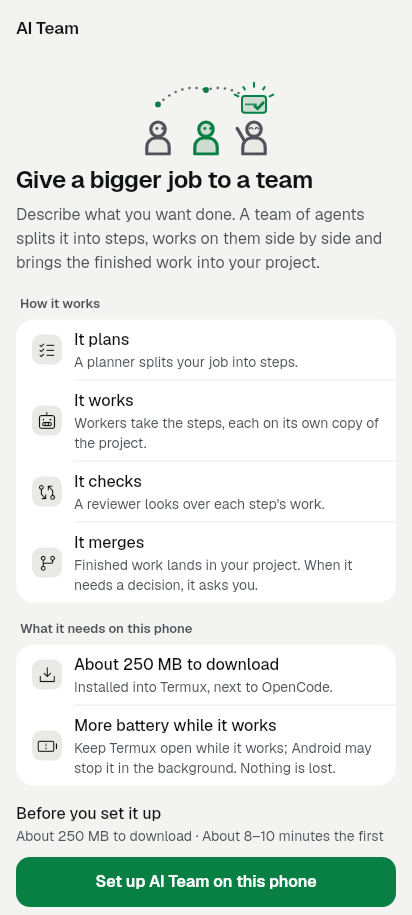 | 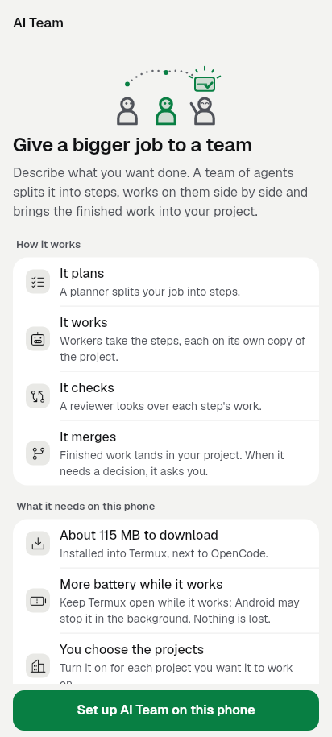 |
| Intro, Termux phone (1280x800) | 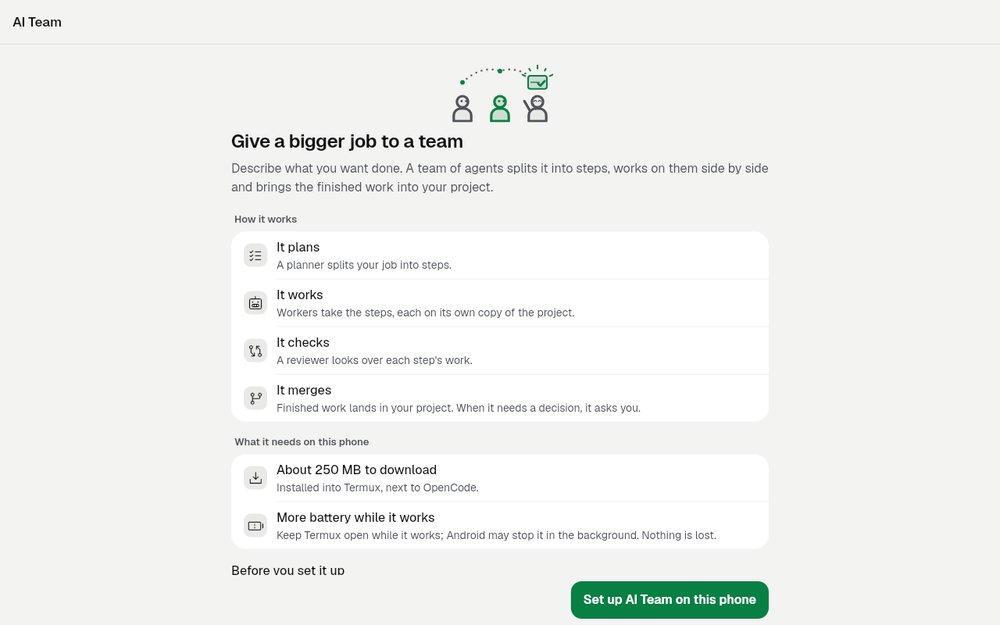 | 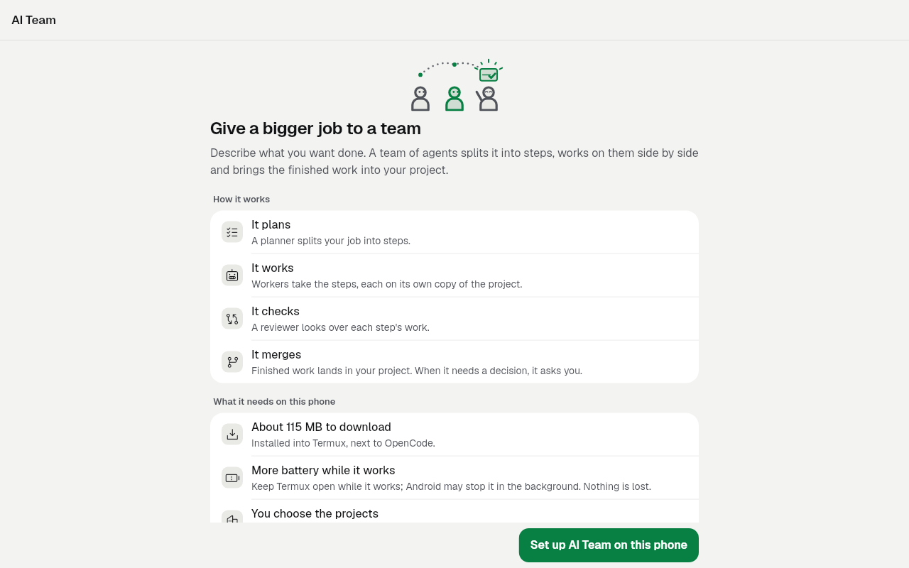 |
| Intro, a 32-bit phone | 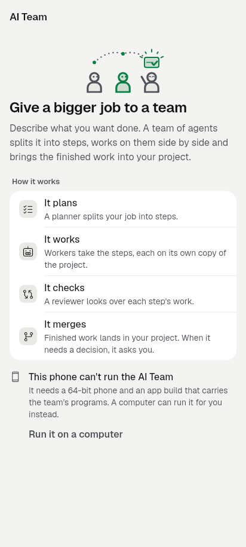 | 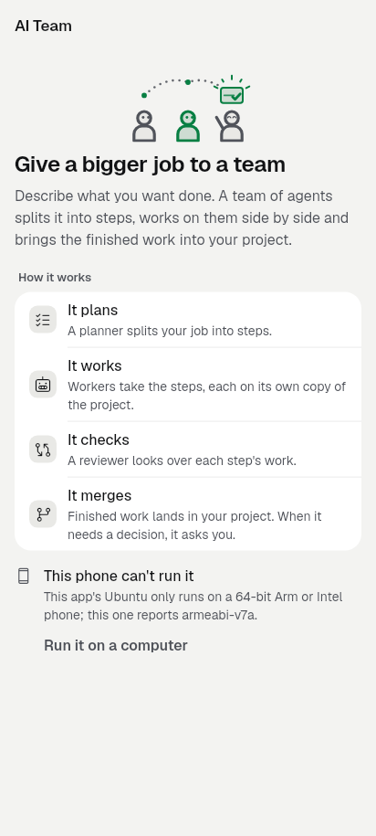 |
| This phone (Termux), Installed | 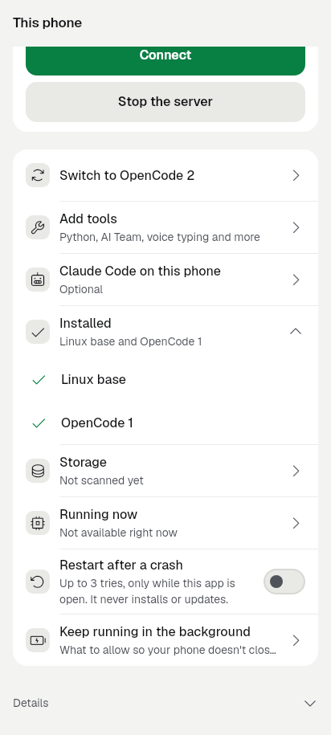 | 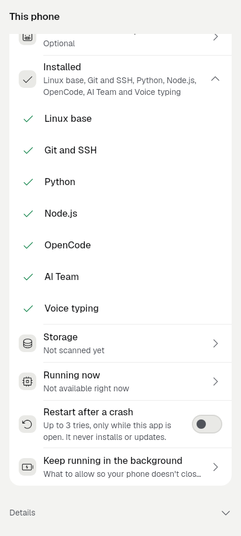 |
| Start screen, Termux job stopped | 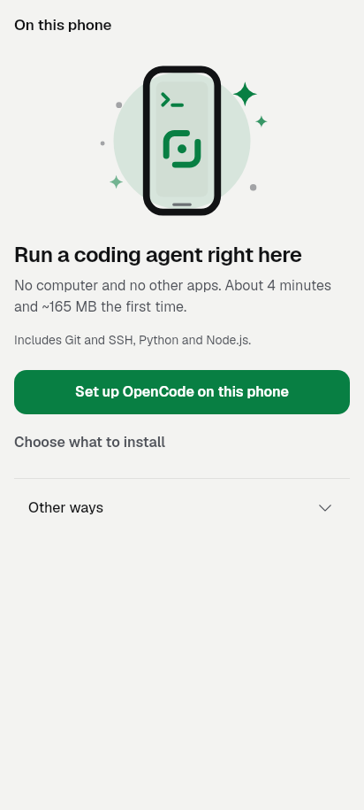 | 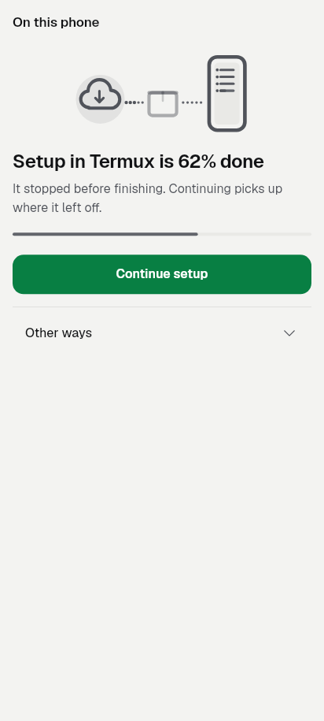 |
| Start screen, Termux job (1280x800) | 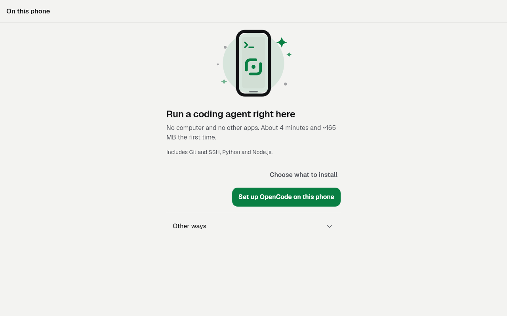 | 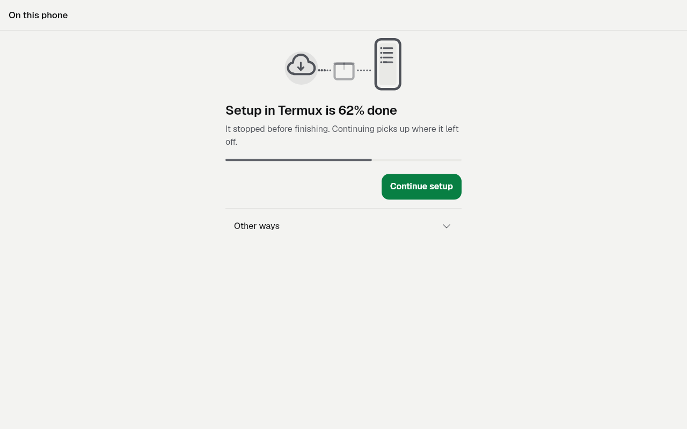 |
| Failed setup row | 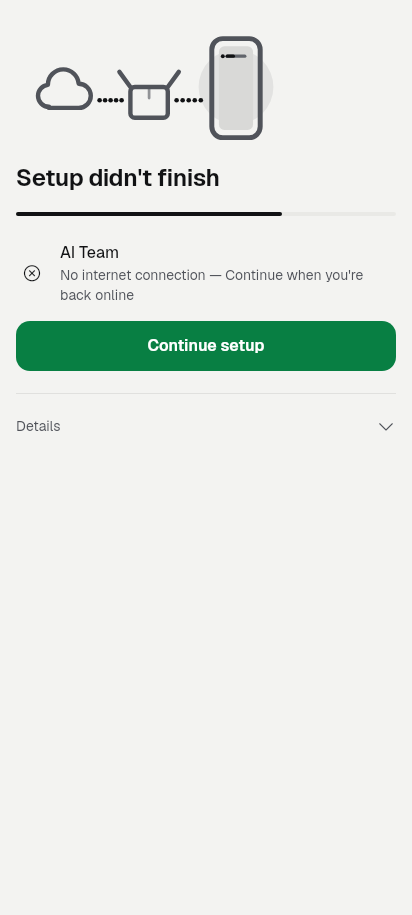 | 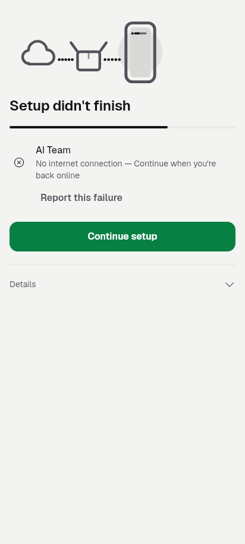 |
| Ready page, turning on | — | 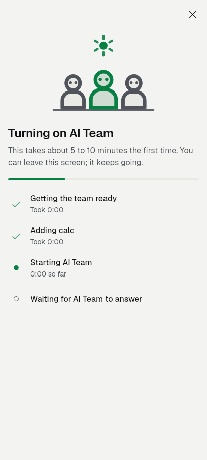 |
| Ready page, turning on (1280x800) | — | 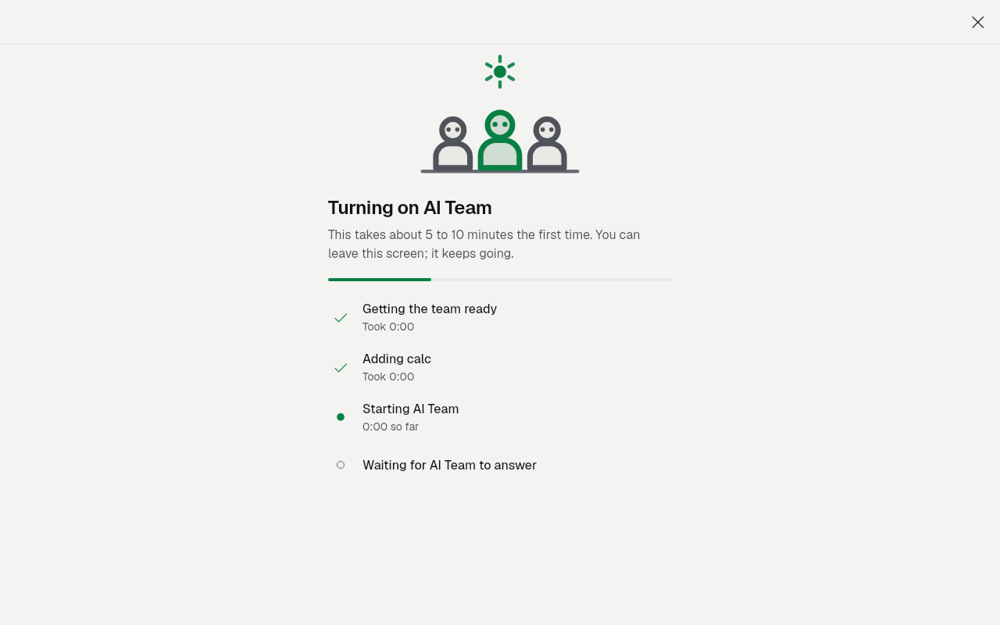 |
| Ready page, ready | — | 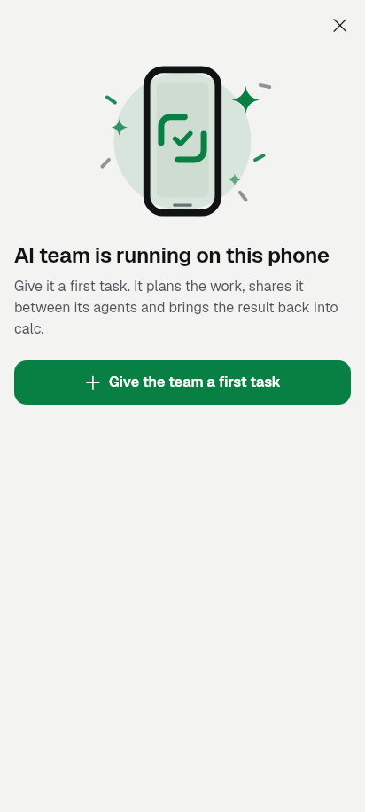 |
| Ready page, ready (1280x800) | — | 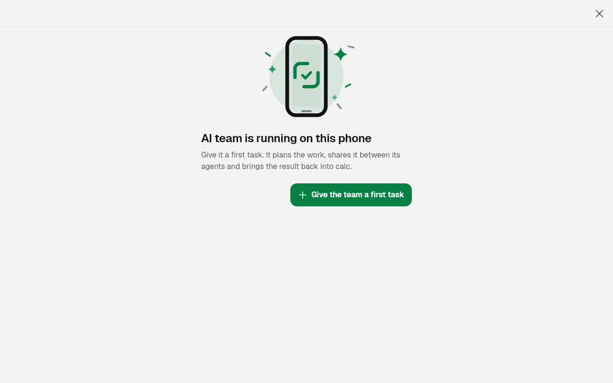 |
| Ready page, failed | — | 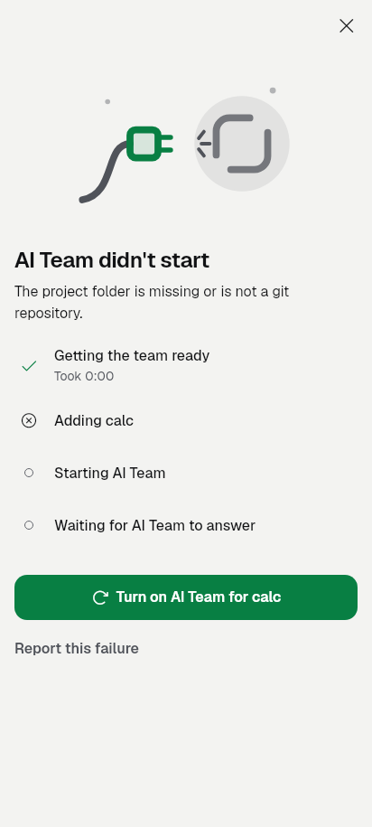 |
| Team page, Android stopped the team | — | 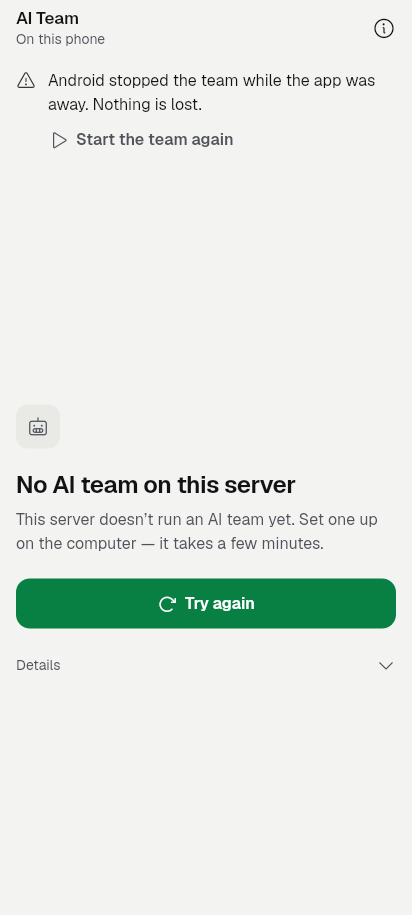 |

In the killed image, the body under the new line is the team page's own
"not answering" state, which comes from the test having no supervisor.
That state's wording belongs to P3.4.

## Tests

**New:**
- `test/team_phone_onboarding_test.dart`, rewritten (19 of its 21 tests
  pass):
  - **Set up flow.** On Termux, Add tools › AI Team runs a Termux v2 job,
    then the ready page runs install, init and start and offers a first
    task. Installed already goes straight on. An unfinished job never
    opens the ready page. The in-app host uses the in-app engine and
    `BuiltinTeam.turnOn`.
  - **Ready page.** It shows the stages. A failure says why, offers
    Report, and turns on again. With no project it asks for one. "Give
    the team a first task" starts on this team.
  - **Team page.** The killed line with Start the team again, and no line
    for a team that runs.
  - **Also kept.** The failure copy test, the Plugins section tests (with
    "not installed" now opening Add tools), and the 320 dp / 2.5x layout
    tests for the ready page.
- `test/setup_progress_report_test.dart` (3):
  - a failed row reports with the job's log;
  - a job that failed between components reports from the log panel;
  - a running job offers no report.
- `test/revamp/team_phone_v2_golden_test.dart` (13 goldens).
- `test/team_discover_test.dart`, intro group:
  - in-app and Termux "Set up" open Add tools on their own host;
  - a 32-bit phone is told why by the pre-flight, and Team is still
    offered;
  - low space says how much to free.
- `test/new_conversation_sheet_test.dart`: the "Solo only on a Termux
  phone" case now asserts that Team stays offered, which is this slice's
  acceptance.
- `test/support/phone_setup_scenes.dart`: fakes `PhoneSetup.termux`.

**Existing files, run once.** Failures were compared with base `5b66961d`
in a separate worktree. Each one listed below is identical on the base and
not caused by this slice:
- `this_phone_screen`: "Update is not offered…".
- `phone_setup_start_screen`: 320 dp ×2 and "entrance eases in".
- `phone_setup_termux_job_screen`, `phone_setup_progress_screen`,
  `failed_job_report_ui`, `kit_checklist`: all pass.
- `builtin_team_section`: "turn-on waits for the store…".
- `motion_setup`: 4 tests.
- `design_standard`: goldens.
- `kit_ratchet`: G17 and G21. G16 passes.
- `ui_glossary`: G11 ×2 and G28, with no new findings.
- Stale goldens, the same on the base: `goldens/team_discover_golden`,
  `revamp/screen_team_1_golden` and `revamp/shared_phone_1_golden`.
- `team_phone_onboarding`: "On this phone section and tips" at
  320 dp / 2.5x overflows on the base too.

`flutter analyze`: clean.

## Still needs a device

None of this ran on a phone or an emulator. These need an Android 15
emulator:
- In-app: off → Set up AI Team on this phone → progress → ready → the
  first task lands in its conversation.
- The same with Termux sideloaded. This includes `aiteam.sh init` and
  `start` on programs that the v2 job installed rather than `aiteam.sh
  install`.
- Android stopping the Termux team, then Start the team again from the
  team page.
- A Termux job left running or stopped, shown on the start screen, then
  Continue.

X12's and P1.2's limits still apply. There is no raw log tail on the
Termux host, and a phone run of the upstream Linux builds under proot is
still unproven.

## State

Implemented, and verified by unit and widget tests. Committed on
`revamp/slice-P1.7`. Not device-verified, pushed or released.
