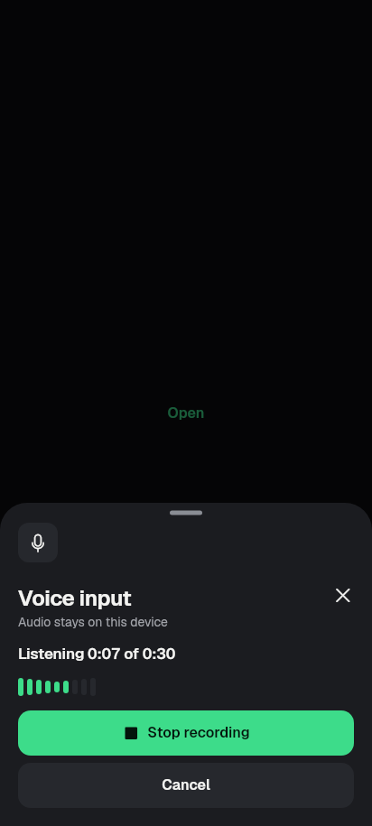
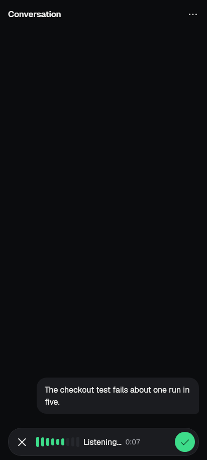
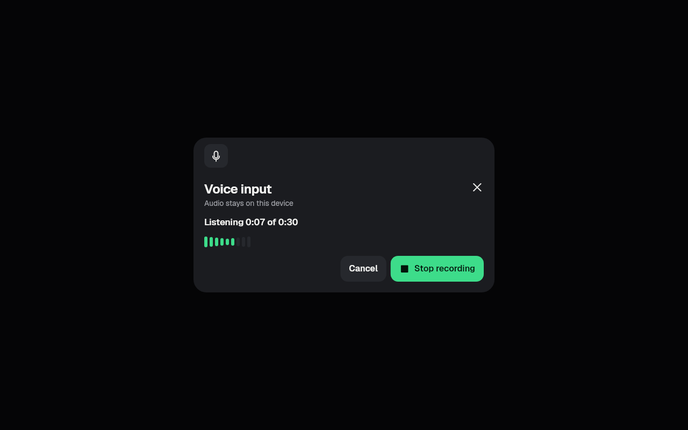
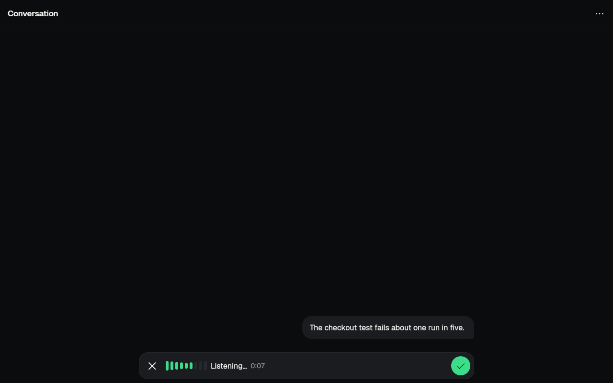
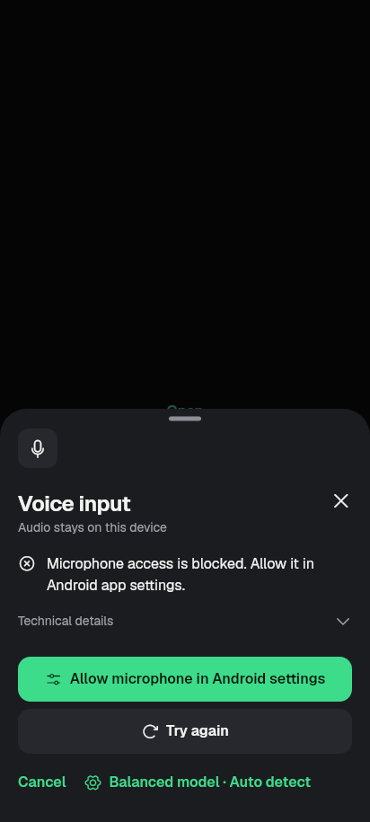
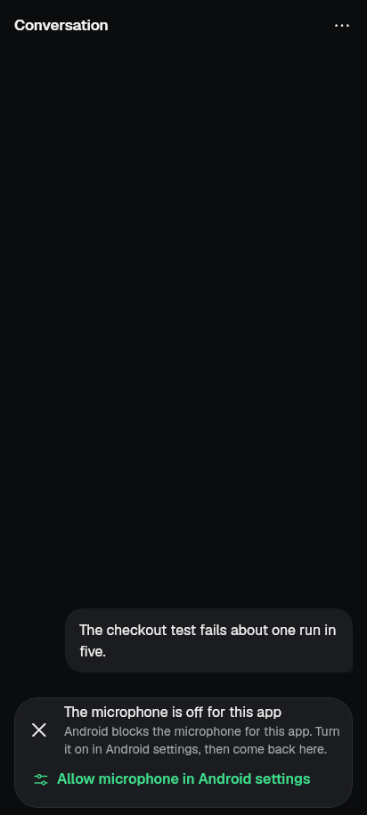
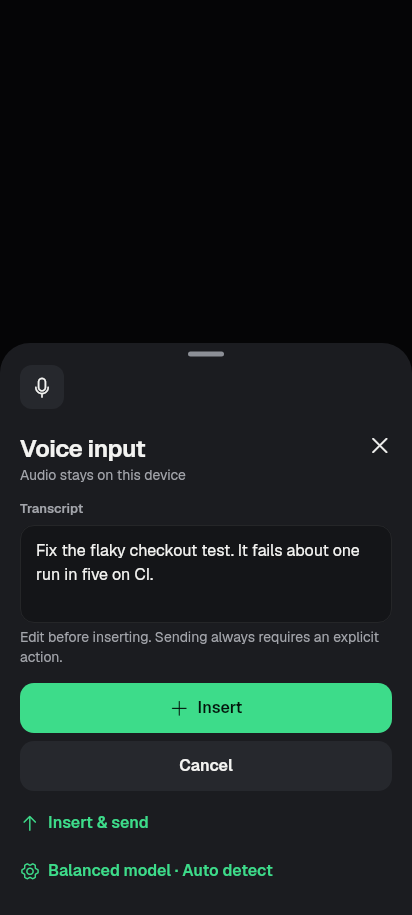

# slice-P10.3-P6.3 (2026-09-28)

The last serial chat-lane slice. It covers P10.3 "Voice as a composer mode"
and P6.3 "The team starts work at once".

- Branch: `revamp/slice-P10.3-P6.3`, base `feat/phone-setup-v2` at `ca043f36`.
- P6.3 was built on the side branch `revamp/slice-P6.3-team` and merged in.
  Its full record is in [p63/SECTION.md](p63/SECTION.md).

## P10.3 Voice as a composer mode

**Finish line.** The mic turns the composer into voice mode. Recording is
continuous in 30 s chunks with no cap, and the transcript lands in the draft,
where DraftStore keeps it. Voice conversation is the same mode. The voice
input sheet and the separate conversation controls are gone.

**Non-goal:** no new speech engines.

### What changed

- **Recording has no cap** (`lib/voice/audio.dart`, `lib/voice/controller.dart`).
  - Whisper hears 30 s at a time. Every 30 s the finished chunk
    (`voiceChunkSamples`) goes to the recognizer while listening goes on.
  - Chunks are recognised one at a time, in order.
  - `Pcm16Accumulator.add` now returns the bytes it took, so a buffer that
    crosses a chunk edge starts the next chunk. An odd byte carries over.
  - The old 30 s `_captureDeadline` is gone.
  - `transcript` gives the words written down so far. `draft` holds all of
    them after Done.
  - If a chunk can't be written down, recording stops and the earlier words
    are kept.
  - `starting` tells a host that the idle state inside `startListening` is
    only a pass-through.
  - The controller no longer awaits `StreamSubscription.cancel()`. Its
    root-zone future never ran under a test's fake clock, and cancelling
    stops delivery at once anyway.
- **Voice mode in the chat**. The code is in `chat/voice_conversation.dart`,
  `chat_screen.dart` and `chat/composer.dart`, and the kit's `KitComposerVoice`
  is now wired to the product for the first time.
  - The mic in the empty composer, or "+" › Voice input when there is text,
    turns the pill into voice mode. It shows the level meter, "Listening…",
    the clock with no cap, Done in the send slot, and Leave (✕) at the start.
  - As each chunk is written down, the words go into the draft at the caret.
    The draft store saves them like typed text.
  - Done writes the rest and returns to the field with the full draft.
    Dictation never sends.
  - Leave (or Esc) stops recording. Words already written down stay in the
    draft.
  - Leaving the app (hidden or paused) stops the microphone at once, and
    what was recorded is still written into the draft. A notification shade
    (inactive) doesn't stop dictation.
  - A page pushed over the chat also stops the microphone.
- **Mic denied, explained inside the mode.**
  - The mode says "The microphone is off for this app".
  - Denied once: the reason is "Voice typing needs the microphone. Tap Allow
    microphone, then choose Allow." The fix is **Allow microphone**, which
    asks again.
  - Blocked for good: the reason is "Android blocks the microphone for this
    app. Turn it on in Android settings, then come back here." The fix is
    **Allow microphone in Android settings**. Coming back to the app tries
    the microphone again.
  - Other failures use the existing plain `voiceErrorText` with Try again.
    No exception text is shown.
- **Voice conversation is the same mode.**
  - "+" › Voice conversation starts listening at once. Send (in the send
    slot) sends what was said through the one send path.
  - Then the mode shows these phases:
    - "Waiting for the reply…"
    - "Reading the reply aloud", with Stop
    - "The reply is ready", with Listen and "Read it aloud"
  - The kit now shows a reply's reason in `replyReady` too, such as "could
    not be matched to your message".
  - "Read replies aloud" is the kit chip, with the same consent and
    voice-choice flow as before.
  - One primary: while a request waits, the phase is "Paused · the agent
    needs you" and there is no Listen, so the request's answer is the only
    primary. Offline, it shows the pause reason with no action.
- **P10.4 is kept.** The first mic tap with no speech model still opens
  `showVoiceAutomaticSetupSheet`, which picks by total RAM and never by
  memoryClass, asks, and downloads. A recording it hands over goes straight
  into voice mode. Declining leaves voice mode.
- **Kit** (`lib/ui/kit/chat/kit_composer.dart`): the voice mode's word line
  is a Wrap. At 320 dp with 2× text, the meter and clock move to their own
  line instead of overflowing by 34 px.
- **Removed:**
  - `showVoiceComposerResultSheet`, `showVoiceComposerSheet`,
    `VoiceComposerResult`, `voiceRecordingCap`, the sheet and its status
    widget (`lib/voice/voice_ui.dart`, −390 lines)
  - the old `_voiceConversationControls` strip
  - 32 strings that only they used (en and ar), and the Arabic test
    fixture's overrides of them
  - `voiceConversationDescription` now reads "Talk, then tap Send: what you
    said goes to the agent. …"
- **Added:** 4 strings, `voiceModeMicAsk`, `voiceModeMicAllow`,
  `voiceModeMicBlocked` and `voiceModeNothingHeard`.
- G10 draft manifest: the voice sheet's draftless multiline field has gone,
  so the baseline entry for `lib/voice/voice_ui.dart` is removed (it only
  shrinks).

### Lane hand-offs done here

- **Task conversation Now line** (P6.3's chat-lane hook), in
  `chat/team_conversation_view.dart`. A pending direct task's line now reads
  its own dispatch attempt (`TeamDispatchAttempts.of(team).latest`, matched
  by work ID):
  - nothing while the assignment is on its way
  - "Waiting for a worker" once it is sent
  - "Starting a worker" only for a running session on exactly this task
  - "Request not accepted", "Request not confirmed" or unavailable for a
    refused, unconfirmed or unknown dispatch

  Before, the line always said "Waiting for a worker". The new test fails
  without the hook (checked).
- **Timeline fork mode** (`chat/timeline_sheet.dart`): the unused
  fork-mode branch (`const forkMode = false`) is gone, along with its two
  strings `chatUiForkFromPrompt` and `chatUiChooseAPromptToRestoreItIn`.
- **Team home Now/heat line vs the status slot:** done in P6.3. The line is
  in the screen's status slot now; see SECTION.md.
- **Not done:**
  - KitComposerChips press tracker. `KitPressTracker` has not landed on this
    base; it is still waiting on revamp/slice-tap-feedback.
  - The pre-existing team_controls failure "start a run sends objective…".
    It is the planning Now line's Why fold after 8 s, not this slice's
    change.

## P6.3 The team starts work at once

This is a summary; the details are in [p63/SECTION.md](p63/SECTION.md).

- `giveTask(onCreated:)` reports the create receipt before the assign is
  sent.
- `TeamDispatchController` has distinct stages:
  - creating, sending, awaitingWorker, workerObserved
  - createRefused
  - assignRefused (the task is kept)
  - createUnconfirmed, dispatchUnconfirmed
  - unknown
- `TeamDispatchAttempts` keeps the latest attempt past the sheet. It lives
  in memory only, so nothing is replayed after a restart.
- The start sheet sends one create, then one assign. It needs both
  capabilities.
- The team home's status slot shows the real stage.
- Host words appear only under redacted Technical details.
- Timing probe: "Task created · sending it to the team…" is visible in the
  frame right after the create receipt.

## Tests

**New:**

- `test/revamp/slice_p10_3_test.dart` (8 tests), run through the real
  controller, the real chunking and the real chat host. Only the native ends
  are fakes: a recorder streaming a **185-second PCM16 fixture** in 4095-byte
  buffers, and a recognizer that decodes the fixture back into one word per
  second, so a lost or shifted sample shows as a wrong word.
  - A 3-minute dictation is written down in 30 s chunks, in order, with no
    cap. It stays listening past 30 s, 6 chunks are done before Done, the
    last 5 s follow, the recognizer never runs two decodes at once, and no
    word is BAD.
  - A failed chunk stops the recording and keeps the earlier words.
  - In the chat:
    - The mic opens voice mode with no sheet. The draft store holds w0–w89
      mid-dictation, and after Done the field and the store hold all 185
      words. Then the app is **swiped away**: a new connection is built on
      the same storage, and the reopened chat shows the dictated draft.
    - Leaving the app mid-dictation: inactive keeps listening. Hidden or
      paused stops the recorder at once, and the words, typed text first,
      still reach the draft.
    - Leave keeps the words already written down.
    - Mic denied once: explained in the mode, and Allow microphone asks
      again, then listens.
    - Blocked for good: Android settings, then coming back listens.
    - Conversation: Send sends what was said. A permission pauses the mode,
      with no Listen and at most one primary.
- `test/revamp/slice_p10_3_golden_test.dart` (8 goldens): dictating (phone
  and wide), mic denied and conversation, dark and light.
- `test/voice_audio_test.dart`: 2 tests (chunk edge; odd byte at the edge).
- `test/team_controls_test.dart`: 1 test (the task conversation's Now line
  follows the attempt).
- P6.3's tests are in SECTION.md: 5 dispatch tests, 4 widget tests, 4
  goldens.

**Rewritten for the mode:**

- `test/voice_reply_pipeline_test.dart` (all 20 conversation tests drive the
  inline mode now)
- `test/voice_composer_test.dart` (the draft test, plus a 320 dp / 2× text
  test replacing the sheet one)
- `test/read_aloud_test.dart` (conversation privacy)
- `test/revamp/screen_voice_1_test.dart` and its golden test: the "voice
  input sheet" group and the 8 `voice_composer_*` goldens were removed
  with the sheet

**Run once:**

- New tests
- Affected tests: voice_*, read_aloud, slice_p3_6, screen_voice_1_*,
  voice_auto_setup_*, kit_composer and its goldens, chat_3/4/5 tests and
  goldens, slice_p10_1_2, session_draft, transcript_search,
  codex_chat_capabilities, chat_live_events, team_conversation_*,
  team_dispatch, team_control(s), slice_p63_golden, text_scale_overflow,
  nudge_moments, offline_queue, release_blockers
- Gates: kit_ratchet, redaction, credential_ingress_redaction,
  team_storage_redaction, ui_glossary, no_raw_error_text, kit_manifest,
  kit_draft_manifest, architecture_boundaries, kit_motion, kit_motion_app

**Result: no new failures.** Every remaining failure also fails on base
`ca043f36`, checked in a temporary second worktree:

- chat_3_golden: 22 goldens (drift)
- chat_5_golden: 12 goldens (drift)
- screen_voice_1_golden: 4 notices goldens
- voice_model_localization: 2 (model picker at 320 dp, 2.5×)
- kit_motion_app: 2 (working button)
- team_controls: "start a run sends objective…"

`flutter analyze`: clean.

## Images (DPR 1, the app's fonts)

| Before (`ca043f36`, the voice sheet) | After (voice mode in the composer) |
|---|---|
|  |  |
|  |  |
|  |  |
|  (review sheet) | the words go straight into the draft; see the tests |

Also here: `after_p103_conversation_dark.png` and
`after_p103_dictating_light.png`. P6.3's before and after images are in
[p63/](p63/SECTION.md#images-412x915-and-1280x800-light-the-apps-fonts).

## Still needs a device

- **P10.3 proof** on the emulator with the audio loopback: a real 3-minute
  dictation through sherpa-onnx. It should cover:
  - the chunk decode time on a phone
  - that listening is not starved while a chunk decodes, since recognition
    runs in an isolate
  - the first-run Android permission prompt: the dialog makes the app
    inactive, and `RecordVoiceRecorder.start` still refuses a non-resumed
    lifecycle
  - "Allow microphone in Android settings" and back
- The P6.3 < 5 s create → worker measurement on the emulator and the owner's
  phone (coordinator, R20).
- The P6.3 items in SECTION.md: retrying the assignment of a kept task,
  automatic pool recovery, and a durable attempt ID. These are contract
  non-goals.

## Shipping state

- Implemented and committed locally on `revamp/slice-P10.3-P6.3`.
- Not pushed, not device-verified, not released.
