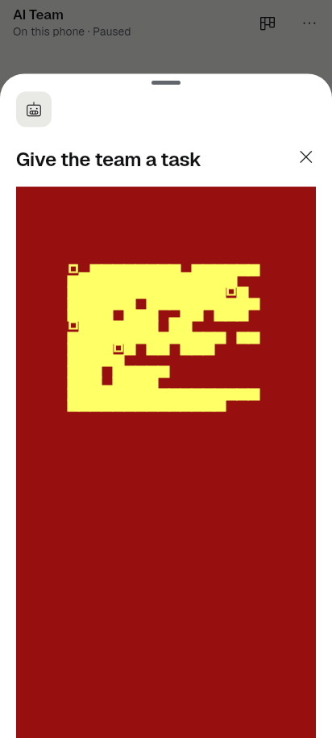
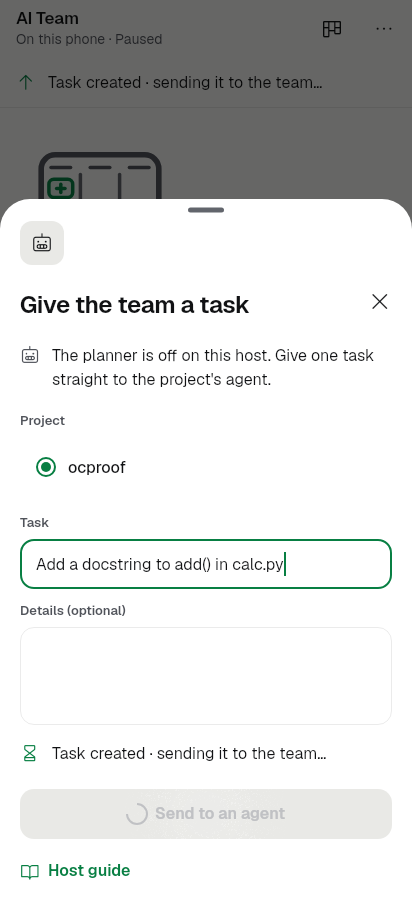
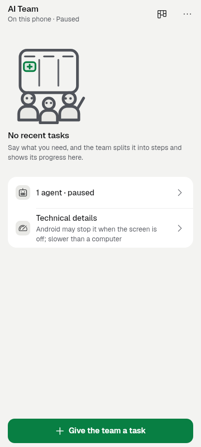
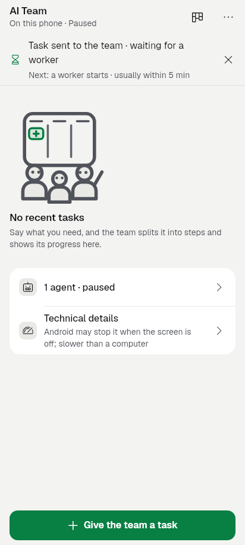
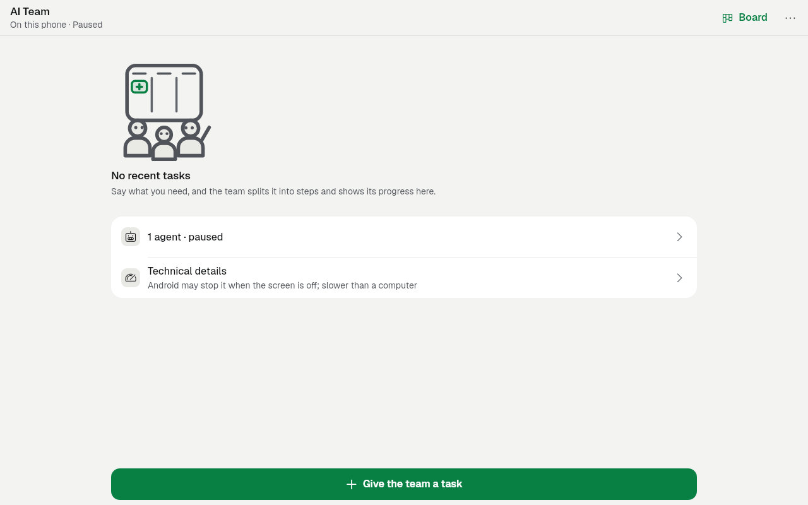
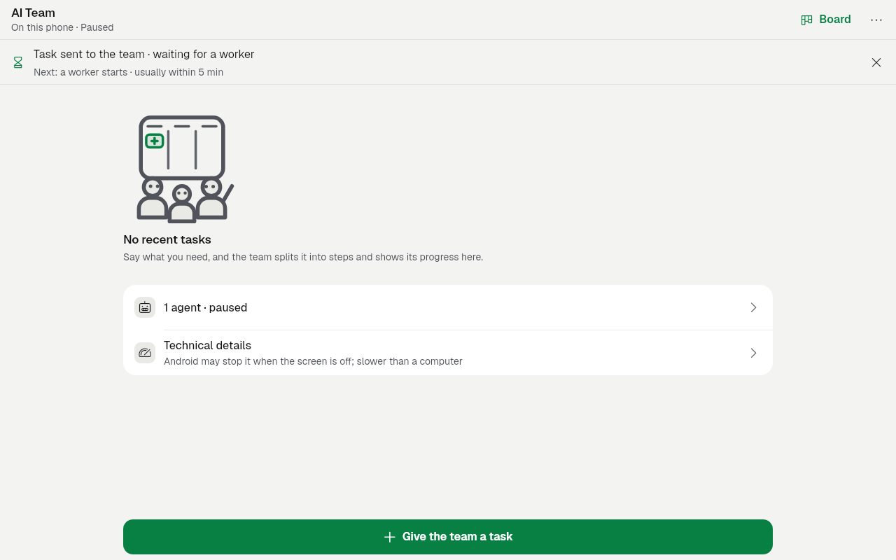
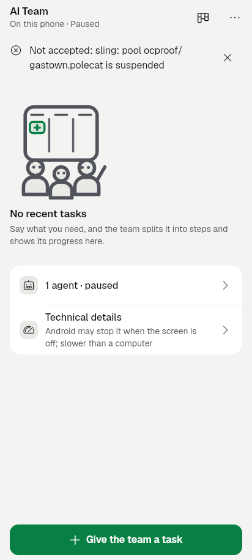
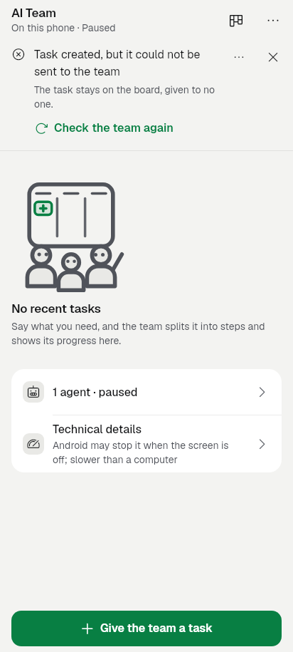

## P6.3 The team starts work at once

Branch `revamp/slice-P6.3-team` (base `ca043f36`), folded into this slice.
Contract: [team-immediate-dispatch-contract.md](../../../design/team-immediate-dispatch-contract.md).

**Finish line (this slice's part):** the team page's Now line shows the
direct task's real stage, claiming only what the host confirmed. The
"< 5 s on the emulator / owner's phone" measurement stays coordinator work
(PLAN §7, R20). **Non-goal:** no warm worker, no pool wake, no new
scheduler, no retry of an unconfirmed step.

### What changed

- **State (`lib/state/team_dispatch.dart`, `lib/state/orchestration.dart`).**
  - `giveTask(onCreated:)` tells the caller the create's record as soon as
    the host answered it, before the assignment is sent. That is the
    per-attempt stage signal; nothing is inferred from elapsed time.
  - `TeamDispatchPhase` now has distinct stages: `creating`, `sending`
    (task ID known, assignment on its way), `awaitingWorker`,
    `workerObserved` (a running session on exactly this task, kept once
    seen), `createRefused`, `assignRefused` (the task is kept),
    `createUnconfirmed`, `dispatchUnconfirmed`, and `unknown` (sent, but the
    team is stale, failing or disconnected).
  - `TeamDispatchAttempts.of(team)` holds the latest attempt per
    `OrchestrationController`, so its stage outlives the sheet. It is in
    memory only and goes with the controller on a profile change. After a
    restart there is no attempt, and a fresh controller starts idle and
    never resends.
- **Sheet (`start_run_sheet.dart`).**
  - The direct task goes through one attempt: one create, then one
    assignment of that exact ID.
  - Admission needs both `controlCreateWork` and `controlAssign`.
  - While sending, a progress notice shows "Creating your task…" and then
    "Task created · sending it to the team…".
  - A refused create stays on the sheet with plain words ("The task wasn't
    made. Change it and send it again."). The host's words are only under
    Technical details (redacted fold).
  - An unconfirmed create (no ID) closes the sheet without clearing the
    draft and opens no conversation.
  - The fields stay editable while sending. Before, `enabled: false`
    without a reason tripped KitField's assert: a debug red screen during
    every send, see `before_sheet_sending.png`.
- **Team page (`team_home_screen.dart`, `team_now.dart`).** Lane hand-off
  from P4.4: the in-list Now/heat line has moved into the screen's status
  slot. There is one line per window, and the app's connection line wins by
  priority.
  - Order: old data, then heat, then a dispatch problem (refused,
    unconfirmed, unknown), then the team's Now (paused/stuck,
    `teamNowStatus`), then dispatch progress.
  - The stages read:
    - "Task sent to the team · waiting for a worker", with next "Next: a
      worker starts · usually within 5 min"
    - "A worker started your task"
    - "Task created, but it could not be sent to the team", with "The task
      stays on the board, given to no one."
    - "Couldn't confirm whether the task was created"
    - "Task created · couldn't confirm it reached the team"
    - "Task sent · the team can't be reached, so whether a worker started
      is unknown"
  - Actions: "Check the team again" (a read, never a resend), Technical
    details (task ID and the host's words, redacted by the kit), and dismiss
    (changes nothing on the host).
  - The old raw "Not accepted: sling: …" notice is gone.
- `TeamConversation.start` opens no conversation for a create without a
  task ID.
- **Copy.**
  - Added 14 `teamDispatch*` strings.
  - Removed `teamUiStartRunDirectRefused` (en and ar), which put host words
    in the visible sentence.

### Tests

- `test/team_dispatch_test.dart`: 5 new tests.
  - Stages in order with held create and assign, one request each.
  - A refused assignment keeps the task, with no second call.
  - Unknown on a stale or stopped team, and worker-seen stays sticky.
  - After a restart there is no attempt, a fresh controller is idle, zero
    calls go out, and the records are persisted.
  - The holder keeps only the latest attempt.
  - The existing tests were renamed to the new phases.
- `test/team_controls_test.dart`: group "P6.3 dispatch stages", 4 new
  tests, plus the updated TEAM-306 refusal test (plain words, host words
  only in the fold).
  - The full flow with the **timing probe**: create receipt → "Task
    created · sending it to the team…" is visible in the **next frame**
    (1 pump, about 35 ms of test time in the harness). Then the home line
    shows awaiting, then worker observed. Reopening the page sends nothing,
    and dismiss sends nothing.
  - An assignment never confirmed becomes "couldn't confirm" after the
    receipt window.
  - A refused assignment: no conversation, the plain line, and Technical
    details show the task ID and the host words. The secret is redacted.
  - A create without an ID: nothing opens, the draft is kept, and there is
    no second create.
- New goldens `test/revamp/slice_p63_golden_test.dart` (4). Refreshed
  `slice_p52_team_page{,_1280x800}_light`: the stuck line moved into the
  status slot (reviewed).
- Run once on the branch and on base `ca043f36` (temporary worktree),
  failures compared by name:
  - **No new failures.** The only failure left in the affected set is
    pre-existing: team_controls "sends objective + supervision to the
    Mayor…", where `team-conversation-now-why` is missing in the
    conversation view (chat library).
  - Other pre-existing failures on both: team_gate_answer 320dp ×4,
    team_plugins_screen manual add ×6, slice_p34 / screen_team_2 /
    team_phone_v2 golden drift.
- Gates pass: kit_ratchet (G17 kept at 1 attention role), ui_glossary
  (G28), no_raw_error_text, redaction, credential_ingress_redaction,
  team_storage_redaction, kit_manifest, kit_draft_manifest,
  architecture_boundaries, kit_motion.
- `flutter analyze` on the changed files: clean.

### Images (412x915 and 1280x800, light, the app's fonts)

| Before (`ca043f36`) | After |
|---|---|
|  (debug assert while sending) |  |
|  (nothing said) |  |
|  |  |
|  (raw host text) |  |

### Still needs a device, and open points

- The < 5 s create → worker measurement on the emulator and the owner's
  phone (coordinator, R20), timing create acknowledgement, sling
  acceptance and matching worker start separately.
- The task's own conversation Now line (`team_conversation_view.dart`, chat
  library) still shows its own pending-task wording. It does not yet read
  `TeamDispatchAttempts.of(team).latest`: a hook for the chat lane.
- Not built (contract non-goals or missing contracts): explicit "retry
  assignment" for a kept task, automatic stalled-pool recovery, and a
  durable attempt ID across restarts.
