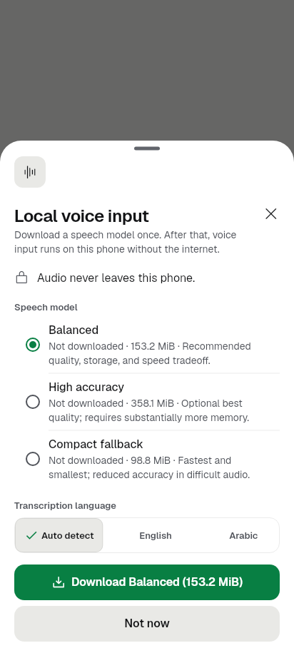
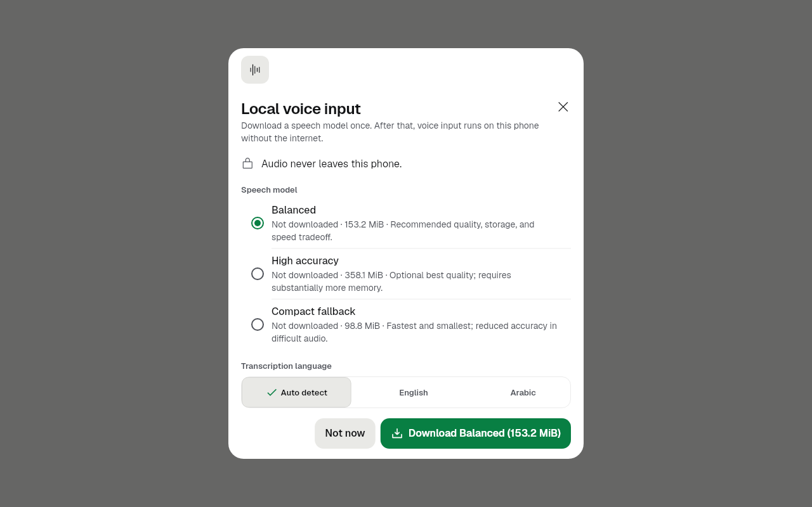
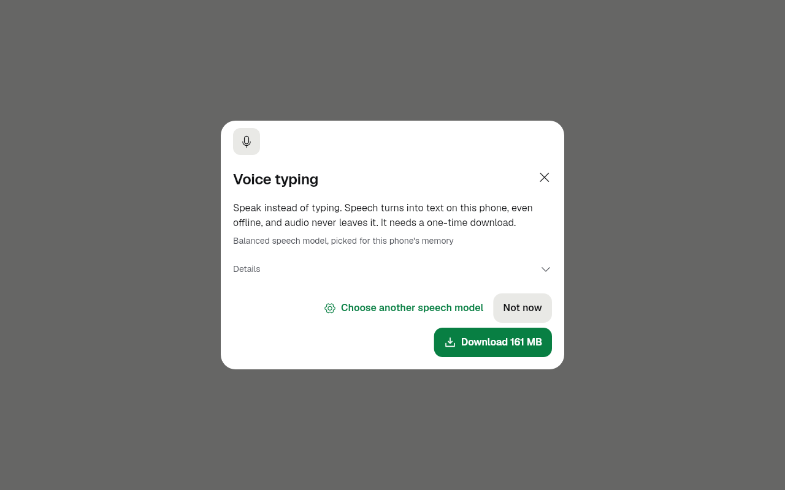
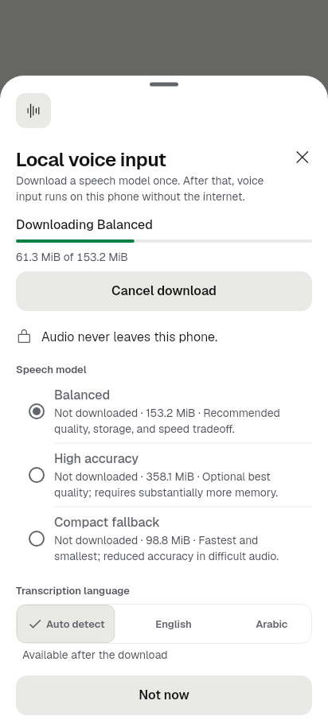
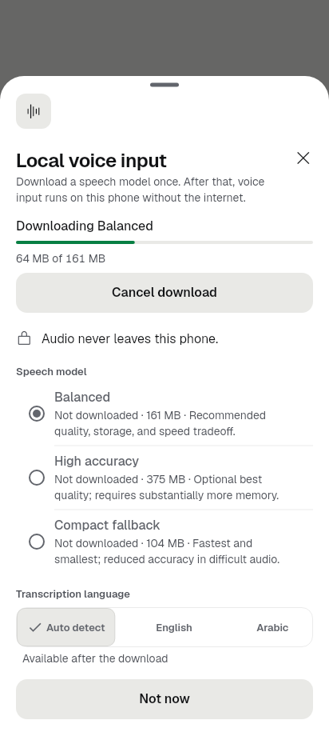

# slice-P10.4 Automatic voice setup (2026-09-27)

Branch `revamp/slice-P10.4`, from `feat/phone-setup-v2` at `52ab78c4`.
Backend: [codex-p104n](../codex-p104n-2026-09-27/README.md) (setup controller
and native download notification, merged).

**Finish line.** The first mic tap picks the pack for this phone by total
RAM, shows its size (and asks on mobile data), downloads with progress and a
notification, and starts listening when ready. Settings › Voice holds the
packs. **Non-goal:** no new packs.

## What changed

- **First mic tap: a new sheet, `showVoiceAutomaticSetupSheet`**
  (`lib/voice/voice_ui.dart`).
  - It runs Codex's `VoiceAutomaticSetupController`. The pack is picked by
    total RAM (small at 3400 MB, base at 1536, tiny at 1024), never by the
    Java heap class. A supported pack already on the phone is kept.
  - It says what voice typing is and which model was picked ("Balanced speech
    model, picked for this phone's memory"). The size is on the button:
    "Download 161 MB". On mobile data a notice says so and the button reads
    "Download 161 MB on mobile data". An unknown network gets the
    may-be-metered notice.
  - The download shows progress in plain MB with Cancel download. When the
    notification was posted, a line says the progress also shows there.
  - When the model is ready the microphone starts. The sheet then closes
    with `true` and hands the recording to the composer (`handOff()`), so the
    caller's recording surface finds it already listening.
  - Problems are plain words with one way forward:
    - offline: Try again
    - unknown RAM: Choose a speech model (opens Settings › Voice)
    - another download running: Show the download
    - no pack fits: the smallest pack's own memory, storage or processor
      reason
    - download failed: the existing plain failure text plus Try again; the
      raw text sits only under Technical details (redacted by the kit)
  - Details (folded) has the file names, the exact MiB size and the memory
    rule. This is the only place model files or MiB appear.
  - "Choose another speech model" opens Settings › Voice. A model made ready
    there starts listening.
  - Closing the sheet cancels the download (the partial file is kept, so the
    next attempt resumes). Leaving the app does not. A download that finishes
    while the app is away stops at "The speech model is on this phone." with
    Start listening, and never opens the microphone in the background.
- **Setup controller** (`lib/voice/automatic_setup.dart`), a small addition:
  - a `ready` stage
  - `setForeground(bool)`: a background finish waits instead of recording
  - `handOff()`: cancelling or disposing no longer cancels a recording the
    composer's surface took over
- **Settings › Voice** (voice-model-setup-sheet): every size is now plain MB
  (`voiceSizeText`, decimal like phone setup), never MiB. The "Verifying size
  and SHA-256…" caption is gone, and its string is deleted.
- **Reading voice by locale** (P6.6's voice half): new
  `readAloudVoiceForLocale(voices, locale)` in `lib/voice/read_aloud.dart`. It
  picks language and region first, then language only, else null (the
  engine's default).
- Copy: 22 `voiceAutoSetup*` strings in `app_en.arb`, and gen-l10n was run.
  `e7VoiceUiVerifyChecksum` is removed from both ARBs and the Arabic test
  fixture.
- No Kotlin, no new storage keys, no chat files.

## Call sites for the chat lane (chat library not edited here)

1. `lib/ui/screens/chat_screen.dart` `_openVoice()`, in the `if
   (!voice.models.isReady)` block, replace
   `await showVoiceModelSetupSheet(context, voice.models)` with
   `await showVoiceAutomaticSetupSheet(context, voice)`. Leave the rest as it
   is: `true` means the composer is already listening, and
   `showVoiceComposerResultSheet` opens on it. Its `startListening()` does
   nothing while the composer is listening. For P10.3's inline voice mode,
   call the same function from the mic.
2. `lib/ui/screens/chat/read_aloud.dart` `_ensureSpeechReady`. After
   `final voices = await speech.voices();` and the empty check, before the
   choice sheet, add:
   `if (!chooseVoice) { final byLocale = readAloudVoiceForLocale(voices,
   Localizations.localeOf(context)); if (byLocale != null) { _readAloudVoiceID
   = byLocale.id; return current(); } }`. The sheet then opens only for
   "Choose voice", or when no voice matches the language.

## Tests (fakes only, no network or microphone)

- New `test/voice_automatic_setup_sheet_test.dart` (11 tests), run with the
  real controller, manager and composer:
  - An 8 GB phone with a 128 MB heap class gets High accuracy, and the button
    is "Download 375 MB". No MiB, Whisper or int8 appears above Details.
  - Consent comes first. Progress reads "150 MB of 375 MB" with the
    notification line. Completion closes the sheet with `true` and the
    composer listening.
  - A 1.2 GB phone with a 16 GB heap class gets Compact.
  - Mobile-data wording and button, and the Wi-Fi consent is not reused.
  - Not now downloads nothing. Cancel download cancels the download.
  - Offline, then Try again. Unknown RAM offers the manual choice.
  - A failed download shows plain words with the raw text under Details.
  - A background finish waits at ready, then Start listening works.
  - Settings › Voice shows MB and never MiB.
  - The reading voice follows the locale.
- `test/voice_automatic_setup_test.dart`: 3 new controller tests (ready on a
  background finish, the hand-off survives disposal, cancelling without the
  hand-off stops the recording). With `handOff`/`ready` disabled, the first
  two fail.
- New goldens in `test/revamp/voice_auto_setup_golden_test.dart`: offer on a
  phone and a wide window, mobile data, downloading and failed, in dark and
  light. The Settings › Voice goldens (`voice_setup_*`) were regenerated for
  MB.
- Existing files run: `voice_automatic_setup*`, `setup_voice_component`,
  `voice_model_manager`, `revamp/screen_voice_1_*`, `read_aloud`,
  `voice_composer`, `voice_model_localization`, `kit_ratchet`. Every failure
  also fails on the base commit `52ab78c4`, checked in a temporary second
  worktree, so there are no new failures:
  - `voice_composer_test`: 3 fail (320dp stacks, notices license)
  - `voice_model_localization_test`: 2 fail
  - `read_aloud_test`: 2 fail
  - `screen_voice_1_golden_test`: 5 fail (composer listening dark, 4 notices)
  - kit ratchet: G21 fails, in kit files this slice does not touch
  - G17 also fails on the base but passes here
- `flutter analyze`: clean.

## Images (DPR 1, the app's fonts)

| Before (`52ab78c4`) | After |
|---|---|
| First mic:  |  |
| Wide:  |  |
| Settings › Voice downloading (MiB, SHA-256):  |  |

Also in this folder: `after_first_mic_mobile_data_dark.png`,
`after_first_mic_downloading.png`, `after_first_mic_failed.png` and
`after_settings_voice_phone.png`.

## Still needs a device

- An emulator first-mic recording once the chat lane wires call site 1. It
  should cover the pick, the download, the notification in the shade, and
  listening starting.
- A real network classification (Wi-Fi, cellular, VPN) through
  `getVoiceSetupNetwork`, and the notification permission prompt on
  Android 13+.
- Leaving the app mid-download and coming back: the download goes on, then
  it waits at ready.
- The native notification's EN copy and what a tap does (it opens the app;
  there is no deep link to Voice settings).
- Phone setup's Voice typing item still picks "the chosen pack (Balanced by
  default)" rather than the pack by RAM (`VoiceSetupComponent.packFor`,
  `lib/builtin/setup/`, not edited here). The first mic keeps whatever setup
  installed, so the two never download twice.
