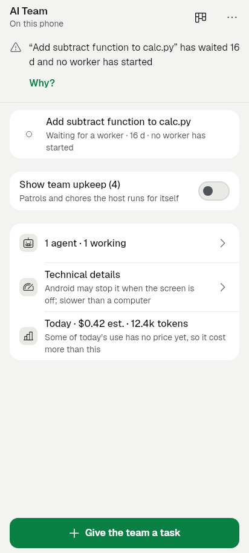
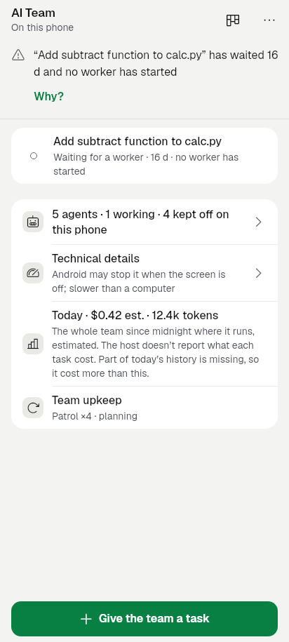
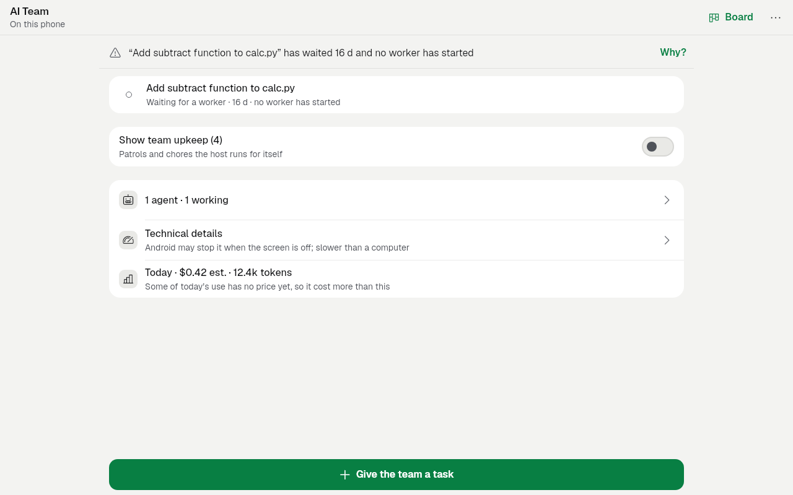
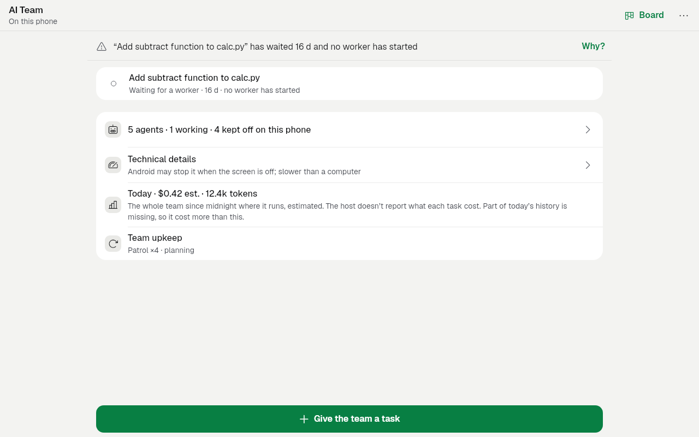
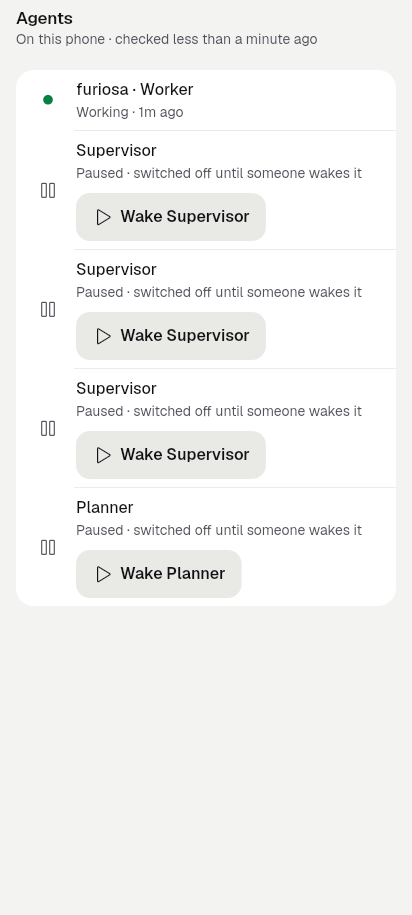
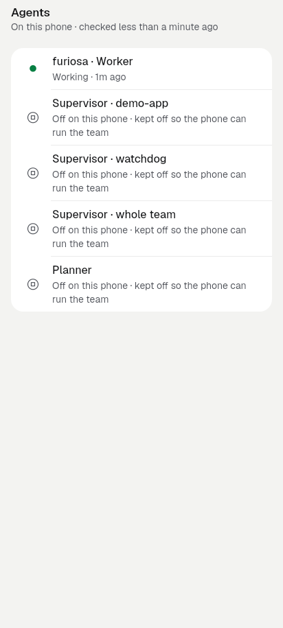
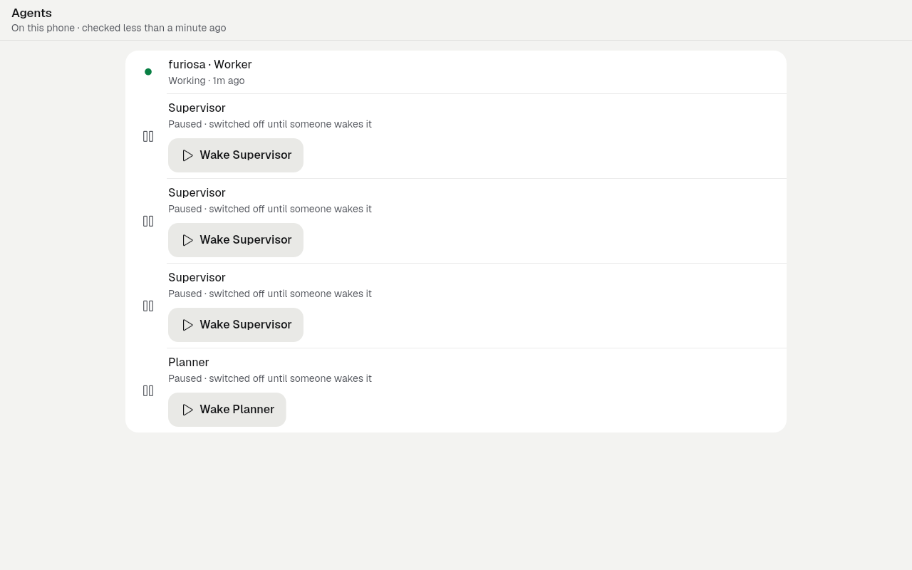
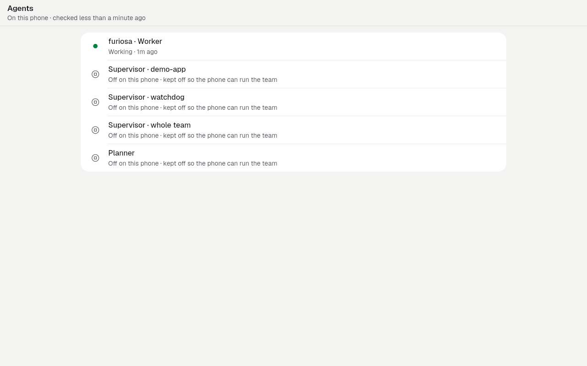
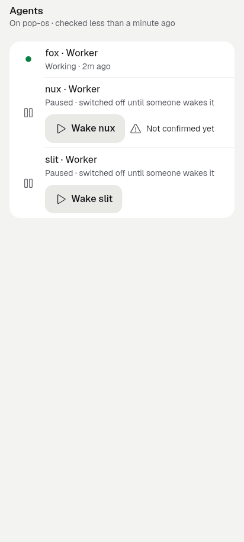
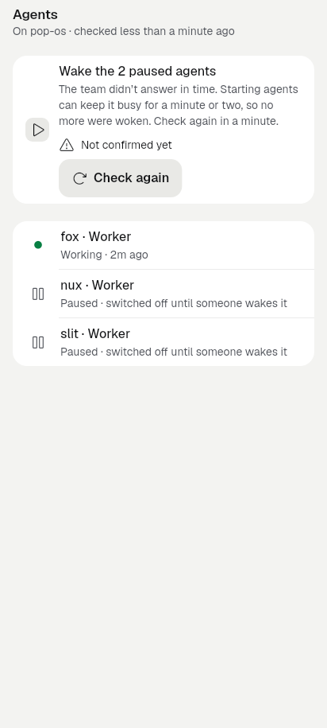

# slice-P5.2: the team page answers questions (2026-09-27)

**Finish line.** The team page answers three questions truthfully:

- Is my team working?
- Where does it run?
- What does it cost?

Agent states come from their sessions (ledger row 21). An idle team is never "Paused" (row 20), and a heat pause says so (P3.4). Today's spend is shown as the whole team's estimate. A task's own cost stays **unavailable**.

**Non-goals.**

- Budget enforcement.
- Per-task cost (blocked, see below).
- The team conversation view (chat lane; P3.5/P3.6).

Branch `revamp/slice-P5.2`. It is based on `feat/phone-setup-v2` and merged up to `52ab78c4` (P4.1c, P6.6a, P5.3 and the error sweeps).

## Blocker kept: per-task cost

The host has no authoritative per-task cost ([codex-p52](../codex-p52-2026-09-27/README.md), [codex-x52](../codex-x52-2026-09-27/README.md)):

- `/usage` `today` is the whole city since the host's midnight.
- `recent_by_session` is a trailing window keyed by worker, with no task join and no assignment intervals.

Charging either one to a task would bill it for an earlier task's spend. So:

- **Team page.** The spend row says what the figure covers: "The whole team since midnight where it runs, estimated. The host doesn't report what each task cost."
- **A task's Details** (`run_screen.dart`). This used to show "Team today · $X est. · N tokens" on the task, and preferred a `usage` found in the run's raw payload. Both are gone. It now says "Not reported for one task. The AI Team page shows today's estimate for the whole team." No figure is shown.

This unblocks once the host provides the `GET /v0/city/{city}/bead/{id}/usage` contract proposed in codex-x52, verified on a host.

## What changed, page by page

### team-home (`team_home_screen.dart`)

**Is it working?** The agents row is built from each agent's session first (`teamSessionState`, row 21):

- A worker the list calls working whose session the host reports stopped does not count as working.
- A running session counts even when the list says the agent is stopped.
- A crashed session is said on the row ("· 1 crashed").

**Counts agree with the agents list** (owner bug 4). The row counts every agent the list shows, for example "6 agents · 1 working · 2 paused" or "5 agents · 1 working · 4 kept off on this phone". Before, it counted only the live agents ("2 agents · 1 working" while the list showed 6). The title wraps to two lines.

**Today's spend** (owner bug 5):

- "Today · $0.42 est. · 12.4k tokens" is followed by what it covers.
- Each reason the figure may be low is its own sentence:
  - some use has no price;
  - part of today's history is missing (now separate from "no price");
  - the team isn't counting new use (`recording: false`).
- A day where every figure is zero or missing shows no row. It never says "$0.00 est. · 0 tokens" while a worker has run for hours.

**Upkeep** (owner bug 6):

- The "Show team upkeep (4)" switch and its rows of `mol-witness-patrol · Planning` are gone.
- One row, **Team upkeep**, in the team's panel says what upkeep is doing in words, with duplicates collapsed: "Patrol ×4 · planning; Chore · working".
- There is no hidden section and there are no engine names.

**Rest.** `teamRest`, the subtitle and the Now line ignore the agents that the app itself keeps off on its phone team. A lean phone team whose worker sleeps reads as asleep, never "· Paused" (row 20). The Now line's Resume never wakes those agents.

**Receipt (coordinator).** The last `TeamReceiptChip` use is now `teamGateRowReceipt(...)`, and the wrapper class is deleted from `team_receipt.dart`. One receipt class remains.

### team-agents (`team_agents_screen.dart`)

**No two identical titles** (owner bug 1). `teamAgentTitles` gives each agent its own title. A repeated role is told apart by, in order:

1. its project ("Supervisor · demo-app");
2. what it looks after ("Supervisor · whole team", "Supervisor · watchdog", "… · workers");
3. its number, as a last resort.

**Kept off on this phone.**

- On the in-app phone team, the planner, deacon, boot and witness are suspended **by the app** (`BuiltinTeam._cityPatches` / `_rigPatches`). They exist so the phone stays under Android's limit of 32 child processes.
- Their rows now say "Off on this phone · kept off so the phone can run the team" and offer no Wake.
- `BuiltinTeam.keptOffKinds` and `teamAgentKeptOff` name them.
- The agent page's "Start … again" is hidden for them too (`agent_screen.dart`).

**One Wake** (owner bug 2):

- The per-row "Wake <agent>" buttons are gone.
- One row, **Wake the N paused agents**, sits above the list. It wakes the agents one at a time and stops at the first the host does not accept.
- Its `KitReceipt` sits under it.

**When the wake is not answered** (owner bug 3):

- The row says in words: "The team didn't answer in time. Starting agents can keep it busy for a minute or two, so no more were woken. Check again in a minute."
- It offers **Check again**, which refreshes.
- A refusal gets "The team didn't wake them. Open an agent to see how it stands, or try again later."
- No host or exception text is shown.

**Session states.** The row's state word, its mark and its place in the order come from the session (row 21). The same applies to `TeamAgentRow` on a task's Agents tab.

### Why the owner's phone stopped answering (bug 3), as far as source shows

The phone's lean team keeps mayor, deacon, boot and witness suspended on purpose (see above). The build-2055 agents list offered "Wake Supervisor" on each of them.

`POST /agent/{name}/resume` asks Gas City to start those agents. On a phone that means more proot/OpenCode processes. Android kills an app's child processes past 32, the oldest first, and the supervisor and OpenCode go with them (`builtin_team.dart` records this: a default team peaked at 40 and Android killed OpenCode and the team). The HTTP request then hits its 30 s receive timeout, so the receipt says "Not confirmed yet", and the stream drops, so the header says "Not answering".

The app no longer offers that wake. Where waking is legitimate (a computer's team, or agents the person paused), it wakes them one at a time and stops at the first unanswered one.

**Not verified on a device.** Proving the process-limit explanation needs the thermal/processes view or `ps` on the phone during a wake.

## Ledger rows

| Row | State |
|---|---|
| 18: the AI Team shown twice with two states | Closed by P3.4: one AI Team row in Plugins opens the one page (`team_plugins_screen_test`). Nothing more was needed here. |
| 19: turn-on takes 8–9 min with no expectation | Covered by the built-in team section: "about 5 to 10 minutes the first time", stages, no action while it runs (`builtin_team_section_test`). This slice made no change. Needs the emulator proof below. |
| 20: an idle team is called "Paused" | Closed. Paused only for agents switched off on purpose, never for the agents the app keeps off, never for asleep ones (`slice_p52_test` "an idle team is never Paused", "the phone team…"). |
| 21: "Working" while the host says stopped | Closed on the team page, the agents list and a task's agents tab. The session is authoritative (`slice_p52_test` group "is my team working?"). |

## Tests

**New: `test/revamp/slice_p52_test.dart`, 19 tests, all pass.** They cover:

- sessions first;
- asleep versus paused;
- spend qualification (missing history, no price, not counting, unavailable);
- owner bugs 1–6, one or more tests each:
  - no two agents share a title;
  - one Wake for the paused agents;
  - an unconfirmed wake stops after one agent and says so with Check again, with no raw text;
  - the phone team's kept-off agents are never woken and the team reads as asleep;
  - the counts agree with the list;
  - a zero day is not "$0.00";
  - upkeep is one line.

**New: `test/revamp/slice_p52_golden_test.dart`, 6 goldens.**

**Changed tests:**

- `test/team_usage_test.dart`: a task's Details say the cost is unreported. They ignore a figure in the run's raw payload and never show the team's day. `teamUiUsageChip` was deleted.
- `test/team_page_test.dart`: the no-price line is now part of the spend row's text.
- `test/team_home_test.dart`: upkeep is one line, not a switch.
- `test/revamp/screen_team_3_test.dart`: one Wake row, the receipt, the words and Check again.

**Pre-existing failures.** The same 43 affected files ran on the base `52ab78c4` in a separate `git worktree`:

- Base: 106 failures. These include kit ratchet G17/G21, stale P3.4/screen-team goldens after P4.1c, `team_controls`, `team_agent_screen`, `team_activity` and others.
- This branch: 105 failures, every one of them in the base list.
- The one base failure that no longer fails is the retired upkeep-toggle test.
- **This slice adds no failure.**

**Other checks:**

- `flutter analyze`: no issues.
- `dart format --language-version=3.10`: clean on the changed files.
- The ledger (`docs/design/ui-ledger`) now records the upkeep row, the Wake row and the retargeted receipt entry. Its problem count equals the base (180).

**Copy.** English only, in `app_en.arb`. The strings this slice made unused were deleted from both ARB files: `teamUiUsageChip`, `teamAgentsWake`, `teamUiHomeUpkeepToggle` and `teamUiHomeUpkeepHint`.

## Images

| | Before | After |
|---|---|---|
| Team page, phone team (412) |  |  |
| Team page (1280x800) |  |  |
| Agents, phone team: three identical "Supervisor" rows, each with a Wake |  |  |
| Agents (1280x800) |  |  |
| A computer's team after a wake the host did not confirm |  |  |
| A task's Details: before, "Team today · $0.00 est. · 0 tokens" |  |  |

## What still needs a device

1. **Owner's phone team** (build ≥ this). Check that:
   - the agents list shows distinct titles and "Off on this phone" with no Wake;
   - the team page says "N agents · … · 4 kept off on this phone" and is not "Paused";
   - the upkeep line reads in words.
2. **Emulator, a team with agents the person paused.** Run "Wake the paused agents", with the host answering and with it slow. Check the words and Check again.
3. **Emulator with the thermal override recipe.** Idle, working, heat-paused and stopped states (the slice's proof line).
4. **A host whose `/usage` reports real figures.** Check the spend row and its qualifiers.
5. **Bug 3's root cause.** Watch the process count on the phone while a kept-off agent is woken with `curl` (not from the app). This confirms the process-limit explanation.

## Shipping states

- Implemented: yes.
- Committed: yes, locally on `revamp/slice-P5.2`.
- Verified: by the tests and goldens above, not on a device.
- Enabled, deployed, released: no.
