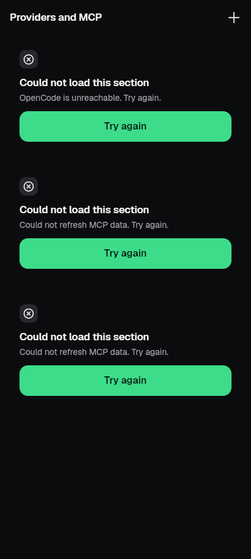
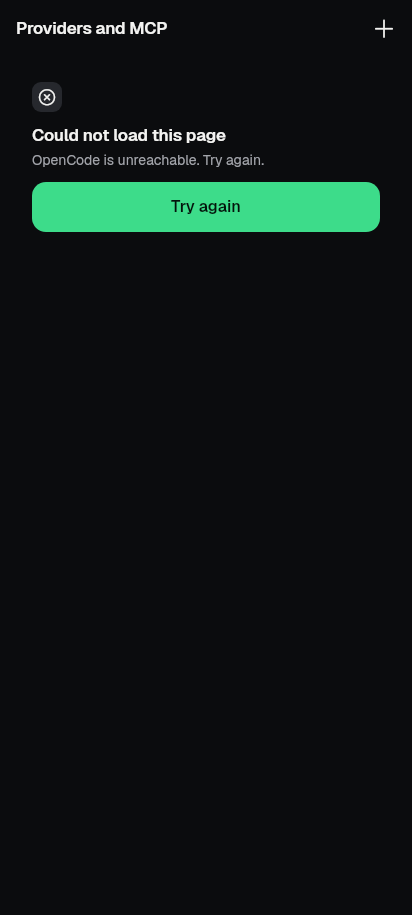
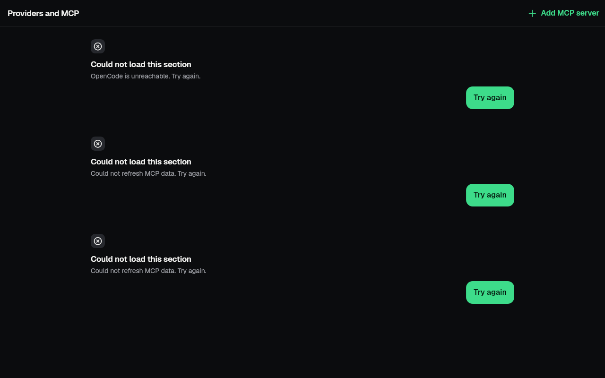
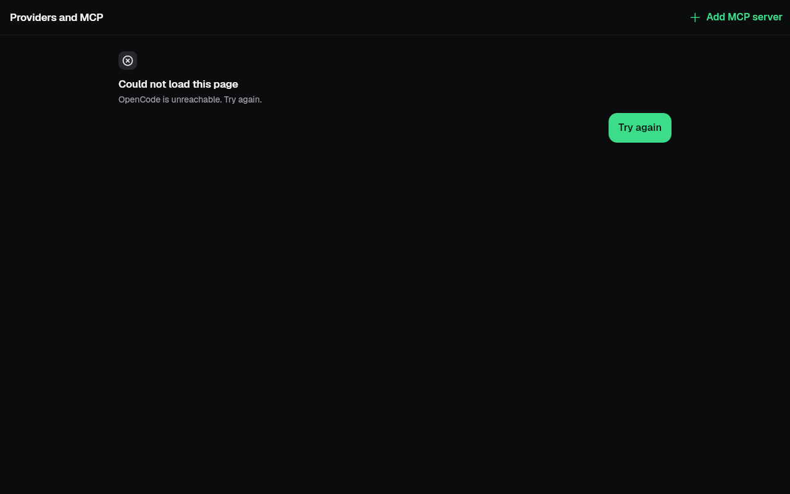
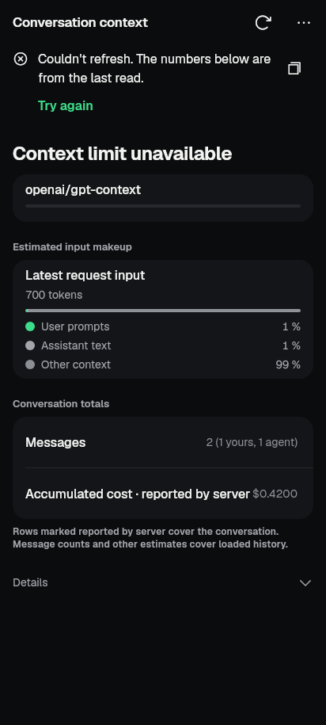
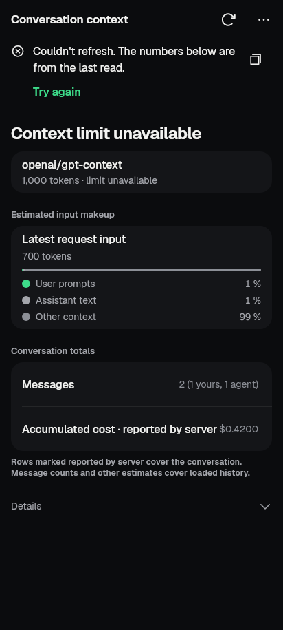
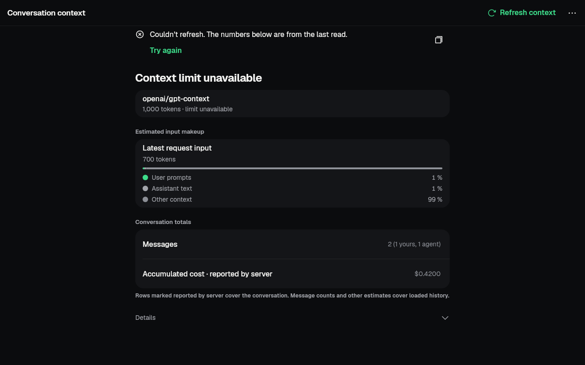
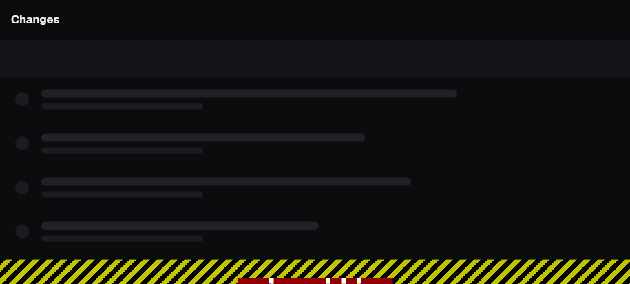
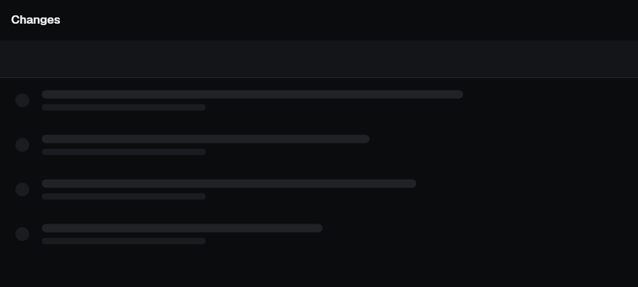

# slice-bugfix-nonchat — 2026-09-28

Finish line: the enabled product failures that the Codex test-repair lanes
([tests-c](../codex-tests-c-2026-09-28/README.md#product-owner-handoff) and
[tests-d](../codex-tests-d-2026-09-28/README.md#product-defects-and-remaining-work))
left behind pass because the product is fixed, wherever the code is outside
the owned areas; the rest are handed to their owners. Non-goals: chat/team,
KitSegmented, glass/nav dock, main.dart/startup, AI setup, connection/gateway
/session-link code; golden refresh; any test weakening or baseline change.

Base: `640655f8` (feat/phone-setup-v2). Branch `revamp/slice-bugfix-nonchat`.

## Every enabled failure

Rechecked on the base with pinned Flutter, one file at a time
(`flutter test --no-pub --concurrency=1 <file>`). "Fixed" means the test
failed on the base and passes after the change, with the test unchanged.

| Test file › case | Root cause | Owner area | Result |
|---|---|---|---|
| `chat_server_state_ui_test` › provider auth opens the providers screen | Integrations page: providers, MCP and resources each built an error state with its own primary Try again → 3 primaries (`kit_screen.dart:652`) | Library / integrations (unowned) | **Fixed** |
| `chat_live_events_test` › mcps command opens its Settings hub destination | Same page, 2 failed sections → 2 primaries | Library / integrations | **Fixed** |
| `chat_live_events_test` › command launcher maps context to the native usage surface | `session_context_screen.dart` passed `value: null` (limit unknown) to `KitProgressRow`, which by its contract means *loading*: bar empty, known "1,000 tokens · limit unavailable" hidden | Conversation context page (unowned) | **Fixed** |
| `model_picker_test` › model selector searches and persists a new selection | Sheet closed with `maybePop`; KitSearchField's back-clears-query `PopScope` intercepted it and the sheet stayed open | `lib/ui/widgets/pickers.dart` (unowned) | **Fixed** |
| `model_picker_test` › "Use for this conversation" leaves every other session alone | Same | pickers | **Fixed** |
| `model_picker_test` › the thinking menu keeps edits bound to the displayed model | An open Thinking menu applied the listed model's level to whatever model the draft had resynced to meanwhile | pickers | **Fixed** |
| `model_picker_test` › dismissing after Apply still completes the authorized agent choice | Sheet disposed its notifiers on close; the exiting body's `_setApplying` then wrote to a disposed `ValueNotifier` | pickers | **Fixed** |
| `product_ui_regression_test` › changes card opens the changed set… | KitUndo committed on "route opened on top" only through the page's secondary animation, which popup routes (sheets, dialogs) never drive; the Undo bar stayed over the reopened sheet's rows | `lib/ui/kit/kit_undo.dart` (unowned kit) | **Fixed** |
| `product_ui_regression_test` › symbol search opens the exact source line… | Enter did not cancel KitSearchField's pending settle, and Files wired `onSubmitted` to the same handler → same query sent twice | `kit_search_field.dart` + `files_screen.dart` | **Fixed** |
| `product_ui_regression_test` › stale terminal rename does not reload a new workspace | Rename completion reloaded without checking the place it started in | `terminal_screen.dart` | **Fixed** |
| `product_ui_regression_test` › stale terminal remove does not reload a new repository | Same, for remove (and "remove ended") | `terminal_screen.dart` | **Fixed** |
| `text_scale_overflow_test` › KitDiffView/loading | Fixed header + six 64dp skeleton rows in a 412dp-high landscape room → 26px bottom overflow | `kit_diff_view.dart` (unowned kit) | **Fixed** |
| `product_ui_regression_test` › persisted startup waits for reconnect before loading tabs | Root connecting page says "Connecting to Saved server" twice (card headline + shared status line). New since the lanes | `lib/main.dart` root / startup | Handed off |
| `nudge_moments_test` › approvals: third request points at Approvals; closing it removes it for good | `chat_screen.dart:6992` `_aboveComposer` overflows 43px with the approval tip | Chat | Handed off |
| `voice_reply_pipeline_test` › late reply stays silent after approval | Permission Allow + voice Listen = 2 primaries | Chat | Handed off |
| `release_blockers_test` › full-screen prompt editor fits a 320dp phone at 2x text | Selection handle covers the prompt-editor button | `lib/ui/kit/chat/kit_composer.dart` | Handed off |
| `demo_isolation_test` › compact demo keeps send and exit reachable… | Pending-request list gets 0px height above the composer | Chat kit / chat screen | Handed off |
| `text_scale_overflow_test` › KitComposerChips/narrow | Glyph-only chip row overflows 12–20px at 1.3–2× | `lib/ui/kit/chat/` | Handed off |
| `text_scale_overflow_test` › KitSegmented/labels-overflow, KitSegmented/tests-d-stacked-long-labels | KIT-24 stacked choice rows not implemented | `kit_segmented.dart` (KIT-24 agent) | Handed off |
| `golden_harness_test` › G23 ratchet | 152 golden naming/harness violations | Golden refresh batch | Handed off (not a product bug) |
| `kit_board_lane_test` ×2, `kit_date_time_picker_test` ×2, `kit_request_sheet_test` ×3 (G8x one-pump) | See [Not product bugs](#not-product-bugs-g8x-one-pump-samples) | Kit gates | Handed off for a gate decision |
| `kit_composer_test` (tests-d: 40px overflow) | — | Chat kit | Already passes on the base (50/50); nothing to do |

Hand-off entries (repro, root cause, suggested fix) are in the coordinator's
lane notes, section "2026-09-28 slice-bugfix-nonchat hand-offs".

Also failing on the base but in neither lane list (new since the lanes'
merges, not investigated here, recorded in the same notes for triage):
`offline_queue_test` › the offline banner counts drafts waiting for other
servers; `release_blockers_test` › offline banner states that displayed data
may be stale; `desktop_shortcuts_test` › Ctrl+1..4 (2 cases);
`development_services_screen_test` › unsupported profile explains….

## What changed

- **Providers and MCP** (`library/integrations_screen.dart`): when more than
  one section fails (a server that cannot answer at all), the page says so
  once — "Could not load this page" (new `integrationsPageLoadFailed`) with
  the first failure's plain words — at the first failed section, and its one
  Try again reloads every failed section. A single failed section keeps
  "Could not load this section". One primary per screen; nothing said three
  times. Keys `providers-/mcp-/resources-load-failed` are unchanged.
- **Conversation context** (`session_context_screen.dart`): with no known
  limit the model row is a plain `KitRow` whose second line is the known
  amount ("1,000 tokens · limit unavailable"); the progress bar is kept for a
  known limit only. `KitProgressRow` is unchanged (its `value: null` is
  loading by contract).
- **Model sheet** (`widgets/pickers.dart`): Apply closes the sheet with
  `pop` when it is the current route (a search query no longer keeps it
  open); a level picked from the Thinking menu binds the draft to the model
  the menu listed; `_setApplying` skips the sheet's notifier once the sheet
  has disposed it.
- **KitUndo** (`kit/kit_undo.dart`): a post-frame check commits the bar when
  its route stops being current while still in the stack (a sheet, dialog or
  page opened on top). A bar shown while its route is covered (a sheet
  closing with the act's result) waits until the route is current again.
  Post-frame checks schedule no frames. `KitUndo.md` already specified this.
- **KitSearchField** (`kit/kit_search_field.dart`, `KitSearchField.md`):
  Enter settles the query at once — a pending `onChanged` runs now and the
  wait is cancelled, so it is never reported twice — then `onSubmitted`.
  Files no longer passes its search handler as `onSubmitted`. Command palette
  and transcript find now act on the typed text even when Enter comes before
  the settle.
- **Terminal list** (`terminal_screen.dart`): rename, remove and "remove
  ended" reload only if the list still shows the repository and location the
  act started in.
- **KitDiffView loading** (`kit/kit_diff_view.dart`): in a bounded room it
  shows only the skeleton rows that fit whole (at most six).

## Not product bugs: G8x one-pump samples

Temporary `debugAssertNoTransientCallbacks` instrumentation (removed) shows
each of the seven leftover callbacks is Flutter's `LayoutBuilder` deferring
an idle-phase rebuild to the next frame (`layout_builder.dart`
`_scheduleRebuild` → `scheduleFrameCallback`):

- board lanes: selecting a lane toggles `ExcludeFocusTraversal`; the focus
  manager applies it in a microtask after the frame and notifies `Focus`
  dependents under the board's `LayoutBuilder`;
- time picker: the post-frame Hour `requestFocus` → `KitField._onFocus`
  `setState`;
- request sheet: the code block's `RawScrollbar` receives its first scroll
  metrics after layout.

No ticker or animation runs; the visible effect is one extra frame. Any
focus change or first scrollbar layout under a `LayoutBuilder` behaves this
way, so "fixing" the parts would mean restructuring them around a framework
detail, and discounting these callbacks in G8x would change a shared gate.
Neither was done; the tests stay enabled and the decision is handed to the
kit-gates owner.

## Tests

New behaviour tests (each watched failing on the base first):

- `test/library_integrations_test.dart` › every section failing says so
  once, and one Try again reloads them all.
- `test/kit/kit_undo_test.dart` › 5e a sheet opened over the page commits
  the bar (fails on base); 5f a bar shown as its sheet closes stays until
  something covers it (guards the new check; passes on base too).
- `test/kit/kit_search_field_test.dart` › 8b Enter before typing settles
  reports the query once.

Runs (pass / fail), pinned Flutter, `tool/qa/machine_lock.sh test -- flutter
test --no-pub --concurrency=1 <file>`, base = `640655f8`:

| File | Base | After |
|---|---:|---:|
| `chat_server_state_ui_test` | 8 / 1 | 9 / 0 |
| `chat_live_events_test` | 103 / 2 | 105 / 0 |
| `model_picker_test` | 22 / 4 | 26 / 0 |
| `product_ui_regression_test` | 22 / 5 | 26 / 1 (startup, handed off) |
| `text_scale_overflow_test` | 498 / 4 (full file) | `--plain-name KitDiffView/`: 10 / 0; the other 3 failures are handed off (chips, segmented ×2) and untouched |
| `library_integrations_test` (with the new case) | 27 / 1 | 28 / 0 |
| `kit/kit_undo_test` (with 5e, 5f) | 39 / 1 | 40 / 0 |
| `kit/kit_search_field_test` (with 8b) | 21 / 1 | 22 / 0 |
| `kit/kit_diff_view_test` | — | 50 / 0 |

Files touching the changed code, after: integration_auth_recovery 4/0,
e7_library_layout 3/0, revamp/screen_library_1 6/0, revamp/screen_library_3
14/0, review_handoff 19/0, prompt_shelf 10/0, projects_screen 27/0,
session_draft 20/0, while_away_inbox 7/0, failed_job_report_ui 9/0,
appearance_picker 7/0, transcript_search 9/0, global_sessions_screen 34/0,
home_navigation 25/0, project_hub 13/0, team_home_layout 2/0,
kit/r08_kit_fields_progress_avatar 11/0, kit/kit_screen 25/0,
revamp/screen_shell_2 14/0. offline_queue 56/1, development_services_screen
14/1 and desktop_shortcuts 12/2 fail the same cases on the base (see above).

Gates after: kit_ratchet 34/0, redaction 16/0, ui_glossary 21/0,
no_raw_error_text 5/0, kit/kit_manifest 3/0, kit/kit_draft_manifest 25/0.
`flutter analyze --no-pub`: no issues. `dart format --language-version=3.10`
on every changed Dart file. `flutter gen-l10n` after the one new English
string (Arabic not added). No skips, baselines or gate edits. Not a full
suite run.

## Images

Captured by `tool/capture/bugfix_nonchat_test.dart` (same file on the base
worktree with `--dart-define=BUGFIX_CAPTURE=before`), dark, real fonts, fakes
only. The before integrations capture also trips the base's 3-primaries
assertion, which is the defect shown. The context captures show a "Couldn't refresh" notice in both before
and after: the capture fake does not serve the page's refresh call.

| Page | Before | After |
|---|---|---|
| Providers and MCP, all sections failed, phone |  |  |
| Same, wide window |  |  |
| Conversation context, unknown limit, phone |  |  |
| Same, wide window |  |  |
| Diff loading, phone on its side (915×412) |  |  |

## Still needs a device

- Undo bar over a real sheet on Android (the commit when the changed-files
  sheet reopens) and the IME search action in Files sending one request.
- Model sheet: Apply with a search typed closes the sheet on a phone.
