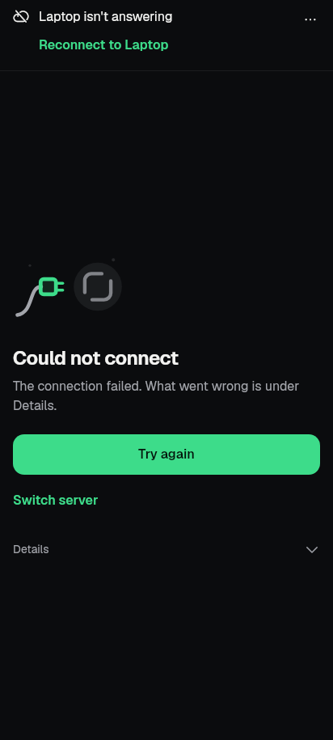
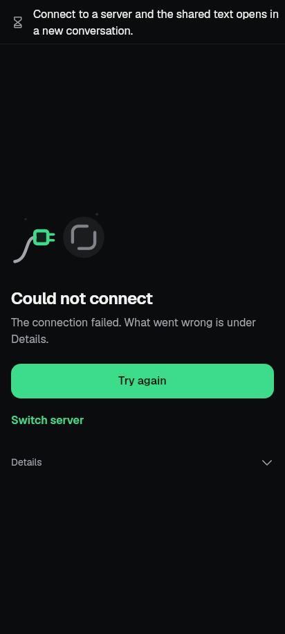
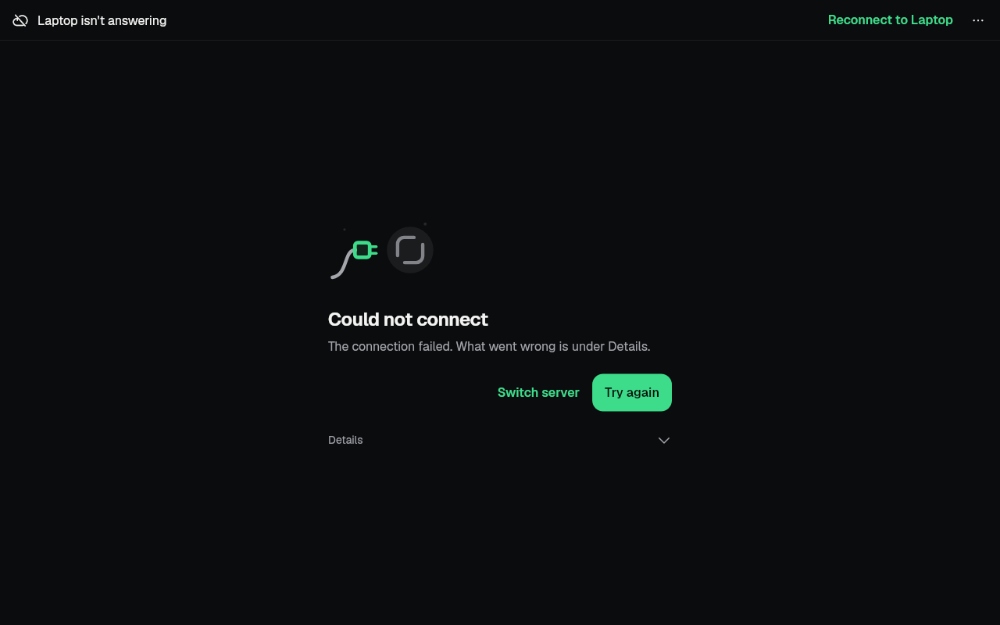
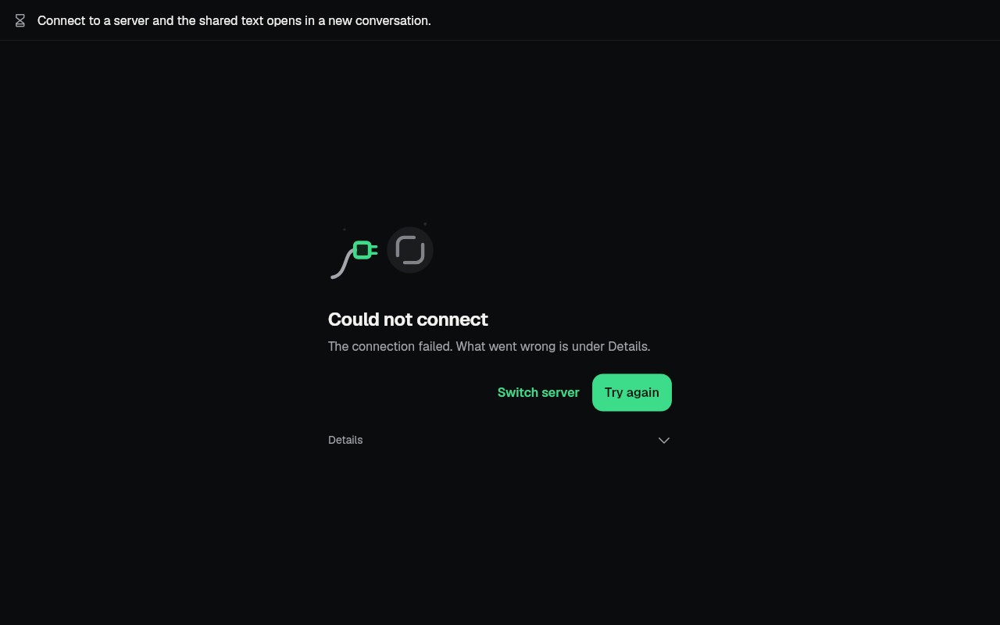

# slice-bugfix-nonchat2 — 2026-09-28

Second pass on the failing tests outside chat. Base `b9fdd22f`
(feat/phone-setup-v2), branch `revamp/slice-bugfix-nonchat2`.

Finish line: every listed non-chat failure passes because the product was
fixed or because the test now asserts the intended Sept 27–28 behaviour
(cited); the chat ones are handed off; AI setup is findable in settings
search. Non-goals: chat library, team pages, golden refresh (except the two
images this slice's own product fix changes), kit press/tap feedback.

The lists in the earlier records were partly stale on this base: rechecked
one file at a time (`tool/qa/machine_lock.sh test -- flutter test --no-pub
--concurrency=1 <file>`), `home_navigation` fails 2 (not 16) and
`first_run_landing` passes (tests-b fixed it). `first_run_auto_test` is
`test/first_run_auto_test_test.dart`.

## Every failure

"Product" = the app was wrong and is fixed, test unchanged or extended.
"Stale" = the test asserted UI that an intentional change removed; it now
asserts the new behaviour (commit cited).

| Test › case | Verdict | Cause | Fix |
|---|---|---|---|
| `product_ui_regression` › persisted startup waits for reconnect | **Product** | Root connecting page said "Connecting to Saved server" twice: the card headline and the shared connection line (3d64653c). With a failed connect it showed two Retry actions ("Reconnect to Laptop" and "Try again") | `lib/main.dart`: the root connecting page reads the app's conditions without the connection kind (the card *is* the connection state, with its own Try again / Details / Switch server). Other app lines (a share waiting, app stopped, heat) still show |
| `revamp/coord_main_golden` › share waiting ×2 | Stale (follows the fix above) | Asserted the connection line wins on that page; the file header already described "a share waiting for the server as the app's status line over that page" | Asserts no connection line, the share line shown, the server named once; two goldens regenerated (images below) |
| `home_navigation` › reduced motion switches destinations without animation | Stale — 71cb03cd (fluid glass) | Read the dock's `AnimatedPositionedDirectional` duration; the lens now rides springs on one ticker | Lens is on Settings after one pump, Settings has no fading `Opacity`, and the lens does not move afterwards. Not "zero callbacks": Settings builds on first visit (5253e12c lazy tabs) and its own loading bar runs |
| `home_navigation` › switching destinations fades through | Stale — 71cb03cd | Same helper | Asserts the lens is caught mid-way at 40 ms and settles on Inbox; fade assertions unchanged |
| `desktop_shortcuts` › Ctrl+1..4 switch the shell destinations; …return to the shell from a pushed route | Stale — 635f69ac (slice-R14) | Read the `current-tab-title` pane bar that R14 removed ("no title repeating the sidebar") | Reads the destination `KitNav` marks as selected |
| `release_blockers` › offline banner states that displayed data may be stale | Stale — 3d64653c | Bare `HomeScreen` without the app's shared status scope, no saved server (the shared status is hidden without one), old `work-status-*` keys | Mounts the same adapter as the app root (`AppConditionsScope` + `connectionKitStatus`), saved profile, `connection-status-banner` → Details → "may be stale" |
| `share_routing` › shared text waits for a connection and says so once (found while checking `main.dart`) | Stale — 3d64653c | The controller owns an 8 s connection wait now; the test ended at 5 s with it pending | Pumps 9 s and checks the share still waits |
| `server_switcher` › current server status follows the connection | **Product** | The switcher sheet read raw `StreamStatus` and said "Reconnecting" forever while the shell pill (shared status) said "Offline" — a consumer 3d64653c missed | `server_switcher_sheet.dart` uses `controller.connectionStatus.phase` with the pill's words. Test pumps past 8 s, expects "Offline" in sheet and pill (fails with the fix reverted). Same extension in `revamp/shared_servers_1` › "while reconnecting…" |
| `server_switcher` › app bar server name opens the switcher; renamed in place and saved | Stale — f4b7a51f | `server-profile-title` key gone from the kit shell pill | Name found inside `server-switcher-button`; label and 48 dp target asserted |
| `server_switcher` › Add server opens the editor | Stale — 71417a2f | URL field is a kit `TextFormField` | Reads the inner `TextField` |
| `first_run_auto_test_test` › invalid address never probed; failure names cause and keeps focus | Stale — 71417a2f | `TextFormField` cast | Reads the inner `TextField` / `EditableText` |
| `first_run_auto_test_test` › leaving the screen cancels the queued test | Stale — 3d251f37 (P3.9) | Add server has steps; the connect step shows Back, not Close | Back, then Close (discard if asked), no probe after either |
| `development_services_screen` › unsupported profile explains… | Stale — 06102116 | Kit link gate says "Opens 192.168.1.20:5173 outside this app." and "Don't open" | Finds the host in `external-link-confirm`, taps "Don't open" |
| G8x one-pump: `kit_board_lane` ×2, `kit_date_time_picker` ×2, `kit_request_sheet` ×3 | **Gate adjusted** (for coordinator review) | See [G8x](#g8x-one-pump-samples) | `test/kit/kit_motion_still.dart` `kitStillLeftovers`; five negative tests |
| Settings search: "AI setup" not findable | **Product** | No search entry for the new row | `search_index.dart` `inside-server-ai-setup` |

| `accessibility_guidelines` › dark / light: Activity meets the guidelines | **Product** | `KitIconButton`'s `Semantics` was not a container: on the Inbox permission row its "Allow once" merged into the `KitRow`, the two taps collided, and the row's tap was left on a node with no label | `kit_icon_button.dart`: `Semantics(container: true, …)`, always its own node; spec line in `KitIconButton.md`. `KitTappable` untouched |
| `accessibility_guidelines` › light: the Project tab | Test host (follows the fix) | With the button split out, the header title is checked alone; the test pumped `ProjectHub` with no page ground (contrast 1.12 on transparent) | Hosted in a `Scaffold` as the shell does and as the Activity/Settings cases already are; contrast check unchanged |
| `motion_states` › Chat: while a reply is written the working mark moves…; under reduced motion the working mark is still | Stale — e28442b0 (chat-3, LOOK-20) | The composer's animated working mark was removed on purpose: Stop is the working signal | Asserts Stop shows while the reply is written, goes when the run ends, nothing left moving; still under reduced motion. Test-only; no chat code touched |
| `desktop_scrollbar` › a controller-owning list gets a pinned, single scrollbar | Stale — 98c064bd | The second `Scrollbar` is the status line's own bounded scroller (large-text status above the keyboard), a different scrollable | Exactly one pinned, controller-owned thumb on the file list, and no two scrollbars share a controller |
| `desktop_scrollbar` › the shell destinations all scroll with a pinned thumb | Stale — c36409dc | Material `NavigationBar` became `KitNavBar` | Finder uses `KitNavBar` |

### Handed off (lane notes, "2026-09-28 slice-bugfix-nonchat2 hand-offs")

- `offline_queue` › the offline banner counts drafts waiting for other
  servers — **product regression in chat**: 3d64653c deleted chat's
  `_queuedNote()` with no replacement, so offline chat no longer says how
  many drafts are queued / waiting for other servers. Fix belongs in
  `chat_screen.dart` (status slot); details in the notes.
- `release_blockers` › full-screen prompt editor fits a 320dp phone —
  chat kit (unchanged from the first pass).
- `motion_states` › Inbox: all caught up is the tray — **product, in
  `lib/state/connection.dart`** (Codex inbox lane): since c96a7fb4 the
  connected server counts as "unknown" until the opt-in other-server
  monitor has a current snapshot of it, so a default user never sees "All
  caught up". Test unchanged (it asserts the right behaviour).
- Noticed, not in this slice: `architecture_boundaries_test` ARCH-1/ARCH-2
  (tools_screen third api import; `last_known_sessions.dart`,
  `session_handoff.dart` new; flavour gating in session_handoff) and
  `revamp/shared_servers_1_golden` 4 pixel diffs — both fail the same on
  the base.

## AI setup in settings search

`inside-server-ai-setup` (inside "This server"): title "AI setup", keywords
its row's supporting line ("Models, tools and suggestions for this server"),
Arabic words through the usual other-language merge. Present exactly when
the row is (a saved server with `setupConfigRead`); `serverGate` marks it as
hidden by the server. The result opens the AI setup page itself, titled with
the same server name as its row. The UI ledger has no `ai-setup` page yet
(`docs/design/ui-ledger/build_ledger.py` rebuild), so `pages` names the door
page, `server-settings`.

## G8x one-pump samples

Instrumentation (a temporary `debugAssertNoTransientCallbacks` hook,
removed) showed each leftover frame callback is Flutter's `LayoutBuilder`
deferring a rebuild asked for after the frame to the next frame
(`layout_builder.dart` `_LayoutBuilderElement._scheduleRebuild` →
`scheduleFrameCallback`): board lanes — the `ExcludeFocusTraversal` toggle
the focus manager applies in the microtask after the frame; time picker —
the Hour field's focus `setState`, then its select-all; request sheet — the
code block scrollbar's first scroll metrics. No ticker runs. The same
rebuild outside a `LayoutBuilder` only schedules a frame, which the gate
never counted, so these were false positives against MOT-7 ("no running
ticker"). Restructuring the parts (removing `LayoutBuilder`s, or changing
`KitField`'s focus/select-all timing app-wide) around a framework detail
was rejected.

**Gate change, for the kit-gates owner to accept or revert** (the smallest
one with proof): `test/kit/kit_motion_still.dart` `kitStillLeftovers`
excuses a frame callback only when its registration stack shows
`_LayoutBuilderElement._scheduleRebuild` right after
`scheduleFrameCallback`, lets those rebuilds run in frames where no time
passes (so nothing can animate), at most 3 in a row, then checks again. A
ticker is never excused — alone, next to a deferred rebuild, or started by
one — and a part that rebuilds itself every frame fails. Five negative
tests in `test/kit_motion_test.dart` ("G8x leftovers") prove each case. The
visible-text checks still run after exactly one pump. No part changed, no
baseline entry added. `kit_request_sheet_test` 15 uses the same helper for
its three direct `hasRunningAnimations` checks.

## Images

Root connecting page with a share waiting (Flutter goldens, real fonts,
DPR 1; the wide file is named `light` but renders dark, as on the base):

| | Before | After |
|---|---|---|
| Phone 412×915 |  |  |
| Wide 1280×800 |  |  |

Before: "Laptop isn't answering · Reconnect to Laptop" over "Could not
connect · Try again". After: the page says it once; the app line carries
the waiting share.

## Tests

New: `search_index_test` › "AI setup is found by name where the server
shares its setup, and absent where its row is" and "the AI setup result
opens the AI setup page"; `kit_motion_test` › group "G8x leftovers" (5).
Extended: `server_switcher` › status follows the connection (fails with
the sheet fix reverted), `revamp/shared_servers_1` › while reconnecting.

Pass / fail, pinned Flutter, `tool/qa/machine_lock.sh test -- flutter test
--no-pub --concurrency=1 <file>`, base `b9fdd22f`:

| File | Base | After |
|---|---:|---:|
| `home_navigation` | 23 / 2 | 25 / 0 |
| `desktop_shortcuts` | 12 / 2 | 14 / 0 |
| `product_ui_regression` | 26 / 1 | 27 / 0 |
| `revamp/coord_main_golden` | — | 8 / 0 (share waiting ×2 fail until the 2 goldens are regenerated) |
| `release_blockers` | 21 / 2 | 22 / 1 (prompt editor, chat kit, handed off) |
| `share_routing` | 6 / 1 | 7 / 0 |
| `search_index` (+2 new) | 21 / 0 | 23 / 0 |
| `server_switcher` | 11 / 4 | 15 / 0 |
| `revamp/shared_servers_1` | 13 / 1 | 14 / 0 |
| `first_run_auto_test_test` | 4 / 3 | 7 / 0 |
| `development_services_screen` | 14 / 1 | 15 / 0 |
| `accessibility_guidelines` | 22 / 2 | 24 / 0 |
| `desktop_scrollbar` | 3 / 2 | 5 / 0 |
| `motion_states` | 12 / 3 | 14 / 1 (Inbox all-clear, handed off) |
| `offline_queue` | 56 / 1 | 56 / 1 (chat queue note, handed off; untouched) |
| `kit/kit_board_lane` | 24 / 2 | 26 / 0 |
| `kit/kit_date_time_picker` | 53 / 2 | 55 / 0 |
| `kit/kit_request_sheet` | 36 / 3 | 39 / 0 |
| `kit_motion` (+5 new) | 165 / 0 | 170 / 0 |

Also passing after the changes (files touching changed code): app_lifecycle
4, bootstrap_start_fresh 3, builtin_server_autostart 6,
perf_startup_connection 1, codex_navigation 2, opening_shell 5,
settings_search_rows 7, phone_server_screens 11, safety_confirms 6,
phone_server_card 36, activity_screen 15, revamp/shared_work_1 5,
stable_chat_layout 10, and the kit files around `KitIconButton`
(kit_icon_button 27, kit_row 19, kit_tappable 30, kit_top_bar 26,
kit_queued_message 22, kit_code_block_r3 6, kit_log_panel_r3 4,
kit_message 32, kit_task_card 28, kit_notice 34, kit_sheet 28,
kit_diff_view 50, kit_work_graph 34, kit_row_parts 17, kit_row_group 6).

Gates: kit_ratchet 34/0, kit/kit_manifest 3/0, redaction, ui_glossary,
no_raw_error_text 42/0 together. `flutter analyze --no-pub`: no issues.
`dart format --language-version=3.10` on every changed Dart file. No copy
changed (no gen-l10n). Not a full-suite run.

Fail on the base and after, unchanged and outside the list:
`architecture_boundaries` ARCH-1/ARCH-2, `revamp/shared_servers_1_golden`
(4 pixel diffs), `kit/kit_image` KitZoom reduced-motion reset (pending
timer) — in the lane notes.

## Still needs a device

- Cold start with a saved server that is down: one connection message, the
  card's Try again works, a share arriving meanwhile shows its line.
- Server switcher sheet after 8 s offline reads "Offline", matching the pill.
