# slice-close-misc: review-board leftovers in Servers, Remaining usage, the Project tab and Notifications (2026-09-28)

**Source:** `docs/qa/review-board-closure-2026-09-28/README.md`, gaps 5, 19 and 23, plus the notifications-settings low item.

**Finish line:** "Background checks" is gone and every way to it lands where checks are turned on. The collector path of Remaining usage answers in plain words, with no engine header and no collector controls where the collector is missing. The Project tab's Changes and Terminal rows carry live lines. The Notifications background line is short.

**Non-goal:** the P2 setup assistant (the owner put it on "later"). Also out of scope: Codex-answer persistence and the device alert (state work for the Codex backend), the Plugins AI Team discovery row (team unit), and the PRIVACY.md rewrite (a legal text the owner has to review).

## What changed, per page

**profile-monitor ("Background checks"): removed** (rethink; P4.2b acceptance "profile-monitor route removed")

- `ProfileMonitorScreen` is deleted, and its status dot and engine words went with it. `profile_monitor_screen.dart` now holds only the Inbox rows (`ProfileMonitorInbox`) and `openMonitoredRequest`.
- The Servers page loses its Background checks row and that row's helper. The server rows already carry each server's status word (P4.2b).
- In search, "Background checks" and the old monitor words now find **Notifications › Saved servers** (`inside-notifications-servers`). The `inside-servers-monitor` entry is gone. The ledger page id stays on the entry, so the ledger coverage test still passes.
- The Inbox's "Not checking …" and "Couldn't check …" rows open Notifications scrolled to the saved servers' checks (`initialSection: 'servers'`). The monitoring settings stay in that section.

**provider-quota (Remaining usage, collector path)**: owner note "Feature itself needs a lot of work"

- Answer rows now sit under "Codex, from the quota collector on Studio". The "Codex account windows / Reported plan / Snapshot checked" header is gone.
- The plan, the reading time, the collector address and the source-bound caveats moved to Details.
- Windows the collector did not report are left out, so there is no "Secondary window · Not reported" row. With no reported limit at all, the page says "The quota collector on Studio reported no limits for Codex."
- The alert row comes after the rows it acts on.
- Missing collector: a plain "Needs the quota collector on Studio" notice and "How to get it". There is no Retry beside the top bar's Refresh, and no "Collector server" or "Stop using this collector".
  - Step 1 no longer names `tool/quota` in the repository.
  - "Open the collector guide" opens the collector README through `openExternalLink`.
- A working collector keeps one stop, which names its target: "Stop using the quota collector on Studio", with one line saying what happens.
- The monitoring section appears only when something is monitored, on both paths. The jargon empty notice ("No provider sources are monitored…") is deleted.
- Monitored sources on other servers read as the same answer rows under "{server} · {provider}".
  - A current source says nothing extra.
  - Any other state is one row in words beside a neutral mark.
  - The mono collector address and "Snapshot checked" are gone.
  - Monitor states were reworded: "Checking now…", "Waiting for Wi-Fi to check again.", "Paused. Checks start again when…", and "The account on this server changed, so checks stopped…".
- `quotaAnswerSentence` and the answer row (`QuotaAnswerRow`) moved to `quota_monitor_section.dart`, so the Codex path, the collector path and monitored sources draw windows one way.

**project-hub (Project tab)**

- Changes shows "3 files changed" or "No changes". Terminal shows "1 running", and nothing when no terminal is running. Changes already came first.
- On the brief's "reuse WorkRowStatus": `WorkRowStatus` describes chat turns and team tasks, not tools, so it has no fact for "3 files changed". As the brief asked, no new poller was built.
  - The lines come from one read of the gateway's existing `listFileStatuses` and `listTerminals`.
  - A read happens when the tab opens, when the server, location or project changes, when a tool screen closes, and when the last busy conversation goes idle, since that is when files change.
  - A failed read leaves the title alone; the tool's own page says what failed.

**notifications-settings**

- The background line now reads "Android stops this after 6 hours a day. The app will tell you when it does."
- `monitorDisclosure` names the switch ("Stay connected in the background") instead of "Keep live".

**Copy:** 10 new English strings; 37 unused keys deleted from en/ar; Arabic dropped for the 8 reworded keys; the glossary baseline was shrunk to match; gen-l10n was run.

## Before / after (phone and 1280x800, dark)

| Page | Before | After |
|---|---|---|
| Servers (Background checks row) | 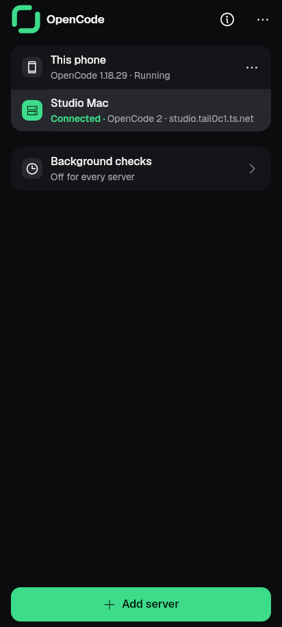 | 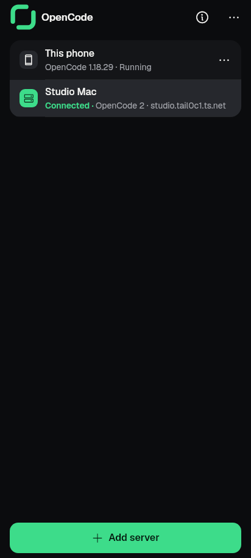 |
| Servers, wide | 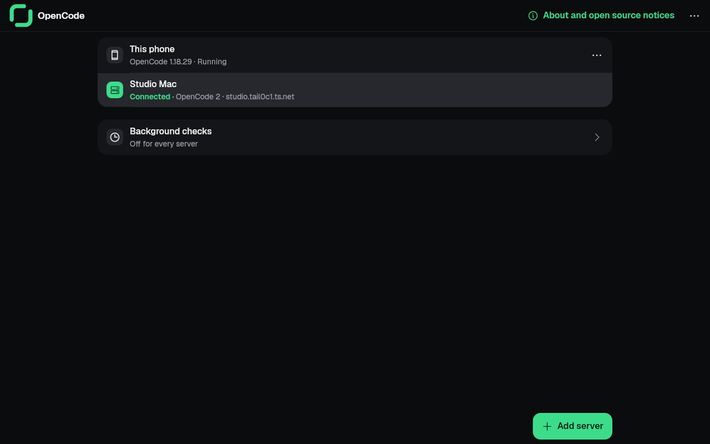 | 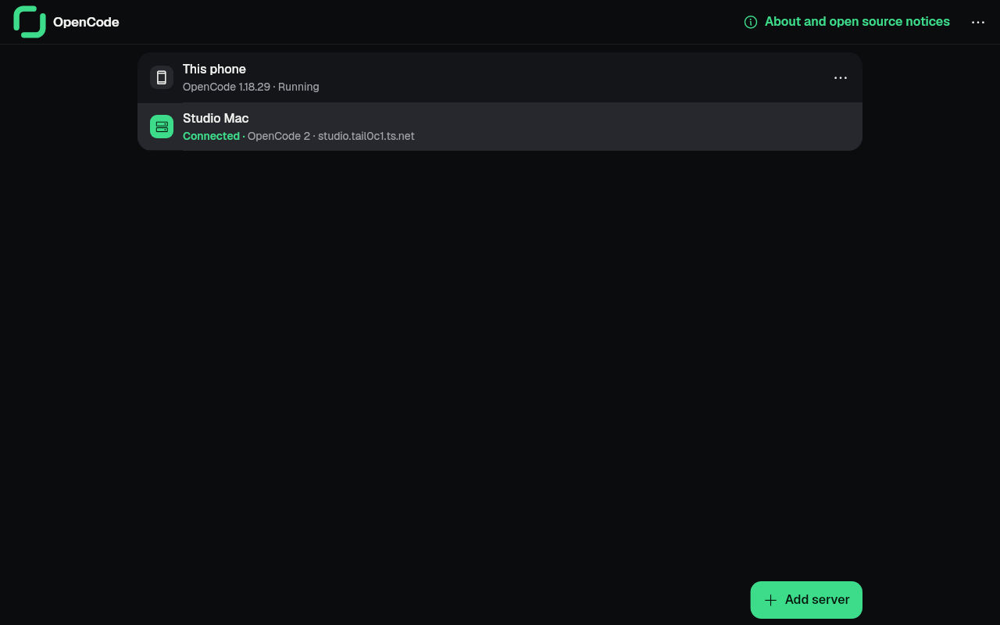 |
| Remaining, collector reading | 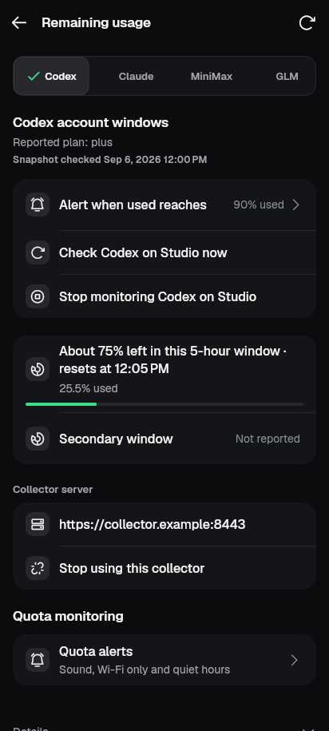 | 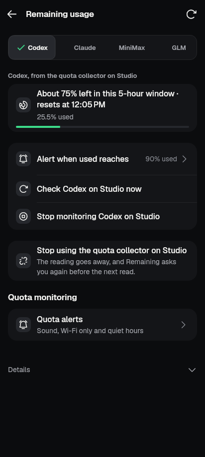 |
| Remaining, collector reading, wide | 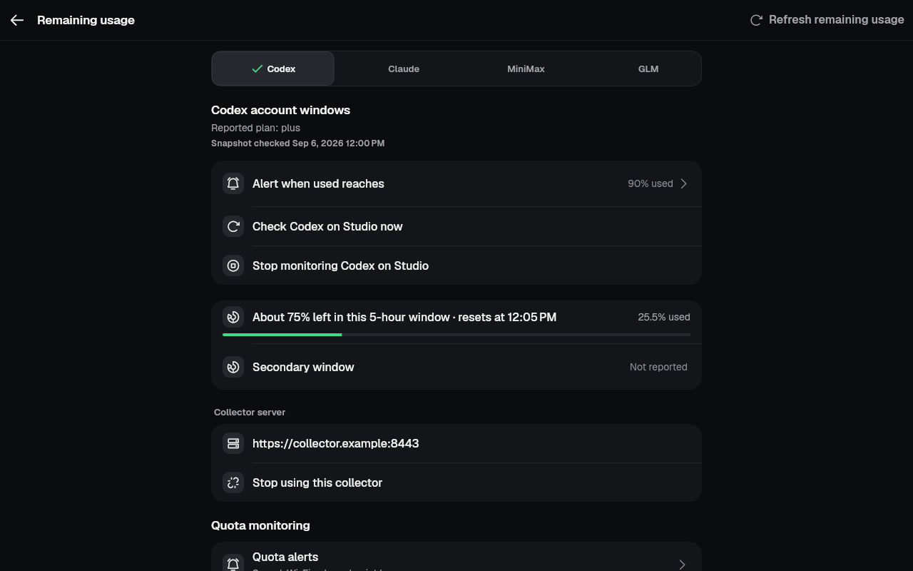 | 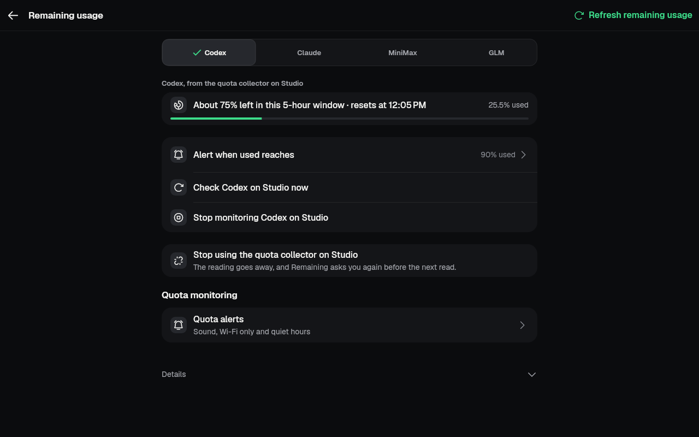 |
| Remaining, collector missing | 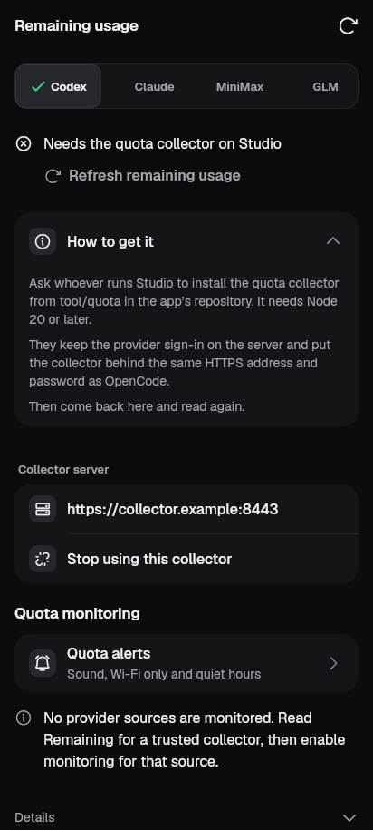 | 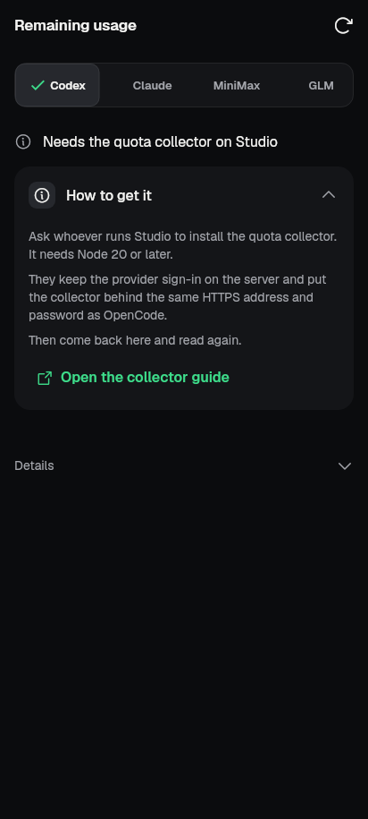 |
| Monitored source on another server | 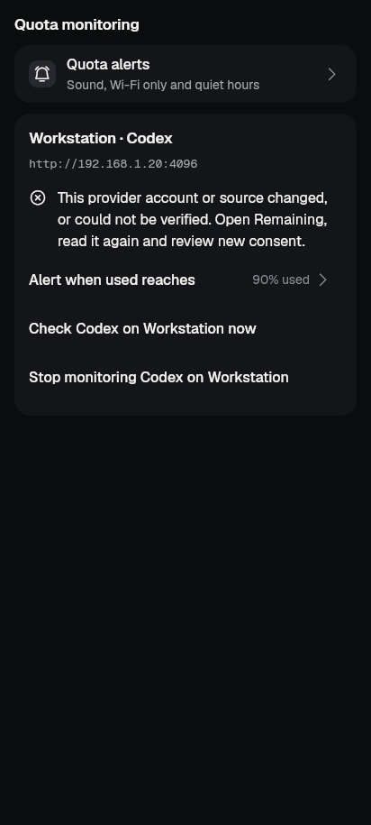 | 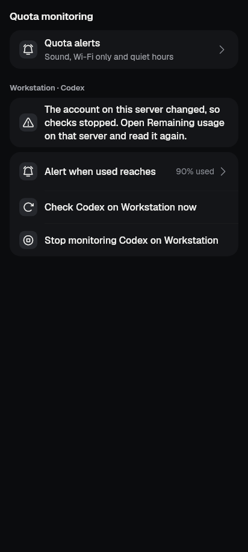 |
| Project tab | 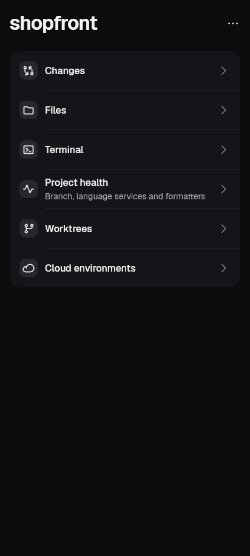 | 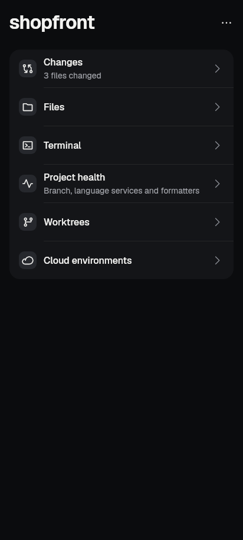 |
| Project tab, wide | 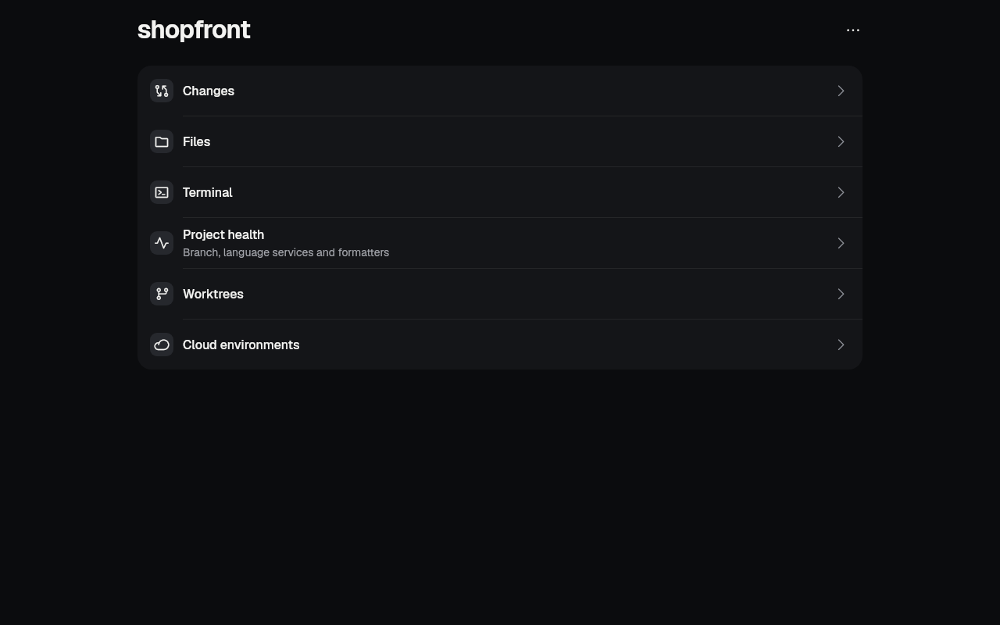 | 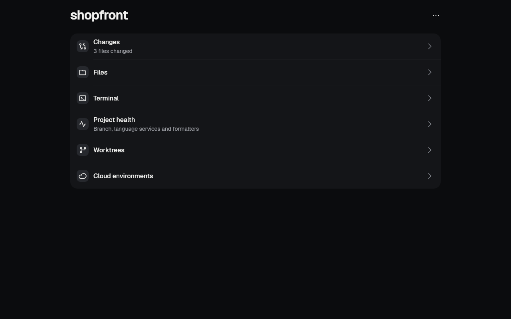 |

## Tests

- **New:** `test/revamp/slice_close_misc_test.dart`, 11 tests.
  - All 11 fail on base `ee0fdb7a`, run in a temporary worktree with the new string keys replaced by literals so the file compiles. All 11 pass here.
  - Coverage: no Background checks row; search lands in Notifications › Saved servers; the Inbox row opens that section; the collector reading has no header, its facts are in Details, and Stop names the server; no-windows copy; missing collector has no retry or controls, and the guide is a link; a monitored source has no address; the hub's live lines and re-read without a timer; the Notifications copy.
- **Existing affected files:** 80 files, run serially in chunks under `tool/qa/machine_lock.sh`, and compared with the same list on base.
  - Every failure the branch added was a deliberate behaviour or golden change and has been updated:
    - `provider_quota_screen_test`, `screen_usage_2_test`, `shared_usage_1_test`, `slice_r17_test`, `search_index_test`, `servers_reachability_test`, `notifications_settings_screen_test` and `profile_monitor_screen_test`: tests and assertions for the removed page or the old copy were updated or dropped.
    - Goldens regenerated for exactly the affected cases: `screen_usage_2_golden` (all), `slice_r15_golden` (all), `slice_p54_golden` "collector missing", `shared_usage_1` gallery, `screen_files_1_golden` "project hub", `screen_servers_1` "servers loaded" and "remove sheet", `queued_prompt_move` goldens, `queued_prompt_removal` "remove sheet with queued prompts".
  - Pre-existing on base and unchanged: 87 failing cases in 22 files. Most are drifted goldens from other merges, plus `server_pairing_paste`, `server_v2_connect_flow`, `agent_account_widget`, `team_gate_answer`, 4 in `notifications_settings_screen_test`, and others. None were touched.
  - Gates: `kit_ratchet`, `redaction`, `ui_glossary`, `no_raw_error_text`, `kit/kit_manifest`, `kit/kit_draft_manifest`, `architecture_boundaries` and `ui_ledger_coverage` pass.
  - `flutter analyze lib test`: clean.

## Still needs a device

- Remaining with a real collector: the guide link opening in the browser, and Stop, then consent again.
- The Project tab's lines against a live OpenCode server with real terminals, including the refresh after a turn finishes.
- The Inbox "Not checking …" row landing on Notifications › Saved servers.

## Notes for the coordinator

- `lib/ui/screens/servers_screen.dart` belongs to the servers agent. My only change there deletes the Background checks row, its line helper and two now-unused imports, so it should merge cleanly.
- `docs/design/ui-ledger/ledger.json` still lists `profile-monitor` with its edge from `servers-background-checks`. It was not rebuilt, because `build_ledger.py` currently regenerates about 650 lines of unrelated drift. Drop the page from `parts/g-servers.json` and `parts/j1-settings-more.json` at the next ledger rebuild, then remove `'profile-monitor'` from the `inside-notifications-servers` search entry's `pages`.
