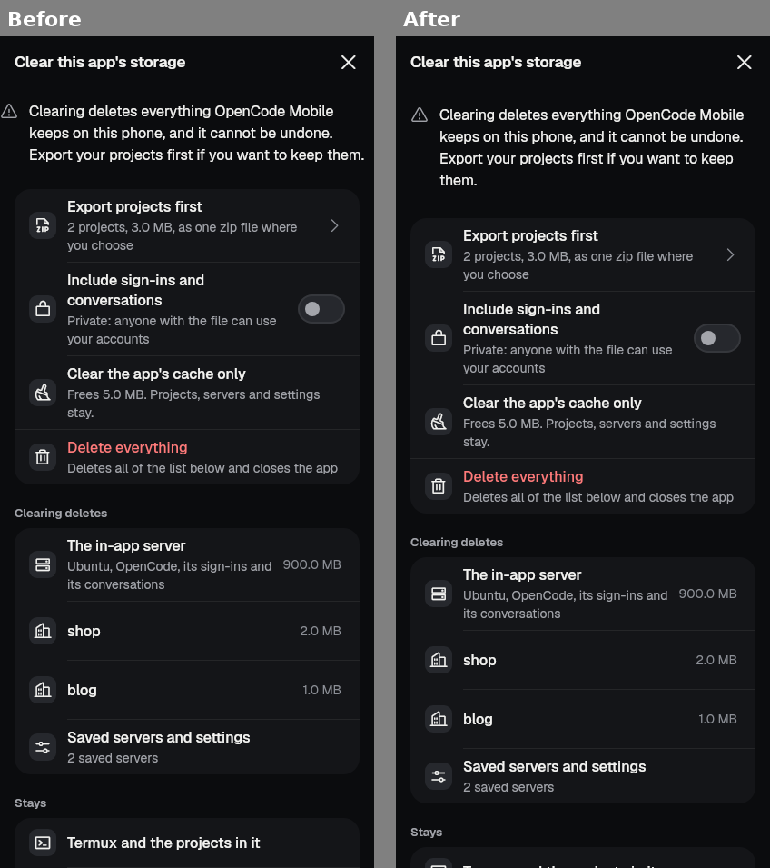
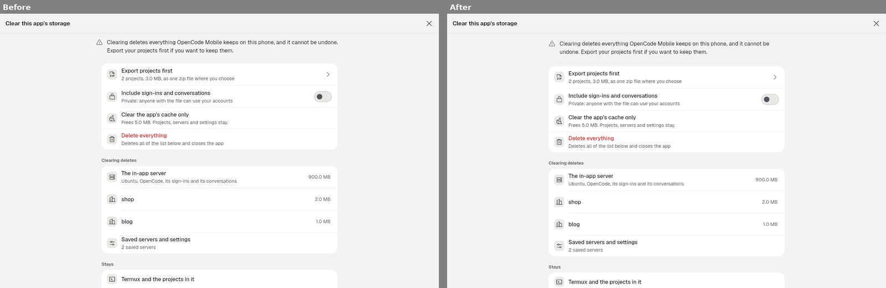
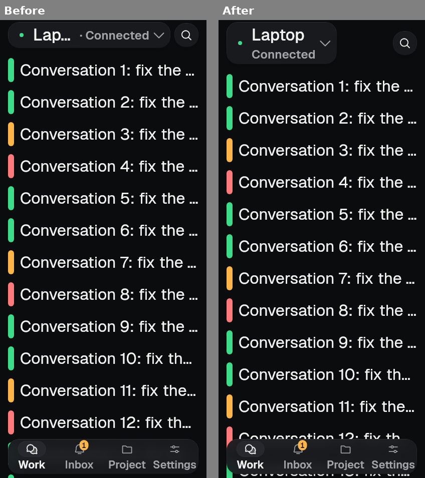
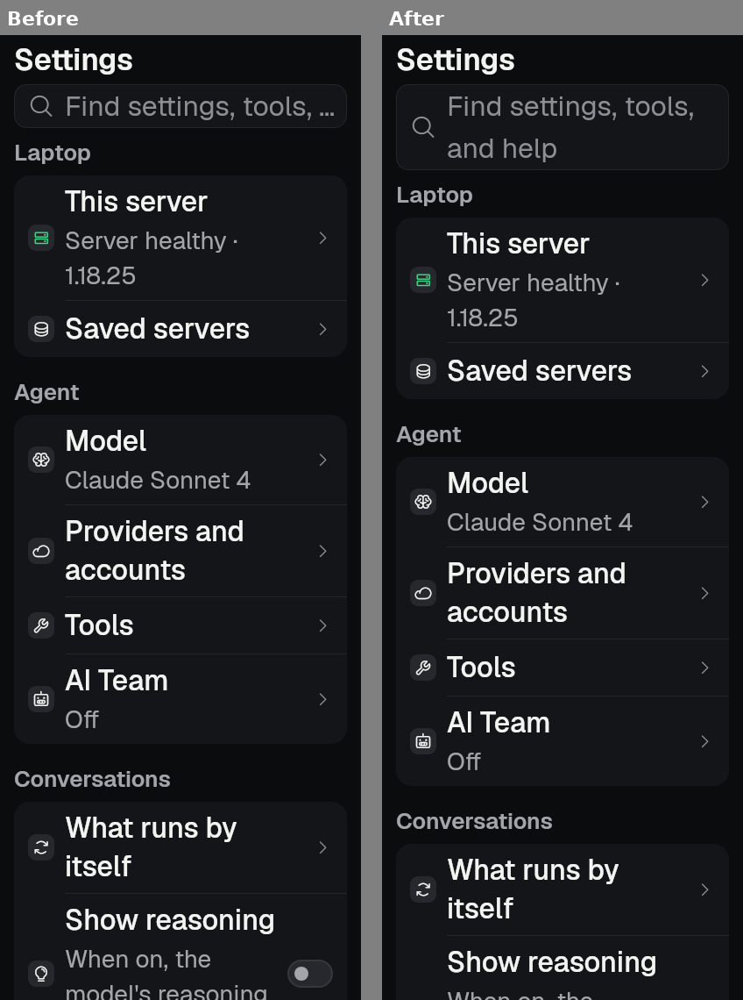
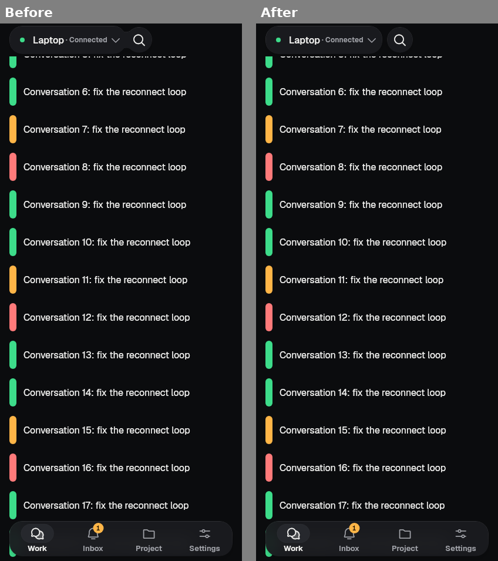
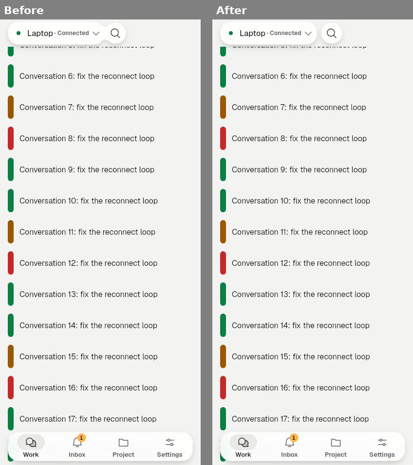
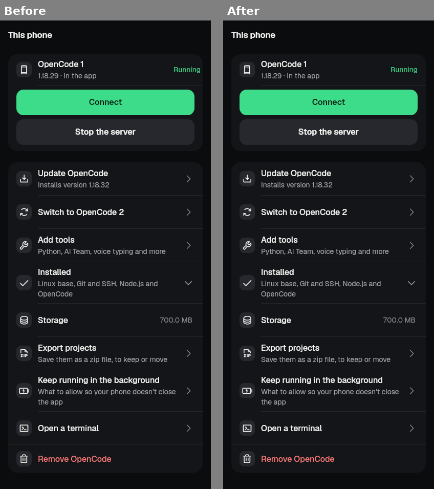
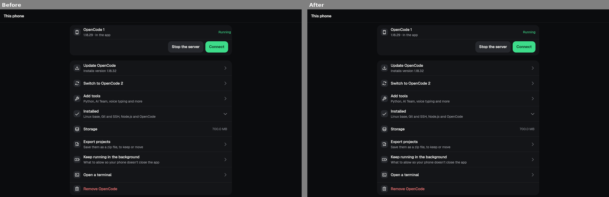

# slice-fix-layout-copy (2026-09-28)

Fixes for findings F7, F8, F9, F11, F12, F13 and F14 from the
[emulator QA of build 2062](../emulator-qa-claude-2026-09-28/README.md).
Branch `revamp/slice-fix-layout-copy`, based on `690c3833`.

## What changed

| Finding | Where | Change |
|---|---|---|
| F7 Manage space (P2) | `lib/manage_space_main.dart`, `lib/ui/screens/manage_space_screen.dart` | The page reads the saved Appearance and theme (plain preferences, never secure storage). It is dark by default like the app, follows Light, and follows the device when set to System. Its notices (the warning, the cache result, the export outcome) now sit on the 16 dp gutter, the same as the row groups, on Manage space and on This phone › Export projects. The warning mentions Export only when the Export row is on the page: with nothing to export it says only "Clearing deletes everything … cannot be undone." |
| F8 Large text (P3) | `lib/ui/kit/kit_top_bar.dart`, `lib/ui/kit/kit_search_field.dart` | At 1.3× text and above, when the server name and " · Connected" do not both fit on one line, the status moves under the name, and the name may take two lines. At 2.0× this shows "127.0.0.1" in full instead of "127.…". At 1.0× nothing changes. From 1.3× the search field's hint wraps to two lines instead of cutting to "Find settings, tools, …". The Work row "Every project on this s…" was already fixed on the base branch (`c6f4a880`, KitRow supporting lines wrap at large text). |
| F9 Glass pair notch (P2) | `lib/ui/kit/glass/kit_glass_pair.dart` (join spacing only) | When the page is scrolled, search still slides up to the server pill, but it stops one `space2` (8 dp) gap away and is drawn whole. The smooth-union neck that drew the notch is gone. Glass paint, tint and rim are unchanged. |
| F11 Setup time left (P3) | `lib/ui/widgets/setup_progress_view.dart` (view only; engine untouched) | The time shown per job only goes down. Steps that have not started count for at least their own estimates. "Less than a minute" appears only on the last step; before that the line says at least "~1 min left". |
| F12 Switch button (P3) | `lib/ui/screens/this_phone_screen.dart`, `app_en.arb` | The confirm button now names the target: "Switch to OpenCode 2" (or "Switch to OpenCode 1"), not "Switch version". |
| F13 "Running" inset (P3) | `lib/ui/screens/this_phone_screen.dart`, `lib/ui/widgets/phone_server_card.dart` | The state word keeps the row's 16 dp end inset and lines up with the other rows' values. Before, it sat 4 dp from the panel edge. The card gets the same fix for its no-menu states. |
| F14 Phone icon (P3) | `lib/ui/widgets/termux_running_server_entry.dart` (`isPhoneOwnServer`), `server_switcher_sheet.dart`, `servers_screen.dart` | Only the in-app server, the Termux server this app manages, and Claude Code on this phone get the phone mark. Any other loopback address (adb reverse, a forwarded port, a server started by hand) gets the server mark. |

Copy: one new string, `manageSpaceIntroNothingToExport`. `setupSwitchConfirm` now takes `{runtime}`, and the Arabic entry was updated to keep the placeholder. gen-l10n was run.

## Before / after (goldens, real fonts)

- F7, phone, dark: 
- F7, wide window, light: 
- F8, shell at 2.0× text: 
- F8, Settings search at 2.0×: 
- F9, pill and search joined (dark, light):  
- F13, This phone (phone, wide):  

The device "before" screenshots are in the QA record (69, 55/56, 62, 73, 80, 81, 71).

## Tests

New or changed behaviour tests. Each one was run against the base commit in a separate worktree and fails there:

- `test/manage_space/manage_space_screen_test.dart`
  - With nothing to export, the warning does not send the person to Export.
  - With projects, the warning is followed by the Export row.
  - Notices sit on the 16 dp gutter.
  - The page follows the saved appearance: dark by default, Light, and System.
- `test/kit/kit_top_bar_test.dart`
  - At 200 % text the name is whole and the status goes under it.
  - At 100 % text the name and status share one line.
- `test/kit/kit_glass_test.dart`: the joined piece keeps an 8 dp gap (the three existing expectations were updated).
- `test/phone_setup_progress_screen_test.dart`
  - The time line never shows under a minute before the last step, and never goes up.
  - A short estimate before the last step reads "~1 min".
- `test/this_phone_screen_test.dart`
  - The state word keeps the row's end inset (base: 4 dp).
  - The Switch sheet's button names the target.
- `test/phone_own_server_icon_test.dart` (new)
  - Only the phone's own servers count as this phone.
  - The switcher draws a forwarded loopback server with the server mark.

Runs, all with the pinned Flutter 3.47.1 and through `tool/qa/machine_lock.sh`:

- Affected test files: the manage-space tests, kit top bar, kit glass, kit nav, kit search field, phone setup progress, This phone, phone server card, server switcher, `shared_servers_1`, the new icon test, and `kit_ratchet_test`. All pass.
- Goldens: the 35 golden files that draw these parts were checked. 34 images changed, each one reviewed and refreshed:
  - kit glass joined, joining and text2 (8)
  - manage space (11)
  - phone server screens (4)
  - `screen_phone_1` (7)
  - `slice_close_servers_phone` (3)
  - `p310` hub at 200 % (1)
- `shared_chat_1_golden_test` "continue on phone" (4 images) fails the same way on the base commit, so it is a pre-existing failure and was left alone.
- `flutter analyze` on the whole project: clean.

## Still needs a device

- F7: open Android Settings › Apps › OpenCode Mobile › Storage › Clear storage with the app set to Dark, and check that the page is dark and inset.
- F9: in landscape, scroll Work and check that the gap shows between the pill and search. The QA also saw a dark rectangle behind the whole pair (the liquid shader's clip area) in 61/62. That belongs to the glass internals, which are left to the glass agent. The gap removes the notch but not that tint.
- F11: do a real This phone setup and watch the time line from start to end.
