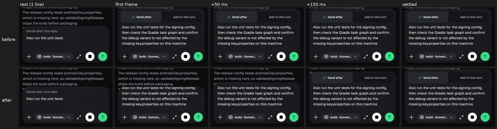
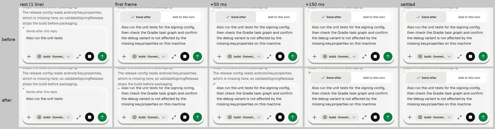
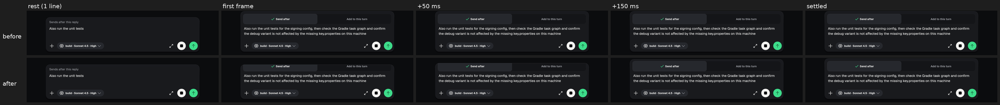
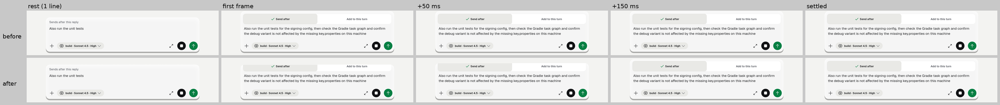

# slice-glass-flow (2026-09-28)

Finish line: `KitGlass(flow: true)` never clips taps, and the chat composer
flows again. Non-goal: any other change in the chat library, the kit
press/tap layer or the joined pair.

## What changed

- `lib/ui/kit/glass/kit_glass.dart`: the glass clip is now `_GlassClip`, a
  `ClipRRect` whose render object (`_RenderGlassClip`) clips **paint** to the
  drawn (moving) shape but hit-tests the layout box, as `RenderBox.hitTest`
  does. Before, `RenderClipRRect` with a custom clipper rejected every tap
  outside the clip, so while the glass flowed from the old size a control that
  had just appeared (composer delivery choice, the /unshare confirm) missed
  taps for the spring's length (~300 ms). At rest the drawn shape is the box,
  so nothing changes there; the visual flow is unchanged (same clip, same
  springs, content never scaled, crisp one-pixel rim).
- `lib/ui/kit/chat/kit_composer.dart`: the one `KitGlass` gains `flow: true`
  (the one line allowed in the chat kit).
- `docs/ux-system/kit-api/KitGlass.md`: motion rule "taps follow the layout,
  never the drawn shape", call-site section marked made, tests listed.
- Tests that found the clip by exact type (`find.byType(ClipRRect)`) now match
  any `ClipRRect` (`test/kit_glass_test.dart`, `test/glass_surface_test.dart`,
  `test/kit/kit_glass_test.dart` `_drawn`): same assertions.

## Tests

New in `test/kit/kit_glass_test.dart` (group flow):

- "a control that just appeared at the edge takes the first tap while the
  glass is still flowing": the drawn glass is still 48 dp on the first frame,
  the new row's centre is outside it, a flow is ticking, and the tap lands;
  the glass then settles exactly on the box. **Fails on the old clip**
  (reverted the hit-test override: `taps` stayed 0), passes with the fix.
- "reduced motion: the new control and the glass are there in one pump": no
  ticker, drawn shape = box, tap lands.

Real composer check (temporary capture test, not committed): the delivery
choice's "Add to this turn" tapped on the first frame after it appears ->
1 tap with the fix, 0 with flow on the old clip.

Runs (pinned Flutter 3.47.1, via `tool/qa/machine_lock.sh`, serial):

| Files | Result |
|---|---|
| kit/kit_glass_test, kit_glass_test, glass_surface_test | 98 pass, 2 skip. Frame budget: mean 1.18 ms, max 2.16 ms (was ~2.3 ms mean) |
| kit/kit_composer_test, goldens/kit/kit_composer_golden_test, goldens/kit/kit_composer_chips_golden_test, kit/kit_composer_chips_test, chat_speed_test | 162 pass; no golden changed (galleries render solid glass, which never flows) |
| release_blockers_test, pending_sends_strip_test, revamp/chat_3_test | 46 pass |
| safety_confirms, chat_reference_send, offline_queue, composer_desktop_enter | pass |
| goldens/chat_states_golden_test (14), chat_empty_start_test (3) | 17 fail, **identical on the base** `4308b155` (temporary worktree); the 12 rendered failure images are byte-identical to the base's |
| Gates: kit_ratchet, redaction, ui_glossary, no_raw_error_text, kit/kit_manifest, kit/kit_draft_manifest, kit_motion, plus interaction_defaults, codex_chat_capabilities, background_notification_navigation, product_ui_regression | pass |

`flutter analyze`: no issues. `dart format --language-version=3.10`: clean.

## Images

Before = base `4308b155` (composer without flow: the glass jumps to the new
size); after = this slice (the glass grows from its bottom edge and reveals the
new row and line). Frames: rest, first frame after the draft grows three lines
and the delivery choice appears, +50 ms, +150 ms, settled. Frosted look
(flutter_tester is Skia), 2x.

- Phone 412x915: 
  
- Wide 1280x800: 
  

## Notes / needs a device

- For the first ~100 ms of a flow the new row is laid out (and tappable) but
  still under the reveal: a tap aimed at the transcript just above the old
  composer edge in that window reaches the composer's new row. This is the
  layout truth (before fluid glass the row was drawn there at once) and was
  the brief's choice; worth a feel check on the phone.
- The liquid look (Impeller) flow on a real phone: the shader reads the same
  `GlassGeometry`, unchanged here.
