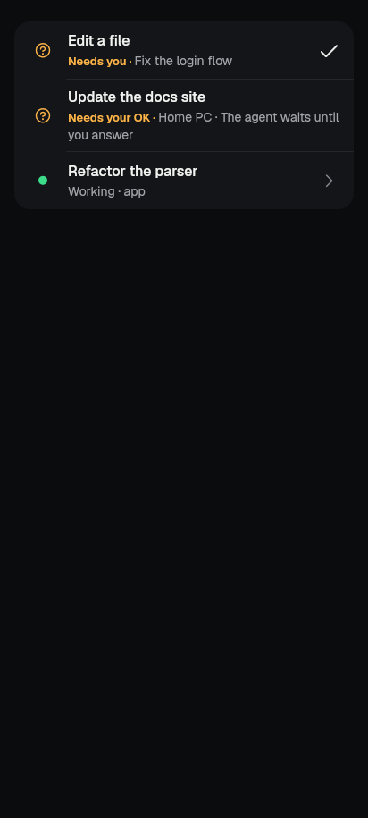
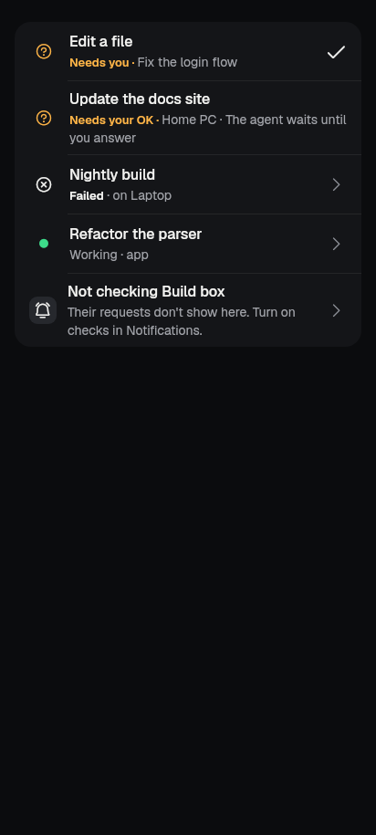
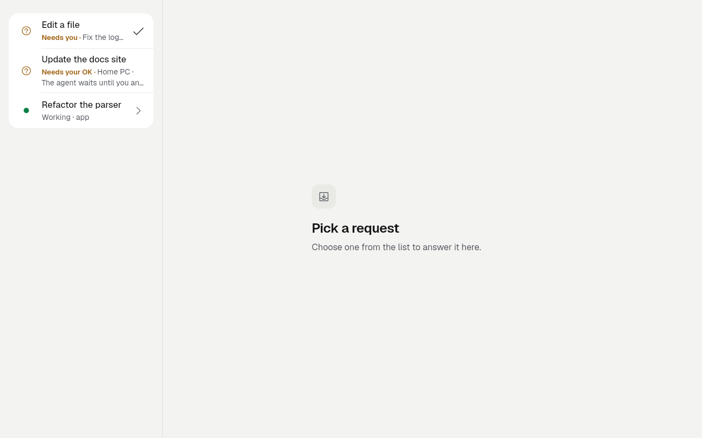
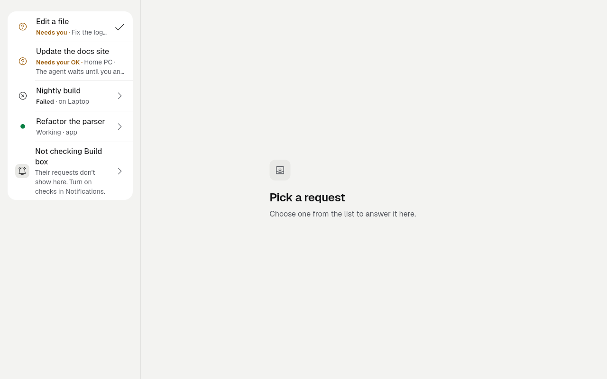
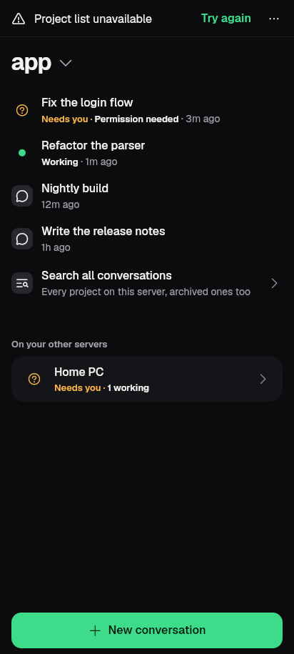
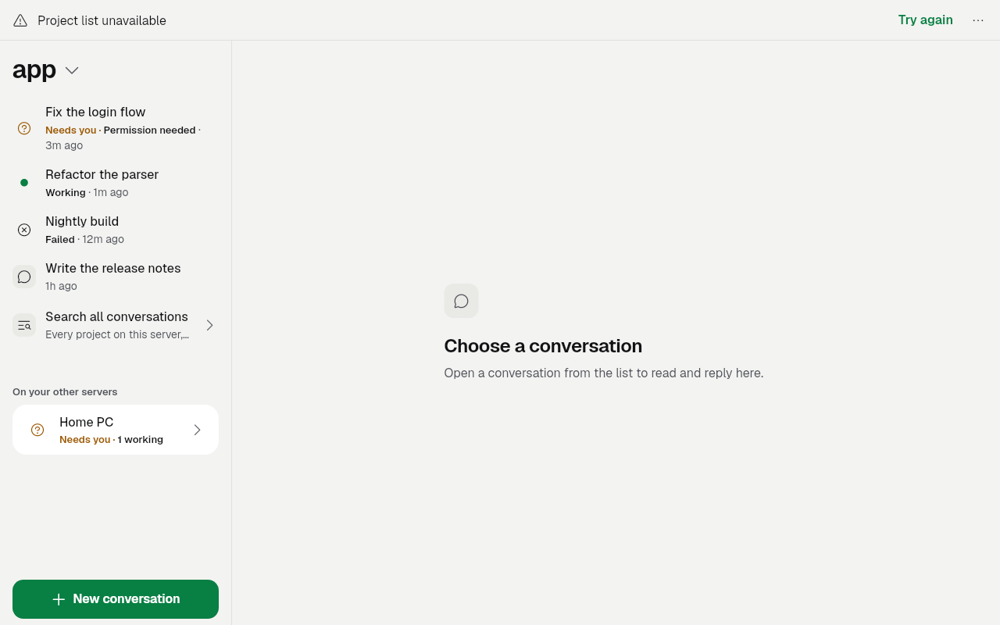
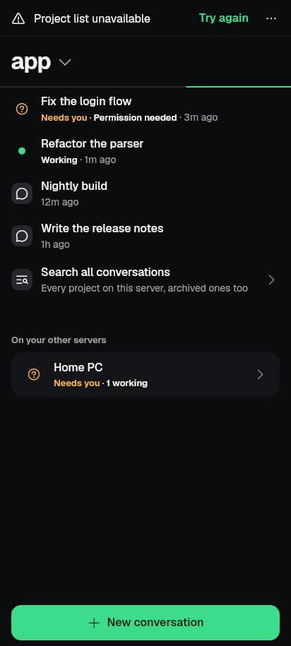
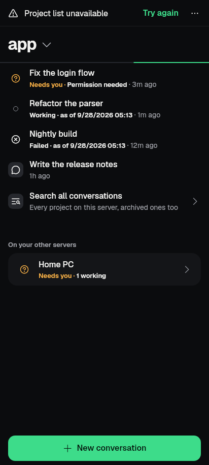

# slice-inbox-work — P4.2b Other servers in the one list + P5.5 Rows say what the work is doing — 2026-09-28

Finish line: the Inbox shows attention items from every saved server in ONE
list, each row naming its server; other servers only while their checks are
on, and when they are off the list says so plainly with the way to turn them
on. Work rows say what each conversation or team task is doing now (Working /
Needs you / Failed / Stalled since … / last seen … as of …) from
`WorkRowStatus`, with no live mark while disconnected. Plain words; no raw
error text (the feed carries none).

Non-goal: no background monitoring changes, no new polling controller, no
chat-library edits, no card focus inside the conversation (P4.2a, chat lane).

Backend: Codex's feed and status projection,
[codex-inbox-2026-09-28](../codex-inbox-2026-09-28/README.md)
(`controller.attentionFeed`, `WorkRowFacts` / `WorkRowStatus`,
`WorkRowStatusController`). This slice is the UI hook-up.

## What changed, per page

| Page | Before | After |
| --- | --- | --- |
| Inbox (`activity_screen.dart`) | Other servers' rows came from the monitor's pending requests only (`ProfileMonitorInbox.rowsFor(...).requests`): no failures, no team gates, no freshness. A server whose checks were off was simply absent. | Rows come from `controller.attentionFeed` (`inboxFeedItems`): another server's permissions, questions, forms, team gates and failed runs, plus a failed run on the connected server. Each row names its server ("Needs your OK · Home PC", "Failed · on Laptop"). A fresh request is the kit's needs-you row; a failure, or a request known only from an older check, leads with its `WorkRowStatus.line` ("Needs you · as of 9/28/2026 14:02 · on Home PC") and a still mark. The connected server's own requests and gates keep their answerable rows and are not listed twice. At the end of the one list: "Not checking Build box — Their requests don't show here. Turn on checks in Notifications." (opens Notifications; showing the Inbox never opts in), and per server "Couldn't check X" (with Try again) or "X is checked on Wi-Fi only" / "Checks on X are paused". Check-in reminders stay the monitor's rows. |
| Inbox row tap | Monitor request route only. | `openAttentionItem` re-resolves the row in the current feed first (answered/removed rows say "Couldn't open it"), then: another server's request → the existing `openMonitoredRequest` (profile, location and exact request revalidated); another server's failure or gate with a conversation → the same route (conversation revalidated, then the chat); the connected server → the Inbox's own conversation route; a team item without a conversation → its task conversation (`TeamConversation.open`). Nothing is answered from a row. |
| Work (`workspace_screen.dart`) | Busy rows kept the live working mark and "Working" even while disconnected; a failed run looked like any idle row. | One `WorkRowStatusController` per server/project in the Work state, observed only while the connection is live. Disconnected: a still mark and "Working · as of 9/28/2026 05:12" (or "Last seen running" when no live observation exists). A confirmed session error (the feed's failure) shows "Failed" with the failed mark; idleness alone is never Done or Failed. Needs-you rows unchanged. Last-known (speed UI) rows untouched. |
| Work team rows (`team_task_row.dart`) | Team line only; no stall word; live mark while disconnected. | `TeamTaskRow.statusOf` (same `WorkRowStatus` vocabulary): needs you and finished outcomes outrank a stall; a stall is the task's own P3.5 evidence (`teamNow(...).kind == stalled`, on the team controller's clock) → "Stalled since 14:02"; a stale team read or no connection → state word + "as of", still mark. |
| Work "On your other servers" panel | — | Unchanged: it is Work's single "N need you" line per server. |

Supporting: `lib/ui/widgets/attention_feed_rows.dart` (rows, open, coverage
rows), `lib/ui/widgets/work_row_presentation.dart` (mark + status span shared
by Inbox and Work), `OrchestrationController.now()` (the team's own clock,
public so rows judge a stall as the team's pages do). Copy: 10 English keys
(`workStalledSince`, `attentionOnServer`, `attentionTeamTask`,
`attentionChecksOff`, `attentionChecksOffDetail`, `attentionUnchecked`,
`attentionUncheckedDetail`, `attentionUncheckedSince`,
`attentionWaitsForWifi`, `attentionChecksPaused`); gen-l10n run once.

## Images (goldens, real fonts, DPR 1)

Scenario: Laptop connected (one permission, "Refactor the parser" running,
"Nightly build" failed with a confirmed session error); Home PC checked, one
permission waiting; Build box saved with checks off. Before = base
`878cdb05`, same test file.

| | Before | After |
| --- | --- | --- |
| Inbox, phone dark |  |  |
| Inbox, 1280x800 light |  |  |
| Work, phone dark |  |  |
| Work, 1280x800 light |  |  |
| Work, connection dropped, phone dark |  |  |

The "Project list unavailable" line in the Work shots is the capture fixture's
fake server (its project calls are stubs), identical before and after.
The offline shot has a wall-clock "as of" time, so it is evidence only
(`--dart-define=CAPTURE_EVIDENCE=true`), not a committed golden.

## Tests

New behaviour tests, `test/inbox_work_attention_test.dart` (5, all pass):
multi-server one list with the connected server's request once; checks off
(row text, opens Notifications, nothing enabled); each Inbox row state
(fresh request, stale request with as-of, failure, team failure, vanished row
re-resolved → "Couldn't open it"); profile isolation (removing a server
removes its rows); Work rows Working → last seen still → live again → Failed
(no raw error text). Goldens: `test/revamp/slice_inbox_work_golden_test.dart`
(4 committed + 1 evidence-only).

Affected existing tests (49 files: every file pumping ActivityScreen /
WorkspaceScreen / TeamTaskRow / OtherServersPanel, plus kit_ratchet,
ui_glossary, no_raw_error_text, redaction, work_row_status,
connection_attention_feed), pinned Flutter through `tool/qa/machine_lock.sh`.
Failures compared with the base commit in a temporary second worktree:
42 fail identically at base (goldens drifted after R9/R5, 320 dp layout,
nudge_moments, motion_states "all caught up", slice_p6_6a, team_gate_answer,
workspace_hierarchy/stable_layout — pre-existing, not touched). Three were
new and are fixed: kit_ratchet G17 (the status span no longer uses the
attention tone), ui_glossary ("Check again" → "Try again"), team_discover
(the recorded convoy, days old on an unpinned clock, now reads "Team ·
Stalled" as its conversation does — expectation updated).

`flutter analyze`: no issues. `dart format --language-version=3.10`: clean.

## Not verified here / still needs a device

- Emulator with two saved servers: answer a request on the other server from
  the Inbox (the unit's proof). Not run; no device was used.
- Stalled team row on a live Gas City (covered only by `teamNow` unit tests
  and the fixture's stalled convoy).
- P4.2a (chat lane): land on the exact request card — hook points noted in
  the lane notes; `target.requestID` is carried to the open call but the chat
  route has no focus field yet.
- The Inbox's empty "all caught up" state still depends on
  `unknownAttentionProfileCount` (connection.dart, another agent's fix).
- `profile-monitor` route removal (unit acceptance) not done: the Background
  checks page stays reachable from Servers; folding it into server rows is a
  Servers-page change outside this finish line.
