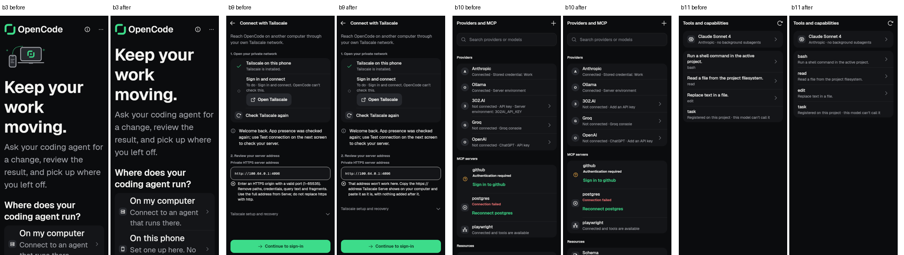

# slice-qa-ui — emulator QA backlog B3, B4, B5, B9, B10, B11 (B12 blocked) — 2026-09-28

Source: [emulator QA backlog](../emulator-qa-2026-09-28/BACKLOG.md), screenshots in
[emulator-qa-2026-09-28](../emulator-qa-2026-09-28/). Branch `revamp/slice-qa-ui`,
based on `feat/phone-setup-v2` at `5decfa8e`.

## What changed

| ID | Finding | Cause | Fix |
|---|---|---|---|
| B3 | Onboarding at 2.0 text: "Connect~~to an~~agent", list cut at the bottom (28–30) | The strike is **Android's gesture-navigation handle**, drawn over the page's bottom edge. It sits at the same place in the 1.0 screenshots (52). The row's icon is in its own column of `KitRow`'s `Row` and cannot overlap the words. The page already scrolled. The screenshots were taken at scroll top, where the choices start below the fold. | At 1.3× text and above, the welcome hides its decorative hero, so the choices start about 110 dp higher. That picture says nothing the words don't. New test at 1080×2400 / 2.625 dpr / 2.0 text, with a gesture inset, in LTR and RTL. It checks: no hero; the list scrolls to its end; every choice ends above the gesture bar; each row's icon rectangle never overlaps any of its text rectangles. |
| B4 | Add server: Close on step 1 asked "Discard server changes?" (19–25) | In the QA run an address had been typed on step 2 (17), then Back led to step 1. The draft was dirty, but step 1 shows nothing typed. | Close on the first step ("What runs there") never asks. The edit form, and any page that shows typed fields, still asks when dirty. The old test that pinned the previous rule was rewritten. |
| B5 | Thin bright green frame around the whole app after relaunch (51–53) | The colour is (129,172,2), not the app's accent #3DDC8A. It is Android's **default focus highlight** on the focused `FlutterView`. `Theme.Black` draws it in the old lime whenever the window leaves touch mode (a key press, D-pad or `adb shell input`). Flutter's own rings already appear only in `FocusHighlightMode.traditional`, and nothing sets `highlightStrategy`. | `android:defaultFocusHighlightEnabled=false` (with `tools:targetApi="o"`) on `LaunchTheme` and `NormalTheme`, day and night. Contract test `test/android_focus_highlight_contract_test.dart`. |
| B9 | Jargon address errors (18, 45, 57) | — | Now in plain words, each with a way forward. `e7SetupLocalHttp`: "An http:// address only works for a server on this phone. For another computer, pair with a code, use its https:// address, or connect with Tailscale." `e7SetupRequireHttps` (sibling rule): "A password is only sent to another computer over https://. …" `tailscaleAddressError`: "That address won't work here. Copy the https:// address Tailscale Serve shows on your computer and paste it as it is, with nothing added after it." The state-layer English keys in `setupUiMessage` are unchanged. |
| B10 | Providers rows: "Server environment: 302AI_API_KEY" (78) | — | An unconnected row says how to connect: "Not connected · Add an API key", or the server's sign-in name. When only the server's environment can connect it, the row says "Set up on the server". Variable names moved to a new row-menu **Details** sheet (`showKitTechnicalDetails`): "Server environment variable: 302AI_API_KEY", plus the note "To connect 302.AI without the app, set this where the server runs, then restart the server." A connected env row says "Server environment" with no name. `e7LibraryServerEnvironment2` was deleted (now unused). |
| B11 | Tools tab showed raw server prompt text as the title (87) | — | Each row now shows the tool's name as the title, with the first sentence of its description as the supporting line. `toolSummary()` uses the first paragraph or list item, drops list markers and stops at the first sentence end. The full description is still on the tool's sheet. |
| B12 | Demo chat: "/" shows nothing (47–50) | **Not built: needs `lib/ui/screens/chat_screen.dart`.** Inline commands are off for isolated (demo) connections (`allowInlineCommands: !_conn.isIsolated && …`), and the note has to come from `lib/ui/screens/chat/composer.dart` `_suggestions`. The slice brief gives both files to the chat chain. | Proposed for the chat owner: when `isolated` and the text matches `^/\S*$`, show a one-line composer note such as "The demo has no commands — send the sample prompt to see a change reviewed." |

## Tests

New or changed behaviour tests. Each was run once and passes:

- `test/first_run_welcome_test.dart`: `welcome at 2.0 text on a gesture phone, ltr/rtl` (B3)
- `test/server_profile_editor_test.dart`: `closing the first step of Add server never asks`. `closing a changed server editor requires confirmation` now uses the edit form (B4).
- `test/android_focus_highlight_contract_test.dart` (B5)
- `test/tailscale_setup_test.dart` and `test/revamp/screen_servers_3_golden_test.dart`: finders updated to the new copy (B9)
- `test/library_integrations_test.dart`: `an unconnected provider says how to connect; env names are under Details` (B10). The `screen_library_1` golden fixture gained a 302.AI row with an env method.
- `test/tools_screen_test.dart`: `a tool summary is the first sentence of its description` and `a tool row names the tool and says its first sentence` (B11)

Existing files re-run: `add_server_flow_test`, `revamp/screen_library_1_test`, `revamp/screen_library_3_test` and `release_blockers_test`. The golden files for servers_3, library_1, library_3, aisetup_review, p310, shared_system_1, coord_main, servers_2, p67, shell_1 and p6_6a were run before any golden was updated. Only servers_3, library_1 and library_3 differed.

Checked against the base in a temporary second worktree at `5decfa8e`: the B3, B4, B5 and B10 tests fail there. B11's test does not compile there, because `toolSummary` is new.

Gates, all passing: kit_ratchet, redaction, ui_glossary, no_raw_error_text, kit_manifest, kit_draft_manifest, architecture_boundaries, golden_harness. `flutter analyze` over the whole project: no issues.

## Goldens refreshed (reviewed, before → after)

- `servers_tailscale_setup_returned_address_error_{dark,light}`: new B9 copy.
- `library_tools_loaded{,_1280x800}_{dark,light}`: name first, first sentence under it.
- `library_integrations_*` (loaded ×4, and 8 sheets whose background shows the list): the new 302.AI fixture row, and OpenAI's line changed to "ChatGPT · Add an API key".

Image pairs in this folder: `b3-*` (welcome at 2.0, top and end), `b9-*`, `b10-*` (phone dark and 1280 light), `b11-*` (phone dark and 1280 light).

## Still needs a device

- B5: confirm on the emulator that the lime frame no longer appears after `adb shell input keyevent` plus a cold relaunch.
- B3: look at the welcome at font 2.0 on the emulator. The gesture handle still draws over whatever sits at the bottom edge; that is the OS.
- B12: waits on the chat owner.
