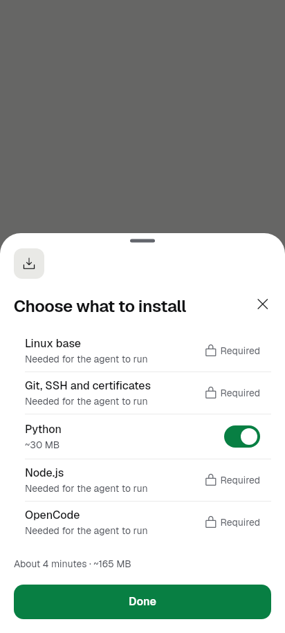
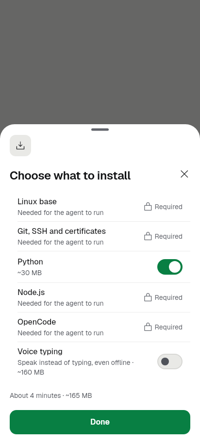
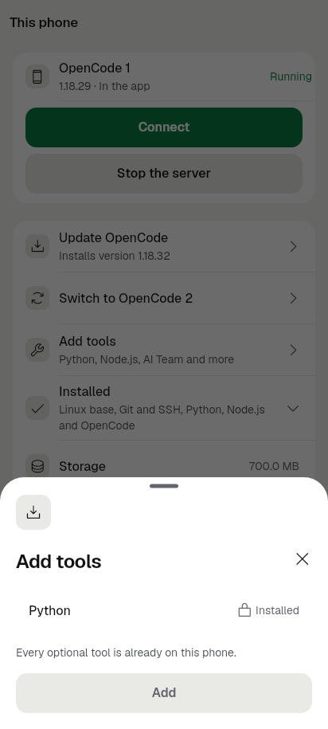
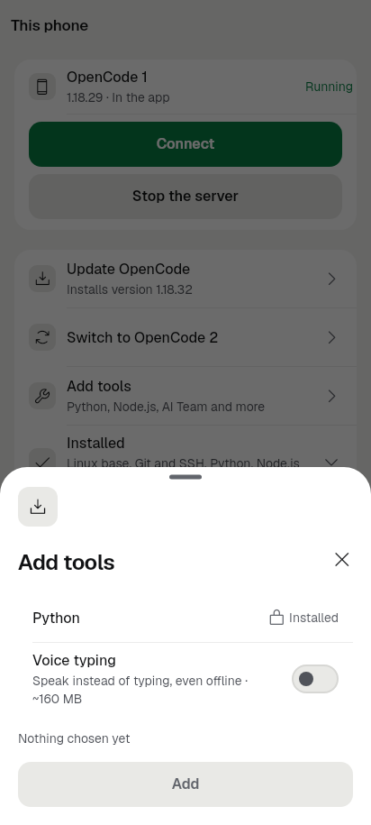

# Voice typing in phone setup (2026-09-27)

Branch `feat/voice-in-setup`, from `feat/phone-setup-v2` at `e1ccfc42`.

The owner asked for the local speech-to-text model download to be an optional
part of first-time setup and of the v2 installation flow.

**Finish line.** In the v2 phone setup flow (first setup's Customize sheet and
This phone › Add tools), the person can switch on an optional **Voice typing**
item. It is off by default, and its row says what it does and how big the
download is in one line. Setup then downloads and verifies the speech model as
a resumable step with progress, alongside the other components. Skipping it
changes nothing. When the model is already on the phone, the row says
Installed and offers **Remove voice typing**.

**Non-goal.** How voice typing works in the composer is unchanged.

## What changed

- **The engine has an app-side component kind.** This is
  `SetupComponent.app`, a `SetupAppComponent` with `offer`, `check`,
  `install`, `cancel` and `remove`.
  - It needs no script: the engine checks it with a Dart call, and does so
    even before Linux is installed.
  - It goes to the native job as a `step`, the same mechanism the "Start
    OpenCode" step uses.
  - When the job reaches the step, the engine runs the install once per job,
    lays the live bytes and stage over the job's row, and completes the step.
  - Failures come back as kinds (offline, no space, checksum, and so on). They
    are recorded as fixed reasons, which the existing failure matcher turns
    into plain words. No exception text is shown.
  - `installedOptional()` and `ComponentRemovalService` handle the kind too.
- **Native change (one).** `SetupRunner.kt` now lets a step wait for
  `data.waitMinutes`, capped at 240. Voice asks for 120, because a download on
  a slow network can take longer than the start's 10 minutes. The Termux runner
  never timed out and ignores the key.
- **The voice component.** `lib/builtin/setup/voice_component.dart` reuses
  `VoiceModelManager.shared()` and its downloader, so there is no second
  downloader.
  - It picks the pack Settings › Voice would use: an installed one, else the
    one already chosen (Balanced by default), else the best pack the phone can
    run.
  - The choice is gated on total RAM and the CPU, never on the Java heap class.
    Low free space does not hide the item, because the sheet's pre-flight
    already says how much to free.
  - The item is not offered when no pack fits, or when the phone has no speech
    capture.
  - A partial download is kept on cancel or when the app is killed, and resumes
    through the downloader's HTTP Range support. Removing the item deletes
    every pack, partial downloads included.
- **Registry.** `voice` is registered after `start`, so a working agent never
  waits for the model and a failed download leaves OpenCode running. It is
  registered on Android only (`supportsVoice`). An engine test assumed `start`
  was always the last component; it now allows app-side components after it.
- **Customize / Add tools sheet.**
  - App-side rows appear only once `offer()` answers, at the real pack size.
    Optional rows show their `summary` next to the size: "Speak instead of
    typing, even offline · ~160 MB". The size never splits across lines.
  - An installed row is locked as Installed in both modes, with a tertiary
    **Remove voice typing** action. That action opens a destructive
    `showKitConfirm` question, which says the space it frees and runs the
    removal inside the question.
  - Only kit parts are used.
- **Copy.** The new strings are in English in `app_en.arb` only; gen-l10n was
  run.
  - No string repeats "on this phone", because the page and sheet titles
    already place it.
  - Arabic falls back to English until it is translated.
- No new storage keys. The model and the pack choice are device-wide and keep
  their existing unscoped voice keys.

## Tested (fakes only, no network)

- `test/setup_voice_component_test.dart` (26 tests):
  - **Offer:** Balanced at its real size; RAM gate at 8 GB with a 128 MB heap
    class, 1.2 GB (Compact) and 800 MB (not offered); no capture support; low
    space; a pack chosen in Settings.
  - **Install:** reports bytes then the check stage, and the pack is left in
    use; the install is idempotent.
  - **Resume:** a stopped install keeps its partial download, and the next
    install starts from it (`starts == [0, kept]`, never a replace).
  - **Failures and removal:** failures map to kinds; no space; remove deletes
    every pack; remove refuses while a download runs; a manager that cannot
    start is not offered.
  - **Registry shape:** optional, off by default, no scripts, after `start`.
  - **Engine:**
    - Left out, it is not checked and not in the job.
    - When chosen, it is checked by the app and runs as a step with
      `waitMinutes`.
    - An installed model is skipped, including before Linux is installed.
    - It installs once however often the engine polls, shows live bytes on its
      row and completes the step.
    - A failure shows as "Could not download Voice typing: no internet
      connection", and Continue retries.
    - Cancel stops it and reports nothing.
    - After the app is killed, a new engine starts it again.
    - An interrupted job continues through it.
    - `installedOptional` counts it even when Linux is not installed.
    - The removal service removes it through the app.
- `test/phone_setup_voice_item_test.dart` (6 widget tests):
  - **First setup:** the item is offered off, with its summary and size.
    Skipped, the selection has no `voice` and nothing is installed. Switched
    on, it is in the result and in the totals.
  - **Not offered:** no row.
  - **Installed:** locked Installed; Remove asks first and nothing is deleted
    before the answer; confirming removes it and the row becomes an off
    switch.
  - **Add tools:** offers it, and returns `{voice}`; when it is installed,
    shows it with Remove and the "every optional tool" line.
- **Existing tests:**
  - Files run: `test/setup_*`, `test/phone_setup_*`,
    `test/this_phone_screen_test.dart`, `test/revamp/screen_phone_1_golden_test.dart`,
    `test/revamp/screen_phone_1_test.dart`, `test/aiteam_component_test.dart`,
    `test/voice_model_manager_test.dart`, `test/voice_automatic_setup_test.dart`,
    `test/kit_ratchet_test.dart`.
  - Result: 453 passed and 18 failed.
  - The same 18 fail on the base commit `e1ccfc42`, checked in a temporary
    second worktree. They are kit ratchet G17/G21 in files this branch does not
    touch, three layout tests on the start and ready screens, the welcome
    entry, the This phone running/remove goldens, and "Update is not offered".
    There are no new failures.
  - No golden changed: the goldens' fake registry has no voice item.
- `flutter analyze`: clean.
- Kotlin: `flutter build apk --release --target-platform android-arm64` built
  the Dart side and stopped at `validateSigningRelease`, because there is no
  signing key in the worktree. `./gradlew :app:compileReleaseKotlin --offline`
  then exited 0.

## Images (light, 412x915, rendered with the test harness and app fonts)

| Before (`e1ccfc42`) | After |
|---|---|
|  |  |
|  |  |

Also in this folder:

- `after_customize_first_setup_voice_on.png`: the item switched on, with the
  totals at +160 MB.
- `after_this_phone_add_tools_voice_installed.png`: Installed, with Remove.
- `after_remove_voice_question.png`: the removal question.

## Still needs a device

- A real download and verification of the Balanced pack, run inside a first
  setup and inside Add tools, with the progress row and the scene during the
  download.
- Force-stopping the app mid-download, then Continue: the job should resume
  from the partial file, not from zero.
- A slow network that runs past 10 minutes, to confirm the new
  `waitMinutes` path in `SetupRunner.kt`.
- The setup notification's percent stays still while the model downloads. The
  native runner does not see the bytes of an app step. The screen does show
  them.
- The removal question on a device, and voice typing afterwards: the composer
  should ask for the model again.
- Termux host: the engine supports the item, but This phone's Termux
  "Add tools" sheet is a separate, older sheet and does not list it yet.
